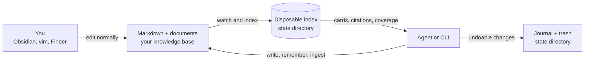
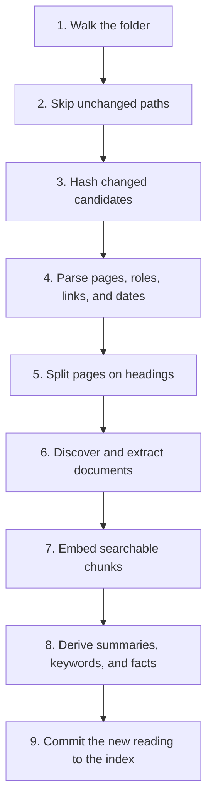
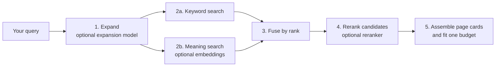
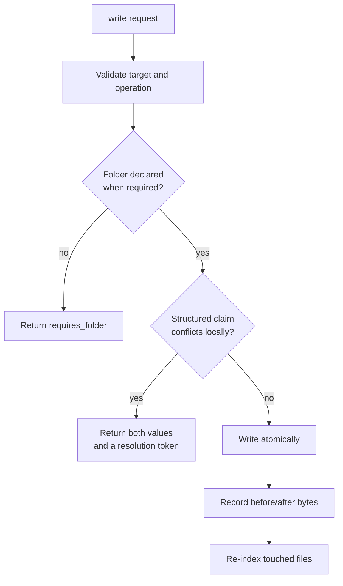
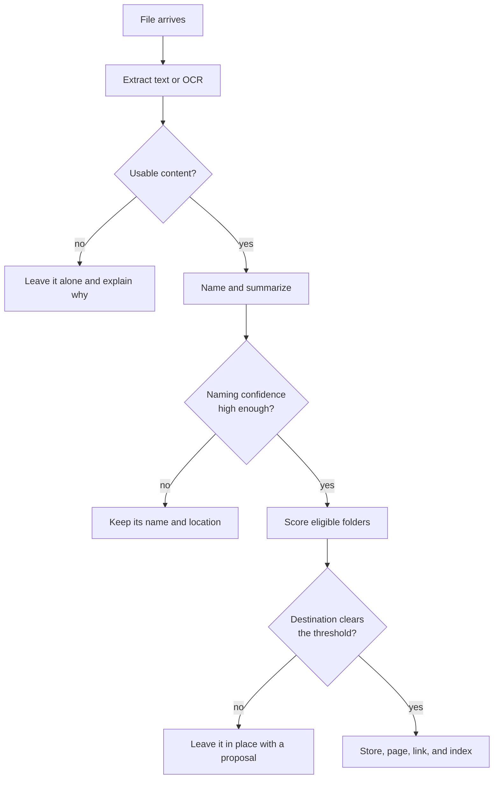
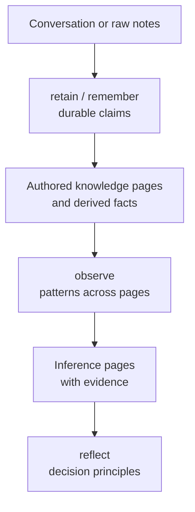
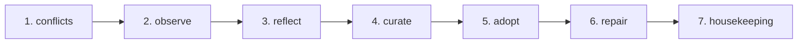

# How Akno works

Akno is a memory layer for agents, built on a folder of Markdown files that you own.
It helps an agent find what your notes actually say, show where each answer came from, and
make deliberate, reversible changes without taking control of the folder away from you.

This guide explains the user workflows first, then the machinery behind them. If Akno is
not installed yet, start with the [README quick start](README.md#quick-start).

---

## Contents

- [What Akno is useful for](#what-akno-is-useful-for)
- [The mental model](#the-mental-model)
- [Choose the right method](#choose-the-right-method)
- [A first useful run](#a-first-useful-run)
- [How indexing works](#how-indexing-works)
- [Ways to retrieve knowledge](#ways-to-retrieve-knowledge)
- [Ways to capture and change knowledge](#ways-to-capture-and-change-knowledge)
- [How folders, roles, and rules work](#how-folders-roles-and-rules-work)
- [How documents and the inbox work](#how-documents-and-the-inbox-work)
- [The dream cycle, phase by phase](#the-dream-cycle-phase-by-phase)
- [Models and graceful degradation](#models-and-graceful-degradation)
- [Running Akno as a service](#running-akno-as-a-service)
- [Diagnostics and recovery](#diagnostics-and-recovery)
- [What Akno does not solve yet](#what-akno-does-not-solve-yet)
- [Command reference](#command-reference)

---

## What Akno is useful for

Akno is most helpful when an agent needs continuity across conversations but the knowledge
must remain inspectable and under your control.

It turns common requests into grounded workflows:

- **“What did we decide?”** Search the notes, return the relevant page and exact lines, and
  say which parts of the question were not answered.
- **“Keep this for later.”** Extract the durable parts of a conversation, find the canonical
  page, append the knowledge, and record the change for undo.
- **“File this scan.”** Extract or OCR it, give an unhelpful filename a meaningful name, route
  it only when the destination is sufficiently clear, and make its contents searchable.
- **“What changed over time?”** Combine a central event ledger with dated lines from any page.
- **“Is the knowledge base still coherent?”** Find cross-page conflicts, broken links,
  unowned documents, and pages that have drifted from their folder rules.

The useful distinction is that Akno does not answer on the agent's behalf. It supplies
**evidence with addresses** and an explicit account of missing coverage. The agent still
reasons and writes the final response.

Akno is a good fit when:

- Markdown is already the durable record, or you want it to become the durable record.
- You want people and agents to edit the same files.
- Citations, reversibility, and honest absence matter more than a frictionless black box.
- You are comfortable running a local service on macOS and configuring model endpoints.

It is not a replacement for a note editor, a chat interface, a backup system, or a source of
truth about the world. It only knows what the indexed files and documents contain.

---

## The mental model



Four rules explain most of the system:

1. **The files are the truth.** The database is a derived reading of them. Delete it and run
   `akno index`; the knowledge base remains intact.
2. **The index is not a second knowledge base.** Search chunks, embeddings, summaries, facts,
   links, and events can all be rebuilt.
3. **Every returned claim has an address.** Page text is cited as `slug:line`; document text is
   cited with the document name and page number.
4. **Missing capabilities degrade explicitly.** If a model or the index is unavailable, Akno
   returns a typed degraded or unavailable result instead of quietly pretending it searched
   normally.

### Pages and documents have different jobs

A Markdown page says what a document is and why it matters. The document keeps its own text.
Akno indexes both, but it does not paste an extracted PDF into the page beside it. That avoids
duplicate search hits and prevents a stale copy from surviving after the file changes.

### Evidence and knowledge have different jobs

Not every page should be treated as a claim you endorse. A contract, email, transcript, or
article may be useful evidence without being canonical knowledge.

| Role        | Searchable? | Normal recall behavior                                | Fact-derived? |
| ----------- | ----------- | ----------------------------------------------------- | ------------- |
| `knowledge` | yes         | Summary plus matching lines; full body when requested | yes           |
| `source`    | yes         | Summary plus a capped quotation window                | no            |
| `inference` | yes         | Returned below authored knowledge                     | no            |
| `ignored`   | no          | Never returned                                        | no            |

A `<!-- source -->` fence can switch a knowledge page into evidence partway through the file.
Content above the fence is canonical; content below it remains searchable but is not fact-mined
or returned in full by default.

Roles are retrieval policy, not access control. An exact `read` can still return a source page.

---

## Choose the right method

The command surface is deliberately small, but several commands can look similar. Choose by how
much you already know about the answer or change.

| Your intent                                 | Method                   | Why this one                                                    | Writes files?    |
| ------------------------------------------- | ------------------------ | --------------------------------------------------------------- | ---------------- |
| Ask a fuzzy or natural-language question    | `recall`                 | Finds relevant pages and reports coverage                       | no               |
| Open a page or document you already know    | `read`                   | No ranking or truncation policy                                 | no               |
| Browse the shape of the knowledge base      | `list`                   | Shows folders, pages, or a tree                                 | no               |
| Ask what happened in a period               | `timeline`               | Uses structured events and dated lines                          | no               |
| Prepare everything an agent turn needs      | `context`                | Fits pins, recent events, structure, and recall into one budget | no               |
| Put exact wording on an exact page          | `write`                  | The caller controls destination and text                        | yes              |
| Keep the durable parts of unstructured text | `remember`               | Akno decides what lasts and where it belongs                  | yes              |
| Bring in a file, folder, or URL             | `ingest`                 | Extracts, names, routes, stores, and indexes                    | yes              |
| Process a drop folder                       | `inbox`                  | Applies ingest automatically to arrivals                        | yes              |
| Correct, remove, or relocate something      | `forget`, `undo`, `move` | Preserves file-level semantics and history                      | yes              |
| Run slow maintenance                        | `dream`                  | Performs bounded, repeat-safe background phases                 | depends on phase |
| Review or apply maintenance proposals       | `plan`                   | Uses durable exact diffs, decisions, and verification receipts  | apply only       |

Two rules of thumb prevent most misuse:

- If you know the destination and wording, use `write`; if you are handing over raw material,
  use `remember`.
- If you know the slug, use `read`; if you only know the subject, use `recall`.

The CLI exposes these methods to a person. The in-process, socket, HTTP, and MCP interfaces expose
the same operations to an agent from one registry, with the same schemas and errors.

---

## A first useful run

After configuring `akno_path`, start read-only. Index, diagnose, ask a question, and inspect the
source before enabling any automatic writing.

```bash
akno index
akno doctor
akno recall "when does the car insurance renew and what is the excess?"
akno read household/car-insurance
```

No notes to use yet? The repository includes a completely invented example:

```bash
cp -R examples/demo-brain ~/akno-demo
export AKNO_STATE_DIR=~/akno-demo-state
akno --akno-path ~/akno-demo index
akno --akno-path ~/akno-demo doctor
akno --akno-path ~/akno-demo recall "who services the boiler?"
```

Copy the demo before using write operations; `remember`, `ingest`, and enabled dream phases can
change the folder.

A practical adoption path is:

1. **Search only:** index, recall, read, list, timeline, and context.
2. **Explicit writes:** use `write`, `remember --dry-run`, and `undo` until the filing behavior is
   familiar.
3. **Document intake:** declare folder rules, then try one file with `ingest` before enabling an
   inbox.
4. **Background operation:** install only the service and watcher with `akno service install --no-dream`.
5. **Maintenance:** start with `dream --phase curate --mode audit`, inspect its exact plan diff, then choose
   human review or autonomous application for opted-in curation.

This sequence is about learning the trust boundaries, not satisfying a technical prerequisite.

---

## How indexing works

`akno index` reconciles the derived index with the folder. Run it once after setup. A running
service then watches for file changes and performs targeted re-indexing.



| Pass                | Method                                                                 | Model         |
| ------------------- | ---------------------------------------------------------------------- | ------------- |
| Walk                | Ignore configured paths, dot folders, and unsupported page types       | none          |
| Skip                | Compare size and modification time with the previous pass              | none          |
| Verify              | Hash likely changes; periodic sweeps also catch misleading timestamps  | none          |
| Parse               | Read frontmatter, headings, wikilinks, dates, roles, and source fences | none          |
| Chunk               | Follow headings and configured size limits                             | none          |
| Extract             | Read PDF text, OCR scans, and convert supported Office files           | none on macOS |
| Embed               | Turn chunks into vectors for semantic search                           | embedding     |
| Derive              | Produce page summaries, keywords, and durable fact candidates          | derive        |
| Summarize documents | Describe each document without copying its body into Markdown          | derive        |

The fast path is why a second index pass is normally quick: unchanged bytes are not re-read,
re-embedded, or re-derived.

Useful variants:

```bash
akno index --structural  # parse and reconcile without model-backed work
akno index --verify      # hash every file instead of trusting timestamps
akno index --rederive    # regenerate summaries, keywords, and facts
akno index --rebuild     # discard the derived index and recreate it
```

`--rebuild` deletes derived state, not the knowledge base. Indexing does not write into the notes
by default. Two opt-in settings are exceptions: `write_ids` can add an Akno id to frontmatter,
and `ingest.text_rendition` can keep extracted text beside readable documents.

---

## Ways to retrieve knowledge

### `recall`: ask when you know the subject, not the file

```bash
akno recall "when does the car insurance renew and what is the excess?"
```

An abbreviated result might look like this:

```text
ok mode=question 1 card 620 tokens
  coverage ✓ renewal date  ✗ excess
  nothing returned covers "excess" — do not answer that part

household/car-insurance (knowledge, 0.93)
  Car insurance › Policy
  Vulpine Mutual policy for the household car.
  household/car-insurance:11  Renews 4 November 2031. ~0.94
```

The important fields are:

| Output              | Meaning                                                                        |
| ------------------- | ------------------------------------------------------------------------------ |
| `mode=question`     | The retrieval strategy chosen for this query                                   |
| `1 card 620 tokens` | The number of page cards and their approximate prompt cost                     |
| `coverage ✓ … ✗ …`  | Which concepts the returned evidence covers                                    |
| `knowledge`         | The page role                                                                  |
| `0.93`              | Relevance of the page to this query                                            |
| `slug:11`           | The exact Markdown line to inspect                                             |
| `~0.94`             | Confidence that the line expresses a durable claim, not that the claim is true |

Coverage is a guardrail for the answer. A relevant page can still fail to answer one part of a
compound question. The caller should answer the covered part and be explicit about the missing one.

#### The recall pipeline



The search arms use different score scales, so they are merged by rank rather than comparing raw
scores. The final cards are built only after fusion and optional reranking.

Recall has three modes:

| Mode       | Best for                             | Expansion method                                                               |
| ---------- | ------------------------------------ | ------------------------------------------------------------------------------ |
| `lookup`   | `car insurance renewal`              | Add synonyms and word forms                                                    |
| `question` | `when does the car insurance renew?` | Search a hypothetical answer because questions and answers use different words |
| `explore`  | `anything about the car`             | Search broadly and favor summaries                                             |

The mode is inferred, or you can set it explicitly. Filters narrow the candidate set before cards
are assembled:

```bash
akno recall "renewal" --folder household
akno recall "invoice" --type receipt
akno recall "policy wording" --include source --depth full
akno recall "rent" --tag legal,household --budget 2000
```

### `read`: open one exact page or document

```bash
akno read household/car-insurance
akno read household/car-insurance --from 10 --to 20
akno read --document doc_a1b2c3d4
akno read --document household/policy-8e7705eb.pdf
```

`read` is not a search. It returns the requested object directly and can return a complete source
page that recall would normally quote only briefly.

### `list`: browse the structure

```bash
akno list
akno list --kind pages --folder household
akno list --kind tree --depth 2
akno list --type receipt --order recent
```

This is useful before writing. A caller that can see the existing taxonomy is less likely to invent
a duplicate page or folder.

### `timeline`: retrieve events by time

```bash
akno timeline --since 2031-01 --until 2031-06
akno timeline --match boiler
akno timeline --subject people/ada-marlow
```

Events come from the configured timeline ledger and from dated lines on any page. A page can remain
the canonical home of an event while `timeline` still finds it globally.

### `context`: prepare one bounded agent turn

```bash
akno context "the boiler is making a noise again" \
  --budget 8000 --pin household/boiler
```

`context` combines pinned pages, recent events, a structure outline, and this turn's recall under
one token budget. The parts compete for the same space, so four individually reasonable calls do not
overflow the model's context when combined.

---

## Ways to capture and change knowledge

### `write`: exact destination, exact wording

`write` creates, appends, patches, or replaces a page. The caller owns the wording; Akno enforces
the folder, conflict, journaling, and re-indexing rules around it.



Examples:

```bash
akno write --slug household/lease --append "- Deposit: 2222 EUR"
akno write --slug household/wifi --title "Wi-Fi" \
  --content "Router in the hallway cupboard."
akno write --slug household/lease --replace "1111 EUR" --with "2222 EUR"
akno write --slug household/boiler --append "- Serviced 4 August." \
  --event "2031-08-04=Boiler serviced."
akno write --slug household/boiler --append "Invoice attached." \
  --attach ~/Desktop/invoice.pdf="The invoice"
akno write --slug household/lease --append "- Deposit: 2222 EUR" --dry-run
```

`append`, `patch`, and `replace` never alter frontmatter. A full `content` replacement can replace
frontmatter only when the submitted content starts with a frontmatter block. The response names keys
removed from the previous declaration so a missing policy or temporal boundary is visible.

#### Local conflict detection

If a page says `Rent: 1111 EUR` and a write proposes `Rent: 2222 EUR`, Akno stops before touching
the file and returns both lines plus a conflict token. After deciding which value is current, repeat
the write with the resolution token.

This immediate check is deliberately narrow: it compares structured values containing numbers or
dates on the target page. Thorough cross-page conflict detection belongs in the dream cycle, where a
model call does not delay an interactive write.

### `remember`: raw material in, durable knowledge out

Use `remember` when you do not know which sentences should survive or where they belong.

```bash
akno remember "Decision: extend the Zephyr QX-100 warranty for €33/month from 1 October 2031."
akno remember "..." --dry-run
```

Its method is:

1. Extract durable decisions, values, dates, preferences, and proven experience. Drop chatter,
   speculation, and facts that are only momentarily true.
2. Use the visible folder taxonomy to choose a branch. It never creates a folder.
3. Recall candidate pages inside that branch and require the routing score to clear the threshold.
4. Run the same local conflict check as `write`.
5. Choose a section, append prose with provenance, and fall back to `## Unsorted` if placement fails.
6. Add dated material to the timeline in the same undoable change.

`maintenance.model` handles this when configured; otherwise `derive` does. A call can include a
`mission` such as “attribute forwarded content to its original author.” The mission adds emphasis to
the fixed retention rules; it cannot replace their safety constraints.

When a durable claim has no confident destination, Akno proposes instead of guessing:

```bash
akno approve --list
akno approve prop_5c1e77a2 --slug household/warranties
akno decline prop_5c1e77a2
```

### `forget`, `undo`, and `move`: correct the record

```bash
akno forget --fact fact_9c2e11ab
akno forget --slug household/old-notes
akno forget --document doc_a1b2c3d4

akno undo --list
akno undo chg_7f3a9c21

akno move household/lease household/rental/lease
```

- Forgetting a fact removes the sentence that produced it; there is no hidden fact store to edit
  instead of the Markdown.
- Forgetting a page or document moves it to Akno's trash, retained for the configured period.
- Undo restores exact previous bytes. If a change created a file, undo removes that created file.
- Move relocates a page and its owned documents, updates embeds within the page, and reports inbound
  links from other pages instead of silently rewriting them.

---

## How folders, roles, and rules work

An agent that invents folders without describing them can turn a useful taxonomy into a pile of
near-duplicates. Akno gates the missing description, not the user's approval.

If an agent writes into an undeclared folder, the write returns `requires_folder` and suggests nearby
existing folders. The caller declares the new folder, then retries:

```bash
akno folder warranties \
  --description "Appliance and electronics warranties, with expiry dates."
akno folder conversations \
  --description "Chat transcripts: what was said." \
  --role source --remember deny
```

The description helps later agents decide where pages belong. Role and management defaults prevent
evidence folders from receiving canonical remembered claims.

Rules can live in machine config or in `<akno_path>/akno.json`. Rules beside the notes win, so a
taxonomy can travel with the knowledge base. They are glob-scoped and the most specific match wins.

```jsonc
{
  "folders": {
    "sources/**": { "role": "source", "remember": "deny", "ingest": "document" },
    "templates/**": { "role": "ignored", "remember": "deny" },
    "inbox/**": { "ingest": "auto", "route": true },
  },
}
```

Use `akno rules <path>` to see the resolved policy and which file supplied it. Changing rules causes
affected pages to be reconsidered on the next index pass even when their content has not changed.

Automatic write policy has two independent dimensions:

- `remember: integrate|deny` controls whether retained knowledge may be appended.
- Page frontmatter `akno.management.dream: none|hygiene|synthesize` controls whether curation may
  rewrite that page during a dream cycle.

A person's manually created folder is not gated. The default `gate: top-level` requires declarations
for agent-created top-level folders while allowing subfolders beneath a declared branch.

---

## How documents and the inbox work

### `ingest`: one file, folder, or URL

```bash
akno ingest ~/Downloads/policy.pdf
akno ingest ~/Downloads --limit 20
akno ingest https://example.com/policy.pdf
akno ingest ~/Desktop/scan.pdf --folder documents
```

The method is:



Extraction uses PDFKit, Vision OCR, and `textutil` on macOS. `derive` names and summarizes. The
optional `vision` role is used only when an image contains no readable text and needs a visual
description.

Ingest refuses three risky guesses:

- It does not rename a file whose existing name is already meaningful.
- It does not name a file whose contents it could not understand confidently.
- It does not route a file when no folder clears `route_threshold`.

A folder ingest walks one level deep and reports one verdict per file. A URL ingest accepts HTTP and
HTTPS, enforces the size limit on bytes actually received, and stores the final URL as provenance.

Stored documents are content-addressed, so ingesting identical bytes again is a no-op. File text is
chunked by document page, making a result cite the original page number:

```text
household/boiler-service (knowledge, 0.91)
  household/boiler-service-8e7705eb.pdf p1
    VULPINE MUTUAL
    Renewal date: 4 November 2031
```

Split scans such as `policy.pdf`, `policy-2.pdf`, and `policy-3.pdf` can form one document with
continuous page numbers. The rule is intentionally narrow: extension and folder must match, part one
must exist, and only a short trailing part number qualifies.

### The inbox: ingest on arrival

An inbox is a folder rule with `route: true`; its name is not special.

```jsonc
{
  "folders": {
    "inbox/**": { "ingest": "auto", "route": true },
  },
}
```

```bash
akno inbox
```

A running service processes arrivals automatically. Above the routing threshold, the file and its new
page move together. Below it, the file remains visibly in the inbox with a proposal.

The inbox is the only place where Akno automatically moves an existing document. A file manually
placed in another folder may be extracted, named, paged, and indexed, but it is not relocated.

### Why an unowned document needs a page

Recall returns page cards. A document that no page owns may be extracted and indexed but still have no
card through which its matching text can be returned. Ownership is established by:

- Akno's content-addressed `<page>-<8 hex>.<ext>` filename;
- a matching page and document stem; or
- a `![[filename]]` embed from a page.

The dream cycle's `adopt` phase creates a minimal owning page for readable documents that still have
none.

---

## The dream cycle, phase by phase

`akno dream` is not one model prompt that rewrites the knowledge base. It is an ordered maintenance
run containing seven bounded phases with different inputs, permissions, and side effects.

```bash
akno dream
akno dream --dry-run
akno dream --phase housekeeping
akno dream --phase curate
akno dream --phase curate --mode audit
akno dream status
```

`--dry-run` executes the selected checks and model decisions but does not change knowledge-base files.
The phases are designed to be safe to repeat: unchanged input should not create duplicate output.

### The retention ladder is not the execution order

Akno has a conceptual ladder for turning raw material into progressively more derived knowledge:



`retain` is the `remember` operation and happens when a person or agent asks for it. It is deliberately
not rerun at night: fresh conversation context should not wait for a schedule, and the dream cycle has
no new conversation to retain.

`observe` and `reflect` are the two inference tiers. Both are off by default because their usefulness
depends strongly on data volume and model quality.

### The actual nightly order



Order matters in three places:

- `conflicts` runs before every inference and transformation phase. Unresolved and unverified claims are
  removed from observation inputs claim-by-claim; observations backed by those claims are withheld from
  reflection. Selecting `observe`, `reflect`, or `curate` alone still performs this prerequisite inspection.
- `reflect` reads observations, so `observe` runs first.
- `housekeeping` runs last so its counts describe the state after adoption and enabled repairs.

### Phase summary

| Phase          | Reads                                                                 | Produces                                                | Writes by default?                  | Model?                        |
| -------------- | --------------------------------------------------------------------- | ------------------------------------------------------- | ----------------------------------- | ----------------------------- |
| `conflicts`    | Live facts on different knowledge pages                               | Typed verdicts and inference eligibility                | no                                  | optional verification         |
| `observe`      | Conflict-eligible facts from at least two knowledge pages             | Evidence-linked patterns under `observations/`          | no; phase disabled                  | maintenance or derive         |
| `reflect`      | Conflict-eligible observation pages                                   | Higher-level principles under `observations/principles` | no; phase disabled                  | maintenance or derive         |
| `curate`       | Explicitly opted-in pages, evidence, typed conflicts, and event state | Verified page and contradiction plans                   | no; phase and write switch disabled | maintenance or derive         |
| `adopt`        | Readable documents with no owning page                                | Minimal page beside each eligible document              | **yes**, capped at 20 per run       | no new call                   |
| `repair`       | Broken links                                                          | Bounded link replacements                               | no; phase disabled                  | only ambiguous target choices |
| `housekeeping` | Links, documents, pages, and folder rules                             | Counts and actionable diagnostics                       | no                                  | no                            |

The default dream therefore has one automatic write-capable phase: `adopt`. It creates pages for
otherwise unreachable documents, but never moves or edits the document itself. `conflicts` and
`housekeeping` report. The other writing phases require explicit opt-in.

### Phase 1: `conflicts` — classify disagreements before inference

**Problem it solves:** the interactive write check sees only the page being changed. Two untouched pages can
state different values for the same subject and attribute.

**Method:** join sufficiently confident live facts from different `knowledge` pages, find disagreeing
values, and optionally ask the maintenance model whether they truly describe the same thing at the same time.

**Output:** every candidate receives one of five typed verdicts:

- `not_a_conflict`: different periods, scopes, or equivalent values explain the difference;
- `time_scoped`: both claims explicitly describe different periods and may remain true together;
- `superseded`: one claim explicitly establishes the current value and the other can become history;
- `unresolved`: the claims disagree and the supplied text does not prove which is current;
- `unverified`: structural evidence exists, but no reliable model verdict was available.

`unresolved` and `unverified` claims cannot support a new observation or principle. For `superseded`, only
the explicitly current claim remains inference-eligible while its plan is pending. Verdicts are cached by
the exact claim-pair fingerprint, model, and prompt version, so unchanged nightly runs do not reclassify them.

**Write behavior:** classification never writes. With `maintenance.conflicts.resolve: true`, a plan-backed
`curate` run can create a high-risk contradiction item, but only when every affected knowledge page declares
`dream: synthesize`. `unresolved` adds an Akno-managed warning block without changing either claim.
`superseded` rewrites only the stale line as retained history; automatic eligibility requires an exact
`YYYY-MM-DD` boundary introduced by `as of`, `effective`, `from`, or `since` in the selected claim. That exact
date is carried into the historical line, and no other numeric value may be added. Page order, model confidence,
and index time are never enough. The curator, exact input hashes, information-preservation guards, journal undo,
re-indexing, and verification are the same ones used by other curation plans.

### Phase 2: `observe` — infer patterns across authored facts

**Problem it solves:** repeated facts can imply a stable pattern that no single page states.

**Method:** group sufficiently confident live facts by subject and top-level folder, require evidence
from at least two distinct knowledge pages, and ask the maintenance model for a pattern that is not a
restatement of any source fact.

**Output:** an inference page under `observations/`. Every line is dated, links to the evidence pages,
and is marked as derived. Recall ranks it below authored knowledge.

**Write behavior:** append-only. A changed pattern adds a new line; it does not delete or overwrite the
old one. Repeated wording is detected so an unchanged run writes nothing.

**Guards:** source pages cannot become evidence, observations cannot feed other observations, every
cited slug must have been shown to the model, hedged patterns are refused, and sensitive conclusions
about health, relationships, finances, beliefs, or character are out of bounds.

**Default:** off. Enable only after reviewing a dry run with a model that produces useful patterns:

```jsonc
{
  "maintenance": {
    "model": { "provider": "openai", "id": "your-maintenance-model" },
    "observe": { "enabled": true, "min_evidence": 2, "max_subjects": 40 },
  },
}
```

### Phase 3: `reflect` — derive principles from observations

**Problem it attempts to solve:** useful observations may support a durable decision principle or
long-term tendency.

**Method:** read summaries from at least two observation pages, require a higher evidence floor than
`observe`, and reject anything that merely repeats a raw fact or an existing observation.

**Output:** append-only, evidence-linked lines in `observations/principles.md`.

**Default:** off and best understood as an extension point. On a knowledge base with only a few hundred
pages, an apparent pattern may be one coincidence away from noise. Enable it only when `observe` already
produces consistently valuable material and the knowledge base contains enough repeated history.

### Phase 4: `curate` — maintain pages that explicitly permit it

**Problem it solves:** a canonical page can accumulate duplicated sections, weak formatting, unresolved
contradictions, and scattered linked evidence.

Curate has two page-owned modes:

```yaml
akno:
  management:
    dream: hygiene
```

- `hygiene` permits Markdown cleanup, minor language repair, and local restructuring while preserving
  top-level organization and meaning.
- `synthesize` permits a full rewrite of a canonical knowledge page, organization of linked evidence,
  explicit preservation of unresolved conflicts, bounded splitting of oversized coherent sections, and
  extraction of a reusable subject into an independent knowledge page. Durable plan modes can also merge an
  explicitly aliased duplicate inside configured folders.

**Method:** select only `knowledge` pages with an explicit mode; build a draft from the page and allowed
evidence; run a separate verifier; then enforce deterministic checks for markers, values, links, size,
materiality, split limits, extraction placement, and exact source-line accounting. Synthesis must add material
evidence-backed knowledge, an allowed evidence link, temporal metadata, a bounded split, or a guarded
extraction. Merge candidates use a separate exact-alias and information-preservation contract. Heading-only
edits, formatting churn, and pure reorganization are rejected before the verifier or curator. Plan-backed
curation seals the resulting exact operations only after those checks.

Typed `superseded` and `unresolved` conflicts join this same plan in all three trust modes. Contradiction
items are always high risk, replace every affected opted-in page atomically, and take priority over a general
synthesis of the same bytes in that run. This prevents two individually valid items from making the second
one stale by construction.

**Write authority has three gates:**

1. The page opts in with `dream: hygiene` or `dream: synthesize`.
2. `maintenance.curate.enabled` includes the phase in scheduled runs.
3. A configured or command-line trust mode authorizes plan-backed curation; when no mode is set,
   the legacy `maintenance.curate.write` switch controls previews and writes.

With `enabled: true` and `write: false`, scheduled runs are summary previews: they report that a page would
change, its mode, verification issues, proposed child slugs, and temporal handling. They do **not** currently
return the proposed body or a diff. Input fingerprints are recorded so unchanged pages do not spend model
calls every night. An explicit `--dry-run` is observational and does not record that state.

Plan-backed runs record the same terminal fingerprints for unchanged drafts and deterministic rejections,
even when no plan item is created. Provider and transport failures are not cached and retry later. An
unfinished audit, review, or auto plan is reused instead of asking the model to rediscover the same proposal.
Together with the post-apply fingerprint, this makes a completed input converge; `max_pages` may still spread
the first complete sweep over several scheduled runs.

For opted-in **hygiene** and **synthesize** pages, a per-run mode provides the durable path:

```bash
# Seal exact diffs, but make no decision and change no note.
akno dream --phase curate --mode audit

# Seal the same artifact and leave every item for a person.
akno dream --phase curate --mode review

# Seal it, ask an independent curator turn, and apply only approved items.
akno dream --phase curate --mode auto
```

Long model calls report a content-free stage and elapsed time while they run: candidate planning, independent
curator, application, and verification. The progress line also says whether a knowledge-base write has begun.

The selected mode is explicit authority for that run, so it replaces the legacy `maintenance.curate.write`
choice for these curation items. It still requires `maintenance.curate.enabled`, an available maintenance or
derive model, and page-level `dream: hygiene` or `dream: synthesize`. A command-line `--mode` currently requires
`--phase curate`; it does not run the other six phases.

For the nightly full cycle, put the same decision in configuration instead:

```jsonc
{
  "maintenance": {
    "curate": { "enabled": true, "mode": "auto", "write": false },
  },
}
```

The scheduled command remains plain `akno dream`, so observation, reflection, adoption, conflict detection,
repair, and housekeeping keep running. Only its curate phase reads this mode. Set `mode` to `null` only when
intentionally retaining the legacy curate behavior.

All three modes create the same persistent plan in `<state_dir>/akno.db`. Each item records its exact
operation, input hash, completed guards, decision, journal change id, and verification result. `audit` leaves
items proposed, `review` labels the plan as waiting for human decisions, and `auto` uses a separate model call
with no tools and a fresh curator prompt after the plan is sealed. A failed or malformed curator response is
blocked, never treated as approval.

```bash
akno plan list
akno plan show <plan-id>
akno plan diff <plan-id>
akno plan decide <plan-id> --item <item-id> --approve --reason "Meaning is unchanged."
akno plan apply <plan-id>
akno plan status                 # same minimal queue view as `akno dream status`
```

Planning never changes a knowledge-base file. Apply hashes the current whole file and refuses the item as
`stale` if it no longer matches the sealed input. Each approved item is written atomically and journalled as
its own undoable change, then structurally re-indexed and checked for exact disk bytes, page identity, policy,
and body hash. A proven verification failure rolls the journalled write back. If verification cannot run, the
write stays visible as `verification_pending` and a later `plan apply` retries verification without applying
the edit twice.

Synthesis plans also retain the bounded linked evidence and conflict records supplied to the independent
curator. When synthesis proposes children, the canonical replacement and every child creation form one item.
All input files and create-path assertions are checked before the first write; a collision makes the whole item
stale. One journal change, one verification result, and one undo cover the complete split.

#### Split and extract are different operations

A **split** is for an oversized page whose sections are still subordinate to one canonical subject. Child
slugs stay below the source, such as `people/ada-marlow/history`, and each child declares the canonical page in
`akno.about`.

An **extract** is for a mixed-purpose page containing one coherent subject that should be independently
retrievable and reusable. It may create at most one page per source per run. The destination must be inside an
existing or explicitly configured folder that resolves to `role: knowledge` and `remember: integrate`; the
model receives that bounded folder catalog and cannot invent a new top-level taxonomy. The destination uses a
lowercase-hyphenated basename, must satisfy the folder's `slug_pattern` and `max_depth`, and cannot be below the
source slug—otherwise it is a split.

Extraction is intentionally stricter than ordinary synthesis:

- The model selects one exact eligible section heading from a list Akno computes. Akno then slices that
  complete section from the source itself; model-authored or paraphrased extraction bytes are never used.
  Item markers, provenance, numeric values, links, and unique detail therefore move verbatim with the section.
- Every original non-blank source line must occur exactly once across the revised source and extracted body.
  Copying the section instead of moving it, condensing it, or silently losing a sentence rejects the proposal.
- The source must retain a meaningful part of its original content and its primary purpose.
- Akno wraps the model's short bridge in `<!-- akno:extract ... -->` markers and adds a managed
  `Extracted from [[source/page]]` backlink to the destination. Preflight and post-write verification require
  both links.
- If another page links directly to a heading that would move, the extraction is rejected. Akno does not
  leave a valid page link with a broken heading fragment or silently broaden the item to rewrite its author.
- The source replacement and destination creation are one medium-risk plan item. A changed source, occupied
  destination, changed folder rule, partial write, or failed verification prevents or rolls back the whole
  operation. Its journal change restores the source and removes the destination in one `undo`.

The limits keep an autonomous night bounded. Extraction is considered only above `extract_after_bytes`, moved
content must clear `extract_section_bytes`, no source can propose more than one extraction in a run, and
`max_extracts` caps the run globally. Set `max_extracts: 0` to disable extraction without disabling synthesis.
Changing those limits or the eligible folder catalog invalidates prior extraction decisions so affected
synthesis pages are reconsidered.

#### Merge is identity-backed and lossless

A **merge** consolidates two pages only when one page explicitly lists the other's exact slug or title in
`akno.aliases`. Matching titles, similar prose, embeddings, shared templates, and model confidence are not
identity proof in this first slice. Both pages must explicitly permit `dream: synthesize`, and both must be
inside a folder named by `merge_folders`. An empty list disables merge even when curation itself is automatic.

The alias-bearing page is canonical. Reciprocal aliases use the page with more authored bytes, then a stable
slug tie-break. The planner may interleave complete source sections and remove exact duplicate lines, but it
must preserve each source's internal line order and may not paraphrase, combine, or omit a unique non-blank
line. Akno checks that contract deterministically and preserves the retired slug and title as canonical
aliases.

A merge is refused before planning when:

- either page has an unresolved conflict or a parent/child relationship with the other;
- the duplicate owns documents whose ownership would need to change;
- unique duplicate frontmatter has no byte-safe canonical disposition;
- a retired alias would collide with a third page;
- an inbound link comes from a page that does not itself explicitly allow synthesis; or
- a heading fragment addressed by an inbound link would disappear.

Every eligible inbound page is rewritten in the same item, including link labels and heading fragments, while
only the target changes. The canonical replacement, all inbound-link replacements, and one duplicate deletion
are sealed before the first write. A new inbound link or any changed input makes the item stale. Apply records
one high-risk journal change, verifies that the duplicate is absent from disk and the index, and confirms that
no link still targets its slug. One `undo` restores the canonical, every inbound page, and the duplicate.

Merge deliberately runs only through `audit`, `review`, or `auto`. The legacy `maintenance.curate.write`
switch cannot authorize it because that path has no durable, separately decided deletion artifact.

```jsonc
{
  "maintenance": {
    "curate": {
      "enabled": true,
      "mode": "review",
      "write": false,
      "verify": true,
      "max_pages": 8,
      "max_splits": 3,
      "max_extracts": 3,
      "max_merges": 2,
      "merge_folders": ["people", "projects"],
      "split_after_bytes": 16384,
      "split_section_bytes": 8192,
      "extract_after_bytes": 8192,
      "extract_section_bytes": 1024,
    },
  },
}
```

For bounded event pages, synthesis can add an Akno-owned temporal declaration using complete dates
already present in the page. When an event ends, one archival assessment may reorganize later knowledge,
but a passed date is never treated as proof that a plan happened.

### Phase 5: `adopt` — make unowned documents retrievable

**Problem it solves:** extracted document text cannot appear in a page-card result when no page owns the
document.

**Method:** find readable unowned documents, make a page name from the existing filename, and create the
same minimal page shape used by ingest: title, available summary, embeds, and extraction provenance.

**Write behavior:** enabled by default and capped at 20 created pages per run. It never renames, moves,
or edits the document. A folder rule of `ingest: "file"` or `ingest: "ignore"` disables adoption there.
If a page already occupies the intended path, adopt reports the collision and asks for an explicit embed
instead of creating a near-duplicate.

**Model use:** no new call. It uses extraction and summary data already in the index; if no summary exists,
the page states only that the stored document is indexed and searchable.

### Phase 6: `repair` — apply only bounded, guardable fixes

**Problem it solves:** a report-only cycle can accumulate the same actionable findings every night.

Repair repoints a broken link when there is one credible target. If several candidates exist, the model may
select only from that list; it cannot invent a page. Ambiguous targets are left alone with a reason.

Contradictions deliberately do not use this direct-write phase. They go through typed conflict inspection and
the durable `curate` plan lifecycle above, including audit and human-review modes.

```jsonc
{
  "maintenance": {
    "repair": {
      "enabled": true,
      "links": true,
      "max_changes": 25,
    },
  },
}
```

**Default:** off. Run a full `akno dream --dry-run` before enabling it. A real repair run groups its edits
into one change id so the night's repairs undo together.

### Phase 7: `housekeeping` — report the remaining structural work

**Problem it solves:** some problems require a person's intent, not an automatic rewrite.

Housekeeping reports:

- broken non-embed wikilinks;
- documents with no owning page, including whether their text is readable;
- pages whose type, slug pattern, or nesting depth conflicts with a matching folder rule.

It always reports and never writes. Lists are capped for readability, while counts show the full total.
Because it runs last, the report reflects anything `adopt` or `repair` changed earlier in the cycle.

### Reviewing and undoing a dream

The default terminal report includes phase timings, aggregate proposed/applied/refused counts, guardrail
categories, remaining housekeeping counts, plan/item ids, and change ids. It deliberately omits page names,
source excerpts, URLs, claims, and before/after text so ordinary terminal capture is safe to retain or attach to
a support request. Ask for private details only when inspecting locally:

```bash
akno dream --phase curate --mode audit --private-details
akno dream --phase curate --mode audit --json --private-details
```

Default `--json` follows the same rule and returns a content-free operational receipt. `--private-details`
returns the full content-bearing report. `akno plan diff` is also explicitly content-bearing: it exists to
show the exact private Markdown before a human decision.

Writes are journalled by purpose rather than collapsed into one opaque nightly change. Observations,
curation, adoption, and repair can therefore have separate change ids. Use the id printed beside a section:

```bash
akno undo <change-id>
```

Plan-backed curation is finer-grained: every applied item has its own change id, printed by `plan show` and
`plan apply`. Human approval changes only plan state; the note remains byte-identical until `plan apply`.

To retain a machine-readable audit record:

```jsonc
{
  "maintenance": { "log_changes": true },
}
```

Each run then appends one JSON object to `<state_dir>/logs/dream.jsonl`, including explicit dry runs.
This is off by default because the log duplicates sensitive inferences outside the knowledge base.

### A safe way to introduce the cycle

1. Run `akno dream --phase housekeeping` and fix obvious rule or ownership problems.
2. Run a full `akno dream --dry-run`; inspect every phase, not only the totals.
3. Keep the default `adopt` phase if minimal owner pages are useful; disable it in media folders with
   `ingest: "file"`.
4. Enable curate, opt in one test page with `dream: hygiene`, and run `--mode audit`.
5. Inspect the exact diff with `akno plan diff`, then try `--mode review`: approve one item, apply the plan,
   and use its printed change id to undo.
6. Use `--mode auto` only after the same maintenance model has produced consistently safe audit plans. Auto
   adds a separate curator turn, stale-input checks, journalling, re-indexing, and post-write verification.
7. Enable observe only with a model whose dry-run patterns are worth recalling later.
8. Treat reflect as a later-stage feature, after the observation layer has real volume.
9. Enable repair last, with a low `max_changes`, after reviewing the same full-run dry output.

---

## Models and graceful degradation

Akno has five model roles. All are optional.

| Role        | Used by                                                      | Without it                                                      |
| ----------- | ------------------------------------------------------------ | --------------------------------------------------------------- |
| `embedding` | Indexing and semantic recall                                 | Lexical search still works                                      |
| `reranker`  | Final ordering of recall candidates                          | Rank-fused ordering remains                                     |
| `expansion` | Query expansion before recall                                | Search uses the query as written                                |
| `derive`    | Summaries, facts, remember, naming, and maintenance fallback | Core search/read/write still works; derived features are absent |
| `vision`    | Description of images with no readable text                  | OCR still covers scans and screenshots                          |

Two roles are on the interactive path:

- `expansion` should be fast because a person is waiting for it.
- `reranker` should be sized for the configured candidate count.

`derive` runs during indexing, ingestion, remembering, and maintenance, where output quality matters more
than interactive latency. `maintenance.model` can override it for `remember` and dream without changing the
rest of the system.

Read-only operations such as `read`, `list`, and `timeline` require no model. `write`, `move`, `forget`, and
`undo` are deterministic file and database operations, although re-indexing after a write may call `derive`.

With no models at all, Akno remains a line-citing lexical search and exact read/write layer over Markdown.
`akno doctor` reports which roles resolved and describes the specific capability lost for each missing one.

---

## Running Akno as a service

The long-lived service holds the index, watcher, model clients, and single write handle.

```bash
akno serve
akno serve --mcp
akno serve --http 127.0.0.1:7777
```

The default Unix socket is for local CLI and client calls. MCP is for compatible agent hosts. Loopback HTTP
is useful when an agent runs in a container and cannot reach the host's Unix socket.

All doors are generated from one operation registry. Transport does not grant trust: `server.mcp_allow`
controls the operations exposed over MCP and defaults to the five read operations.

Only one process may write to a state directory. If the service holds the write handle, operator commands such
as `index`, `inbox`, and `dream` are sent through it. Without a running service, they execute in-process.

Install the macOS background agents with:

```bash
akno service install --no-dream  # cautious first install: watcher only
akno service install             # watcher plus the nightly dream schedule
akno service status
akno service uninstall
```

The installation includes the watcher service and, unless disabled, a nightly dream schedule at 03:00. Use
`--dream-hour` to choose another hour or `--no-dream` to omit the scheduled cycle.

For an agent host, choose one integration:

```ts
import { open } from '@tenphi/akno-core';

const memory = await open({ aknoPath: '~/Notes' });
const result = await memory.call('recall', { query: 'car insurance renewal' });
```

```ts
import { connect } from '@tenphi/akno-client';

const memory = await connect();
const result = await memory.call('recall', { query: 'car insurance renewal' });
```

```json
{
  "mcpServers": {
    "memory": { "command": "akno", "args": ["serve", "--mcp"] }
  }
}
```

---

## Diagnostics and recovery

### `doctor`: what works and what each gap costs

Run `akno doctor` after the first index and whenever behavior changes unexpectedly. It reports the
knowledge-base path and writability, index counts, broken links, document ownership, model availability and
latency, and degraded capabilities in plain language.

### `rules`: why a page is treated this way

```bash
akno rules
akno rules household/boiler.md
```

The result lists matching rules from most to least specific and names the config file that supplied each one.

### `config`: what settings won

```bash
akno config
```

Configuration precedence is:

```text
config/default.jsonc → <state_dir>/config.json → config/local.jsonc → AKNO_* environment
```

An installed package has no checkout-level `config/local.jsonc`; its machine config normally lives at
`~/.akno/config.json`. `akno config` prints the merged result with credentials redacted and lists the
source files in precedence order.

### `bench`: whether important paths remain fast

```bash
akno bench --write
```

Deterministic storage budgets are asserted. Model-dependent latency is reported rather than failed simply
because an endpoint or GPU was temporarily busy.

### Recovery guarantees

```text
<state_dir>/
  akno.db       derived index plus journal, gates, and durable maintenance plans
  akno.sock     local service socket
  akno.lock     current write-holder metadata
  trash/          recoverable forgotten files
  logs/           service and optional dream logs
```

Inside the knowledge base, Akno touches only files authorized by an explicit operation or setting. By
default an index pass leaves both the set of files and every file's bytes unchanged.

If search state is suspect, re-run `akno index`; do not delete `akno.db` while journal undo history,
pending gated writes, or maintenance plans still matter. If a write is wrong, undo its change id. If a page
or document was forgotten, recover it from Akno's trash within the configured retention period.

---

## What Akno does not solve yet

The current product has several meaningful UX gaps. They are worth understanding before enabling unattended
maintenance. The proposals in this section describe a direction, not behavior that already ships.

### The durable review queue currently covers curation only

Hygiene, synthesis, bounded splits, independent extraction, and exact-alias merge now have stable plan and item
ids, exact diffs, input hashes, separate human or curator decisions, hash-checked apply, verification receipts,
and journal undo. The other dream
outputs still do not feed that queue: observations, principles, adoption, conflict findings, repairs, and
housekeeping each retain their existing execution or reporting behavior. There is also no snooze or
requested-revision decision yet.

### Searchability should not depend on an overnight write

An extracted document with no owning page is currently absent from recall because recall returns page cards.
The default `adopt` phase repairs that by creating a Markdown page later. This is internally coherent but
surprising from a user's perspective: indexing can report success while a document remains unanswerable, then
a scheduled maintenance run creates a file to make retrieval work.

Recall should be able to return an orphan document card directly, with document-page citations and a
`needs_home` state. Adoption could then become an optional filing action instead of a default write required
for search correctness.

### The whole dream should become a plan, apply, verify loop

The curation slice now follows this lifecycle. The seven-phase cycle as a whole still mixes analysis, proposals,
writes, and final reporting. Its consistent user-visible stages should be:

1. **Inspect:** find ownership gaps, conflicts, structural drift, and inference candidates without writing.
2. **Plan:** produce stable finding ids and complete proposed diffs against recorded input hashes.
3. **Decide:** let a human or a separate curator turn approve, reject, or request revisions.
4. **Apply:** execute the authorized bounded plan only if its inputs are unchanged.
5. **Re-index:** reconcile every affected path before judging the result.
6. **Verify:** rerun relevant checks and produce one durable receipt.

The named phases can remain as internal methods, but the operator would reason about one consistent lifecycle.
Conflict analysis should also precede `observe` and `reflect`, or unresolved claim groups should be excluded,
so higher-level inference is not built from facts the same run later identifies as contradictory.

### Maintenance permission is powerful but hard to reason about

Dream currently combines global phase switches, a separate curate write switch, page-level policy, folder
rules, dry-run behavior, and per-run caps. The safeguards are valuable; the interaction is difficult to hold
in one mental model.

The curation path now exposes `audit`, `review`, and `auto` both per command and through
`maintenance.curate.mode`, so a full scheduled run can use durable plans without dropping the other phases.
The next operator step is still a named profile that resolves authority across every transformation, not just
curation. Expert config can remain underneath. Setup must say plainly when it schedules knowledge-base writes.
`adopt` is enabled by default, so installing background operation can eventually add Markdown pages unless the
user passes `--no-dream` or disables adoption.

The intended profile depends on how Akno is used: a trusted agent-connected installation should recommend
`autonomous`, with a separate model curator and automatic verified application; a standalone installation should
recommend `review`, where a human makes the final decision. `audit` remains the no-write option for either case.

### The scheduled cycle has weak visibility

`akno dream status` now shows active plans, proposed items, pending verification, and the latest plan.
It still does not show the last full-cycle run, next scheduled run, resolved permissions, model in use, or
phase-level failures.

### Setup assumes too much infrastructure knowledge

The first useful result currently requires editing JSON, knowing an OpenAI-compatible endpoint, choosing model
roles, indexing, diagnosing, and then connecting an agent host. The graceful no-model path helps, but the user
still has to discover it from prose.

A guided `akno init` should select the knowledge-base folder, perform a read-only scan, detect reachable
models, explain degraded choices, run one recall, and optionally install the service. That would shorten the
distance between “I have notes” and “my agent can cite them” without weakening any safety rule.

A single-model setup could add a one-provider OpenAI preset using `gpt-5.6-luna` for generative work and
prompted reranking, with lexical retrieval when no separate embedding model is configured. That recommendation
should be gated by a ranking benchmark, including an explicit comparison of disabled and low reasoning effort.

### Inference should remain visibly separate from authored memory

`observe` and `reflect` mark their pages as derived and recall ranks them lower, but once inference is written
as fluent Markdown it can still feel authored. The planned lifecycle stages these outputs alongside other exact
diffs and makes a separate curator or human decision before applying them. Conflict screening also moves before
inference so an unresolved claim cannot quietly become a new observation.

---

## Command reference

| Command               | Purpose                                                | Writes to the knowledge base?    | Model roles                              |
| --------------------- | ------------------------------------------------------ | -------------------------------- | ---------------------------------------- |
| `index`               | Reconcile the index with files                         | no by default                    | embedding, derive                        |
| `recall <query>`      | Search and return cited page cards                     | no                               | expansion, embedding, reranker           |
| `read <slug>`         | Read one page or document directly                     | no                               | none                                     |
| `list`                | Browse folders, pages, or a tree                       | no                               | none                                     |
| `timeline`            | Retrieve events by range, subject, or text             | no                               | none                                     |
| `context <query>`     | Assemble one bounded pre-turn bundle                   | no                               | same as recall                           |
| `write`               | Create, append, patch, or replace a page               | yes                              | vision only for textless attachments     |
| `remember <text>`     | Retain durable knowledge and route it                  | yes                              | maintenance or derive, plus recall roles |
| `folder`              | Declare a folder and its default policy                | yes, `akno.json`               | none                                     |
| `approve` / `decline` | Resolve a held routing proposal                        | approve may write                | depends on held action                   |
| `forget`              | Retract a fact or trash a page/document                | yes                              | none                                     |
| `undo <id>`           | Restore exact bytes from a journalled change           | yes                              | none                                     |
| `move <from> <to>`    | Move a page and its owned documents                    | yes                              | none                                     |
| `ingest <path\|url>`  | Extract, name, route, store, and index                 | yes                              | derive; vision when needed               |
| `inbox`               | Process arrivals in routed folders                     | yes                              | same as ingest                           |
| `dream`               | Run the seven maintenance phases                       | depends on enabled phases        | maintenance or derive                    |
| `plan`                | Inspect, decide, and apply durable maintenance items   | apply only                       | none after planning                      |
| `serve`               | Run the watcher and operation doors                    | no by itself                     | none by itself                           |
| `service`             | Install, inspect, or remove background jobs            | outside the knowledge base       | none                                     |
| `doctor`              | Diagnose paths, index, models, and structural warnings | no                               | probes configured roles                  |
| `rules [path]`        | Explain effective folder policy                        | no                               | none                                     |
| `config`              | Print resolved, redacted configuration                 | no                               | none                                     |
| `bench`               | Measure important latency budgets                      | only with explicit write testing | configured search roles                  |
| `redeploy`            | Build, restart, and wait for the local service         | no knowledge-base write          | none                                     |

Add `--help` to a command for its flags. Commands that support structured output accept `--json`.
