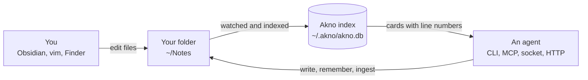
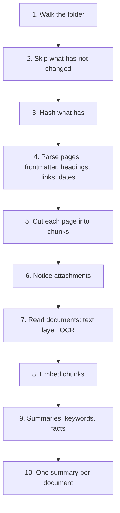
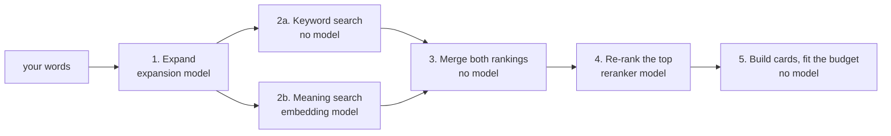
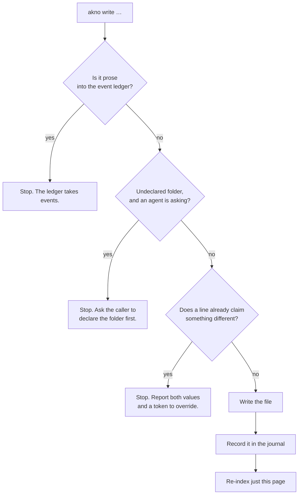
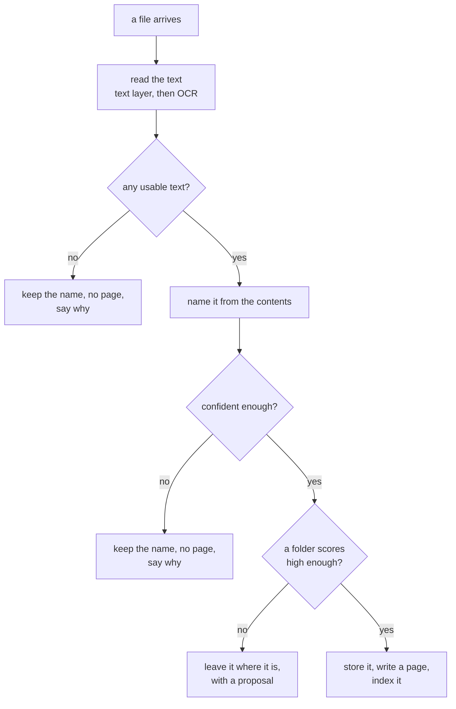
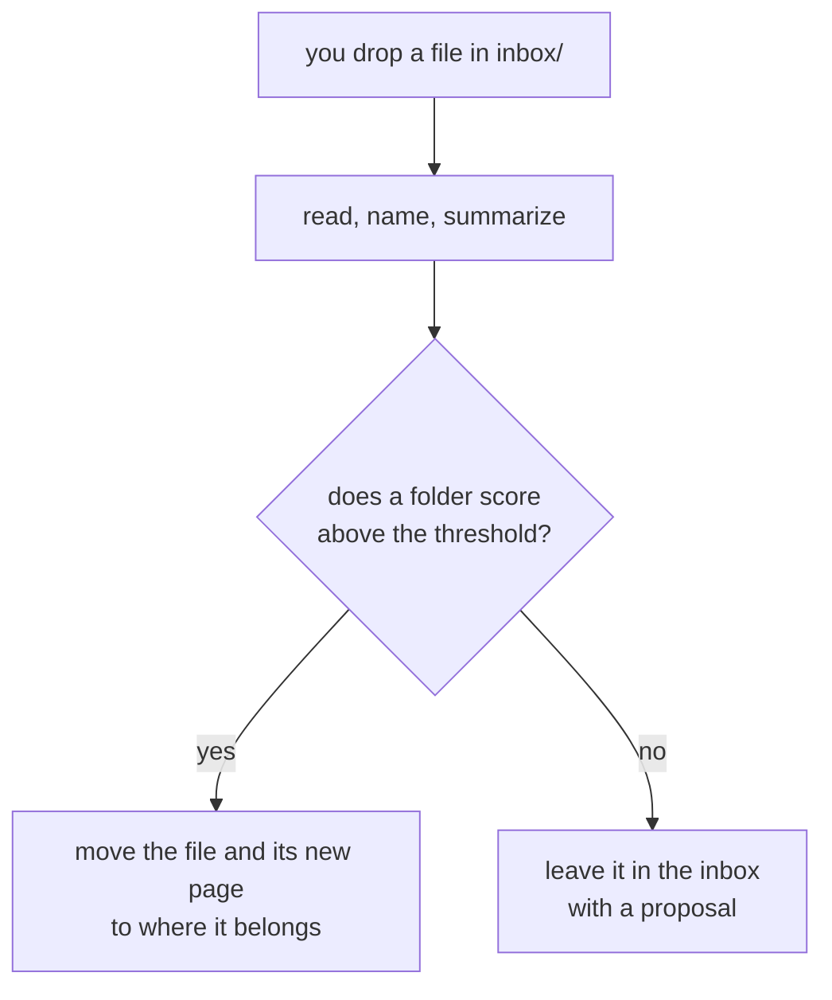
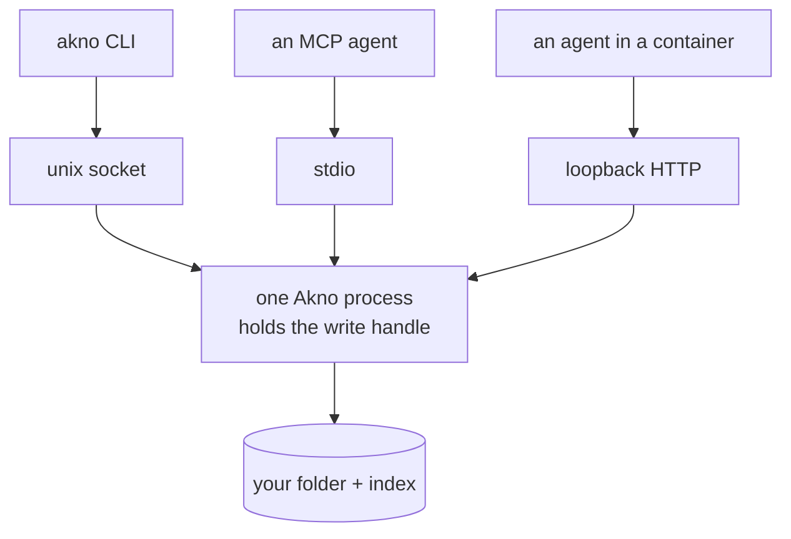

# How Akno works

A walk through every command and every background process, in plain language.

If you have not set it up yet, start with the [README](README.md#quick-start). This document assumes Akno is
pointed at a folder of notes and explains what actually happens when you run things.

---

## Contents

- [The shape of it](#the-shape-of-it)
- [Two rules that explain the rest](#two-rules-that-explain-the-rest)
- [Which model does what](#which-model-does-what)
- [`akno index` — reading your folder](#akno-index--reading-your-folder)
- [`akno recall` — asking a question](#akno-recall--asking-a-question)
- [`read`, `list`, `timeline` — looking things up directly](#read-list-timeline--looking-things-up-directly)
- [`akno context` — everything a turn needs, once](#akno-context--everything-a-turn-needs-once)
- [`akno write` — changing a page safely](#akno-write--changing-a-page-safely)
- [`akno remember` — "just keep this"](#akno-remember--just-keep-this)
- [`forget`, `undo`, `move` — taking things back](#forget-undo-move--taking-things-back)
- [Declaring a folder](#declaring-a-folder)
- [`akno ingest` — files, folders and URLs](#akno-ingest--files-folders-and-urls)
- [The inbox — drop it and forget it](#the-inbox--drop-it-and-forget-it)
- [How a PDF becomes searchable](#how-a-pdf-becomes-searchable)
- [`akno dream` — the nightly cycle](#akno-dream--the-nightly-cycle)
- [`serve` and `service` — running it properly](#serve-and-service--running-it-properly)
- [`doctor`, `rules`, `config`, `bench` — checking on it](#doctor-rules-config-bench--checking-on-it)
- [What happens when a model is missing](#what-happens-when-a-model-is-missing)
- [Where Akno keeps its own things](#where-akno-keeps-its-own-things)
- [Every command, one table](#every-command-one-table)

---

## The shape of it

You have a folder of Markdown files. Akno reads it into a small database beside it, and offers that folder to
agents through a handful of operations. You keep editing the files however you like.



Three things follow from that picture:

- **Your folder is the real thing.** The index is a reading of it, not a copy of it.
- **Changes flow both ways.** You edit by hand; agents edit through operations. Neither has to know about the
  other.
- **Nothing is hidden.** Every answer Akno gives points at a file and a line you can open.

---

## Two rules that explain the rest

**1. The Markdown is the truth.** If Akno and your folder disagree, your folder wins. Delete the whole index
and run `akno index` — every chunk, embedding, summary, fact, event and link comes back from the files.

**2. Missing pieces degrade, they do not fail.** No embedding model? Search still works, lexically. No model for
summaries? Recall still works, without them. Akno tells you what it lost instead of pretending.

Everything below is an application of those two.

---

## Which model does what

Akno uses five model roles. Most operations use none of them.

| Role          | Runs during                               | How it is called                                            |
| ------------- | ----------------------------------------- | ----------------------------------------------------------- |
| **embedding** | `index`, and the meaning half of `recall` | once per chunk when indexing; once per query when searching |
| **reranker**  | `recall`                                  | once per search, over the top candidates only               |
| **expansion** | `recall`                                  | once per search, before the search runs                     |
| **derive**    | `index`, `ingest`, `remember`, `dream`    | once per page, and once per document                        |
| **vision**    | `ingest` and `write --attach`             | once per image that has no text in it                       |

Two of these are on the path you wait for and three are not, which is the whole reason they are separate
settings:

- **`expansion` and `reranker` run inside a search you are waiting for.** Point them at something fast. Their
  output is thrown away after the answer.
- **`derive` runs while indexing, on arrival, and at night, and what it writes stays in your notes.** A slower,
  better model earns its keep here. One model can serve both roles; two is usually better.

**`maintenance.model` overrides `derive`, for the two jobs where the writing is the point:** `remember`, which
decides what is worth keeping and where it goes, and the whole nightly cycle. Set it and the rest of the system
is unaffected. Leave it unset and both fall back to `derive`.

Everything else — `read`, `list`, `timeline`, `write`, `forget`, `undo`, `move`, `approve` — runs no model at
all. They are database and file operations. What follows a write is not: changing a page re-indexes it, so
`derive` sees it again.

Nothing here is required. See [What happens when a model is missing](#what-happens-when-a-model-is-missing).

---

## `akno index` — reading your folder

This is the pass that turns files into something searchable. Run it once after setup; after that the running
service does it for you as files change.

```bash
akno index
```

```
Indexed in 255ms
  pages indexed     221
  pages unchanged   0
  chunks written    1069
  chunks embedded   1069
  pages summarized  214
  facts derived     982
  events indexed    8
  documents read    13
```

### What each pass does



| Pass                | What it is doing                                                                              | Needs a model? |
| ------------------- | --------------------------------------------------------------------------------------------- | -------------- |
| Walk                | Lists files. Skips dotfolders, `node_modules`, anything in `ignore`.                          | no             |
| Skip unchanged      | Compares size and modification time against last run. This is why a restart is not a rebuild. | no             |
| Hash                | Only for files that look changed. Confirms whether the content really moved.                  | no             |
| Parse pages         | Frontmatter, headings, `[[links]]`, dated lines, the `<!-- reference -->` fence.              | no             |
| Chunk               | Splits a page on its own headings, ~1,200 characters per chunk.                               | no             |
| Notice attachments  | Records PDFs, images and Office files, and which page owns each.                              | no             |
| Read documents      | PDF text layer, or OCR for scans. Per page of the document.                                   | no (macOS)     |
| Embed               | Turns each chunk into a vector for semantic search.                                           | embedding      |
| Derive              | One call per page: a summary, keywords, and the durable claims on it.                         | derive         |
| Summarize documents | One summary per document, so a card can say what a PDF is.                                    | derive         |

The first three passes are the reason indexing feels instant on the second run. Nothing is re-read unless its
bytes moved.

### Useful variations

```bash
akno index --structural   # skip everything that needs a model. Milliseconds.
akno index --verify       # hash every file, ignoring timestamps. The paranoid pass.
akno index --rederive     # ask the model again for summaries and facts.
akno index --rebuild      # delete the index and start over. Costs time, never data.
```

`--verify` exists because a modification time can lie — a sync client or a restored backup can put old
timestamps on new content. Akno trusts timestamps for speed and hashes everything on the periodic sweep and
whenever you ask.

---

## `akno recall` — asking a question

The command you will use most. You ask in words; you get back **page cards**: a summary, the lines that
matched, and where each line lives.

```bash
akno recall "when does the car insurance renew?"
```

```
ok mode=question 2 cards 1180 tokens
  coverage ✓ car insurance  ✗ renewal date
  nothing returned covers "renewal date" — do not answer that part

documents/car-insurance-2026 (full, 0.931)
  Car insurance 2026 › Policy
  Vulpine Mutual policy for the household car, renews 4 Nov 2026.
  documents/car-insurance-2026:11  Premium: 33 EUR/month (raised at renewal; was 28) ~0.94
```

### Reading that output

| What you see                   | What it means                                                                    |
| ------------------------------ | -------------------------------------------------------------------------------- |
| `mode=question`                | Akno inferred you asked a question, not a keyword lookup.                      |
| `2 cards 1180 tokens`          | Two pages came back, and the whole answer costs about 1,180 tokens.              |
| `coverage ✓ … ✗ …`             | Which parts of your question the results actually cover — and which they do not. |
| `documents/car-insurance-2026` | The page. `full` is its class; `0.931` is how relevant it is.                    |
| `Car insurance 2026 › Policy`  | Which heading the best match sat under.                                          |
| `…:11`                         | File and line. Open it and check.                                                |
| `~0.94`                        | How confident the deriver is that this line states a solid durable claim.        |

That coverage line is the point of the whole thing. If the answer to half your question is not in your notes,
Akno says so rather than letting an agent fill the gap.

### What happens inside



Three model calls at most, and each one is optional. Without the expansion model your exact words are searched
for; without the embedding model the meaning half drops out and keyword search carries the answer; without the
reranker the merged ranking is the final one. The result says which of these happened rather than quietly
returning less.

Step 1 is different depending on what you asked, which is what `mode` selects:

| Mode       | Use it for                           | What expansion does                                  |
| ---------- | ------------------------------------ | ---------------------------------------------------- |
| `lookup`   | "car insurance renewal"              | adds synonyms and word forms                         |
| `question` | "when does the car insurance renew?" | writes a _hypothetical answer_ and searches for that |
| `explore`  | "anything about the car?"            | goes broad, returns summaries only                   |

Why the hypothetical answer? Because a question does not sound like its answer. "When does the car insurance
renew?" shares almost no words with "Renews 4 Nov 2026". So in question mode Akno invents a plausible answer
and searches for _that_ — it matches the shape of the real one.

### Narrowing it down

```bash
akno recall "rent" --folder home            # only inside home/
akno recall "invoice" --type receipt        # only pages with type: receipt
akno recall "lease" --tag legal,home        # only pages with both tags
akno recall "policy wording" --include reference --depth full   # include evidence pages, in full
akno recall "rent" --budget 2000            # keep the answer small
```

---

## `read`, `list`, `timeline` — looking things up directly

When you already know what you want, do not search for it.

### `read` — one exact thing

```bash
akno read home/lease
akno read home/lease --from 10 --to 20
akno read --document doc_a1b2c3d4
akno read --document household/lease-8e7705eb.pdf   # or just `lease-8e7705eb.pdf`
```

`read` always gives you the whole body, even for pages recall would only quote a window of. Recall is a
relevance policy; `read` is you asking directly.

### `list` — browse the structure

```bash
akno list                        # folders, with how many pages each holds
akno list --kind pages --folder home
akno list --kind tree --depth 2  # an outline
akno list --type receipt --order recent
```

Useful before writing: an agent that can see your folders stops inventing new ones.

### `timeline` — when things happened

```bash
akno timeline --since 2026-01 --until 2026-06
akno timeline --match dishwasher
akno timeline --subject people/ada-marlow
```

Events come from two places: the ledger in `timeline.md`, and **any dated line on any page**. Write
`- **2026-03-20** | Replaced the dishwasher` on your appliances page and the timeline finds it. You do not have
to keep a separate diary.

---

## `akno context` — everything a turn needs, once

This one is for whoever builds the agent, not usually for you at a prompt. It assembles the whole pre-turn
bundle against **one** budget: pinned pages, recent events, a structure outline, and this turn's recall.

```bash
akno context "the dishwasher is making a noise again" --budget 8000 --pin home/appliances
```

The point of one budget is that the parts compete honestly. Four separate calls each with its own limit will
overflow the model's window together while each one believes it behaved.

---

## `akno write` — changing a page safely

Write creates a page, or appends to one, or patches it. What makes it safe is the order things happen in.



Nothing is half-done: a write that is going to be refused is refused before your file is touched, and a write
that lands is recorded before anything else happens.

### The everyday shapes

```bash
# add a line to a page
akno write --slug home/lease --append "- Deposit: 2222 EUR"

# create a page
akno write --slug home/wifi --title "Wi-Fi" --content "Router in the hallway cupboard."

# replace one exact string
akno write --slug home/lease --replace "1111 EUR" --with "1234 EUR"

# add a timeline entry at the same time, in one undoable change
akno write --slug home/appliances --append "- Serviced 4 August." \
             --event "2026-08-04=Dishwasher serviced."

# attach a file to a page
akno write --slug home/dishwasher --append "Repaired today." \
             --attach ~/Desktop/receipt.pdf=The invoice

# see what would happen, touch nothing
akno write --slug home/lease --append "- Deposit: 2222 EUR" --dry-run
```

### When two lines disagree

```
conflict — nothing was written
  page      home/lease:7
  on file   - Rent: 1111 EUR per month
  incoming  - Rent: 1234 EUR per month

  ask the user which is current, then:
  akno write … --resolve-conflict c8f21a90b3d4
```

Akno noticed that your page already says something different about the same thing, and stopped. It does not
guess which is current — you decide, then repeat the write with the token.

This check is deliberately cheap: it compares structured lines like `Rent: 1111 EUR` and only fires when both
values contain numbers or dates. Free prose rarely contradicts itself in a way a machine can see, and a check
that thought otherwise would block half your writes. The slower, thorough check runs at night — see
[`dream`](#akno-dream--the-nightly-cycle).

---

## `akno remember` — "just keep this"

`write` is for when you know the page and the wording. `remember` is for when you do not.

**Which model:** `maintenance.model` if you set one, otherwise `derive`. It is one call to decide what in the
text is worth keeping, then a `recall` to find where each claim belongs — so a `remember` costs a derive-class
call plus a search, not a call per claim.

```bash
akno remember "Decision: switching the internet plan to Blackwater Fibre at 39 EUR a month from 1 October."
```

```
ok

Wrote
  event  timeline:24
```

That one was a dated decision, so it became a timeline line and nothing else. When a claim also belongs on a
page, the report shows what it weighed:

```
ok

Considered
  keep The rent increases to 1234 EUR from September 2026.
       → home/lease (0.82)
  ask  The landlord agreed to repair the kitchen tap.
       → no page scored high enough

Wrote
  appended  home/lease:8
  event     timeline:41
```

What it does, in order:

1. Reads your text and keeps only what lasts — decisions, values, dates, preferences. Chatter, speculation and
   anything true only today are dropped. The curator receives the complete visible folder taxonomy, including
   empty and newly declared folders, and may only suggest a page beneath one of those folders.
2. Searches your notes for where each claim belongs, within the folder the curator selected. A topical match in
   another taxonomy branch cannot override that filing decision.
3. Checks for conflicts, exactly as `write` would.
4. Appends **prose** to the right page — not a row in a table. Facts get derived from that sentence afterwards.
5. Puts anything dated on the timeline as well, in the same undoable change.

Where it was not confident enough about the destination, it says so instead of guessing. `--dry-run` shows the
whole plan without writing.

### Telling it what to notice in _this_ text

A host handing over a conversation often knows something about it that the text does not say: that a message was
forwarded and its facts belong on somebody else's page, that a channel is mostly logistics, that today's subject
is medical. That travels with the call:

```jsonc
{
  "text": "Forwarded from Brannoch: my membership number is 88-4120.",
  "source": "telegram:2026-08-07",
  "mission": "Attribute forwarded content to its original author, not the forwarder.",
}
```

It is **emphasis, not a replacement**. Your words are appended to the standing rules about what lasts, never
substituted for them — otherwise one careless instruction would discard every guardrail at once. A caller that
wants to decide the phrasing and the page itself should use `write`, which is exactly that.

Omit it and `maintenance.retain.mission` applies instead, so an install-wide policy still holds. The digest also
runs on `maintenance.model` when one is set: it is a maintenance tier, and an install that pointed the nightly
cycle at a strong model should not have to say so twice.

---

## `forget`, `undo`, `move` — taking things back

### `forget` — retract something

```bash
akno forget --fact fact_9c2e11ab     # remove the sentence that produced a fact
akno forget --slug home/old-notes    # move a page to trash
akno forget --document doc_a1b2c3d4  # move a document to trash
```

Forgetting a fact edits the Markdown, because that is where the fact came from. There is no separate store to
delete from. Trashed files go to Akno's trash folder and stay there for 30 days.

### `undo` — reverse any change

```bash
akno undo --list
akno undo chg_7f3a9c21
```

```
ok reversed appended home/lease
  restored  home/lease.md
```

Every write, ingest, move, forget and maintenance run is one journalled change with an id. Undo puts the exact
previous bytes back. For a file that was _created_, undo removes it — and says `removed`, not `restored`.

### `move` — relocate a page

```bash
akno move home/lease home/rental/lease
```

The page moves, its attachments move with it and are renamed to match, embeds inside the page are rewritten,
and **inbound links from other pages are reported rather than rewritten** — editing five other people's pages
is a bigger action than you asked for.

---

## Declaring a folder

An agent inventing folders is how a tidy knowledge base turns into forty top-level directories. This used to
be handled by asking you: a new top-level folder became a proposal and an approval card.

That was the wrong question put to the wrong person. You cannot usefully rule on whether a research note needs
a `research/` folder, and while the question waited the note was lost. Worse, an agent that learns a folder
request may be declined learns to append to whatever page already exists instead — which is how claims land on
the pages of unrelated subjects.

So **nothing waits on you any more.** What is refused is not the folder but the _silence_: a write into an
undeclared folder comes back asking for a sentence.

```
'warranties' is not declared — nothing was written
  could go instead  home, documents, receipts

  say what belongs there, then repeat the write:
  akno folder warranties --description "…"
```

```bash
akno folder warranties --description "Appliance and electronics warranties, with their expiry dates."
akno folder conversations --description "Chat transcripts: what was said." --class reference
```

The description is the point of the step. It is returned by `list` and carried in the pre-turn bundle, so it is
what the _next_ caller reads before filing a page — and `research/` versus `household/` is not self-explanatory
to anyone who has not been told that one holds findings about the world and the other holds claims about this
household. `--class reference` is the other load-bearing choice: only claims become facts, so a folder of
transcripts or legal texts declared `full` gets mined for assertions nobody made.

The rule is written to `<akno_path>/akno.json` as a textual insert, so every comment already in that file
survives and the diff is one hunk. It is in force immediately — declare and write in the same turn.

`gate` in config still decides how deep this applies: `top-level` (the default) asks about a new top-level
folder and lets subfolders of a described one through. A folder you create yourself is yours and is never
questioned, and `--actor user` writes wherever you say.

Proposals still exist, for the one question only you can answer: `remember` kept a claim, nothing scored high
enough to hold it, and it could not name a page for it either.

```bash
akno approve --list          # what is waiting
akno approve prop_5c1e77a2 --slug home/warranties
akno decline prop_5c1e77a2
```

---

## `akno ingest` — files, folders and URLs

Hand Akno a file and it does the whole job: read the text, name it from what is inside, summarize it, decide
where it goes, and index it.

**Which model:** `derive`, once, to name and summarize the document. Getting the text out is not a model job —
a PDF's text layer is read directly and a scan is OCRed locally. `vision` is called only for an image that
turns out to have no text in it at all, to describe what it shows.

```bash
akno ingest ~/Downloads/policy.pdf
akno ingest ~/Downloads --limit 20
akno ingest https://example.com/policy.pdf
akno ingest ~/Desktop/scan.pdf --folder documents   # you choose the folder
```

```
ok change chg_61c811fc
  page          documents/car-insurance-2026
  file          documents/car-insurance-2026-91de77c4.pdf
  pages         9
  text from     the document's own text layer
  renamed from  Scan 2026-08-06 at 14.22.pdf

  Northwind motor policy, 33 EUR/month, renews 4 Nov 2026, second driver covered.
```

### What it decides, in order



### The three things it refuses to do

- **Rename a file whose name already says something.** `2024-lease-agreement.pdf` keeps its name.
  `IMG_4821.HEIC` does not — that name says nothing, which is the whole reason to replace it.
- **Name a file it could not read.** A photo of a garden gets no invented title. It keeps its name and is
  reported.
- **File a document it cannot place.** If no folder is clearly right, the file stays exactly where it is with a
  note about it. A misfiled document is a lost one.

### Reading a folder

Folders are walked **one level deep**, and every file gets its own verdict:

```
5 files
  invoice-june.pdf     filed           receipts/vulpine-mutual-invoice-2026-06
  invoice-july.pdf     filed           receipts/vulpine-mutual-invoice-2026-07
  garden.jpg           skipped         nothing could be extracted
  contract.pdf         needs a home    nothing scored above 0.5
  duplicate.pdf        already stored  receipts/vulpine-mutual-invoice-2026-06-91de77c4.pdf
```

One unreadable file does not abandon the rest, and if `--limit` cut the pass short, the report says how many
were not looked at.

### Reading a URL

Only `http` and `https` — a `file://` URL would turn "fetch this" into "read anything on my disk". The size
limit applies to the bytes that actually arrive, not to the size the server claims. The final URL is saved into
the page as `source_url`, because "where did this come from" is the one question a downloaded file cannot
answer for itself.

---

## The inbox — drop it and forget it

An inbox is any folder you mark with `route: true`:

```jsonc
// akno.json in your notes folder, or config/local.jsonc
"folders": {
  "inbox/**": { "ingest": "auto", "route": true }
}
```

Now drop anything in it.



```bash
akno inbox          # process what is sitting there now
```

```
1 filed
  → inbox/Scan 2026-08-06 at 14.22.pdf  became  receipts/vulpine-mutual-invoice-2026-06

1 still in the inbox
  · inbox/contract.pdf
    nothing scored above 0.5 — the file stays where it is
```

A running service does this as files land, so usually you never type the command.

**The inbox is the only place Akno moves files.** A file you put straight into `documents/` was put there on
purpose — Akno will name it, page it and index it, but never relocate it.

And when routing is not sure, the file **stays in the inbox**. That is deliberate: an inbox with three things
in it is a to-do list, and you will see it. A file confidently filed into the wrong folder is gone.

---

## How a PDF becomes searchable

Akno reads every attachment and indexes its text **against the document**, not into your page. So you can
search the contents of a PDF and get told which page of it matched.

```
akno recall "who replaced the drain pump"

household/dishwasher-repair (full, 0.91)
  household/dishwasher-repair-8e7705eb.pdf p1
    MERIDIAN APPLIANCE CARE
    Replaced the drain pump
```

The page beside the file stays short — what the document is, and a link to it. Its text is not pasted in,
because a copy in your Markdown is a copy that cannot be corrected when the file changes.

### Scanners that split one document in two

`passport.pdf` and `passport-2.pdf` are one document, not two. Akno treats files that differ only by a
trailing `-2`, `-3` as parts of the same thing: one page, one summary, and page numbers that run through the
whole document — so a hit on the second file's first page is cited as page 5 of the passport.

The rule is deliberately narrow, because welding two unrelated documents together would be worse than missing
a pair. All of these must hold: the same extension, the same folder, a one or two digit suffix that does not
follow another digit (so `bill-2026-07-28.pdf` is a date, not part 28), and part one has to exist.

### Files nothing points at

Recall answers with pages, so a document no page mentions has nowhere to appear. Akno links a file to a page
when the filename matches (`passport.pdf` next to `passport.md`), when it follows the
`<page>-<8 characters>.pdf` shape Akno itself writes, or when **any page embeds it** with `![[filename]]`.
Anything still unlinked gets a page of its own from the nightly cycle.

---

## `akno dream` — the nightly cycle

Slow work that should not happen while you are waiting: noticing patterns, finding contradictions, tidying
reports. Five phases, each independent and safe to run twice.

**Which model:** `maintenance.model` for the whole cycle if set, otherwise `derive`. `adopt` and `housekeeping`
are mostly bookkeeping; `observe`, `reflect` and `conflicts` are the phases that actually spend calls, and they
run at 3am precisely so a slow model costs you nothing.

```bash
akno dream              # every enabled phase
akno dream --dry-run    # show what it would write, write nothing
akno dream --phase conflicts
```

| Phase          | Writes?       | What it does                                                                        |
| -------------- | ------------- | ----------------------------------------------------------------------------------- |
| `observe`      | appends lines | Notices patterns across repeated facts. **Off by default.**                         |
| `reflect`      | appends lines | Builds principles on top of observations. **Off by default.**                       |
| `adopt`        | creates pages | Gives a document with no page a page, so its text can be found at all.              |
| `conflicts`    | never         | Finds two pages that state different values for the same thing.                     |
| `repair`       | edits pages   | Acts on the two above: repoints links, retires replaced claims. **Off by default.** |
| `housekeeping` | never         | Broken links, unlinked documents, pages that drifted from their folder's rules.     |

`conflicts` and `housekeeping` only ever report, which is the safe default and, run nightly for a
year, a to-do list nobody reads. `repair` is the phase that acts on them, and it is off by default
because it is the only one that edits pages you wrote:

- **Broken links** are repointed, never removed. A link is a pointer, not a claim — moving it changes
  no assertion, it restores an address you meant. The target is matched on the tokens of the whole
  slug, path included, so `personal/residence-permit-ada-marlow` finds
  `ada-marlow/residence-permit` (every word survives, only its position moved) while
  `bo-winters/spare-travel-passport` does **not** match a page called
  `ada-marlow/passport` (one word in five, and somebody else's document). Where several pages
  could be meant, the maintenance model chooses — from that list only, never a page of its own
  invention.
- **A conflict's stale side** is rewritten into the past tense, never deleted. The sentence stays on
  the page, which is what makes it read as superseded rather than disappear — a fact marked stale
  only in the index is live again the next time its page is read. Every number in the original must
  survive the rewrite or it is refused: changing a tense is tidying, changing a value is a model
  deciding what your rent is.
- **Everything it will not touch is reported with the reason.** A repair tier that skips silently is
  indistinguishable from a broken one.

One journalled change per night, so `akno undo` takes the whole run, and a ceiling per run so a
bad night is a small bad night. Try it with `--dry-run` first: on the knowledge base this was built
against, the dry run is what caught the passport case above.

```
Dream — 1.3s
  observe       skipped  disabled in config
  reflect       skipped  off by default — enable it once the knowledge base has the volume for it
  adopt         ran  2ms
  conflicts     ran  1.3s
  housekeeping  ran  5ms

5 conflict candidate(s) — 0 to look at, 5 judged not a conflict

Housekeeping
  broken links           12
  orphaned documents     1
  pages off their rules  0
```

### Why two phases ship switched off

`observe` writes sentences it inferred into your notes, and once written they read like anything else you
wrote. So it is opt-in, and its rules are enforced in code rather than asked for in a prompt:

- at least two **different** pages as evidence, and every page it cites is checked against what it was shown
- claims only — never a `reference` page like a contract or an email
- never its own output as evidence for more output
- no hedging: "might", "seems", "possibly" are refused outright
- nothing about anyone's health, relationships, finances, beliefs or character
- nothing that describes your files rather than your life

On a real 223-page knowledge base with a small local model, those rules refused 18 suggestions and passed 15,
of which about four were worth keeping. With a strong model: 8 suggestions, **none refused**, most of them
useful. Which is why the cycle can use a different model from everything else:

```jsonc
"maintenance": {
  "model": { "provider": "openai", "id": "your-good-model" },
  "observe": { "enabled": true }
}
```

Read the first run with `--dry-run` before letting it write.

### Keeping a record of what it did

`akno undo <change-id>` reverses a night's work, and the index keeps the bytes of every change — so what a run
_wrote_ is always recoverable. What is not recorded by default is the reasoning: which pattern a guard refused
and why, which phase was skipped, what it deliberately left alone. Turn that on and every run appends one JSON
object to `<state_dir>/logs/dream.jsonl`:

```jsonc
"maintenance": {
  "log_changes": true
}
```

```bash
# every suggestion a guardrail refused, over every run so far
jq -r '.rejected[] | "\(.reason): \(.pattern)"' ~/.akno/logs/dream.jsonl
```

It is off by default on purpose. A log of inferences drawn from your notes is a second copy of the private part,
sitting outside your notes — worth having while you decide whether to trust the cycle, and your decision to
make. `--dry-run` writes a record too, marked as one, so you can review a night that never touched a file.

### Why the conflict phase never fixes anything

It reports. On that same knowledge base it found five candidate contradictions and the model correctly cleared
all five — three months of bank statements with different totals, and three different Rome addresses filed
under one heading. A pass that had "fixed" those would have destroyed correct records.

---

## `serve` and `service` — running it properly

Starting a new process for every question costs about 33 ms; a running one answers in 0.04 ms. So Akno is
meant to run as a small background service.

```bash
akno serve                            # unix socket, the default door
akno serve --mcp                      # stdio MCP, for any agent that speaks it
akno serve --http 127.0.0.1:7777      # for agents in a container or on another machine
```



All three doors are generated from the same list of operations, so they cannot drift apart. What differs is
trust: the MCP door exposes only the five read operations by default, so an agent reaching Akno that way
cannot write until you allow it.

**Only one process may write.** A second one opens read-only and says so. That is why `akno index`,
`akno inbox` and `akno dream` are sent _through_ a running service when there is one — they need the write
handle, and the service has it. Without a service they simply run in place.

### Install it as a background agent

```bash
akno service install     # writes two launchd agents
akno service status
akno service uninstall
```

Two agents: the service itself, which restarts if it ever stops, and a nightly `dream` at 03:00. Use
`--dream-hour 4` to move it or `--no-dream` to skip it. Logs land in your state directory.

---

## `doctor`, `rules`, `config`, `bench` — checking on it

### `doctor` — what is working, and what each gap costs

```bash
akno doctor
```

```
Akno
  knowledge base  /Users/you/Notes
  writable        yes
  vector backend  sqlite-vec

Index
  pages            221 (122 full, 99 reference)
  chunks           1142 (1142 embedded)
  facts            1036 live, 0 superseded
  documents        13 (13 extracted)
  links            136 (12 broken)

Models
  embedding  ok 68ms
  reranker   ok 60ms
  derive     ok 81ms
  expansion  ok 44ms
  vision     unavailable
    without it: photos with no text yield no page; OCR still covers scans and screenshots

2 warnings
  · 1 attachment has text that recall cannot reach, because no page owns it
  · 12 wikilinks point at pages that do not exist
```

The last column of the models section is the important part: not "reranker missing" but what you lose without
it. Model latency and index latency are shown separately, because a system that feels slow after idling is
almost never slow because of its database.

### `rules` — why is this page treated that way?

```bash
akno rules                       # every rule, most specific first
akno rules articles/some-page    # what governs this one path
```

```
articles/some-page
  class  reference

  matched, most specific first:
    articles/**  ~/Notes/akno.json
```

So you get the setting that actually applies, and the file the rule came from. When nothing matches, it says
so and names the default.

### `config` — what settings are actually in effect

```bash
akno config
```

Prints the merged configuration with secrets replaced by the name of the environment variable they come from,
and lists the files it was assembled from, lowest priority first. The fastest way to find out why a setting you
changed is not doing anything.

### `bench` — is it still fast?

```bash
akno bench --write
```

Asserts the budgets that matter and _reports_ the ones that depend on your models, rather than failing because
your GPU was busy.

---

## What happens when a model is missing

Nothing breaks. Things get simpler, and Akno says which.

| Missing   | What still works                                       | What you lose                                      |
| --------- | ------------------------------------------------------ | -------------------------------------------------- |
| Embedding | keyword search with stemming, all reading, all writing | semantic matching; question-mode hypotheticals     |
| Reranker  | everything                                             | the final precise ordering of results              |
| Derive    | search, reading, writing, `ingest` of readable files   | summaries, keywords, facts, `remember`, `observe`  |
| Expansion | everything                                             | synonyms and related words — your exact words only |
| Vision    | everything, including OCR of scans and screenshots     | a description of a photo that contains no text     |

The two text roles are separate because one is allowed to be slow. **Derive** runs while indexing, on arrival and
at night, and what it writes stays in your notes — a bigger model earns its keep. **Expansion** runs inside a
recall you are waiting for, so it wants a fast one. One model can serve both; two is usually better.

With no models at all, Akno is still a fast, addressable, line-citing search over your notes.

---

## Where Akno keeps its own things

```
~/.akno/
  akno.db        the index. Delete it and re-index; you lose nothing.
  akno.sock      the socket the service listens on
  akno.lock      which process holds the write handle
  trash/           what forget and undo moved aside, kept 30 days
  logs/            service and nightly-cycle logs
```

Inside **your** folder, Akno only ever touches:

- `timeline.md` — the event ledger, if you use one
- `inbox/` — only if you created it
- `observations/` — only if you switch `observe` on
- one frontmatter key, `id`, and only if you set `write_ids: true`
- `<file>.txt` beside a document — only if you switch `ingest.text_rendition` on

Everything else in your folder is yours. Every other frontmatter key is preserved exactly, including ones
Akno has never heard of.

---

## Every command, one table

| Command               | In one line                                               | Writes to your folder? | Models                              |
| --------------------- | --------------------------------------------------------- | ---------------------- | ----------------------------------- |
| `recall <query>`      | Search, and get lines with addresses                      | no                     | expansion, embedding, reranker      |
| `read <slug>`         | One page or document, in full                             | no                     | —                                   |
| `list`                | Browse folders, pages, or an outline                      | no                     | —                                   |
| `timeline`            | What happened, filtered by date, subject or text          | no                     | —                                   |
| `context <query>`     | The whole pre-turn bundle against one budget              | no                     | same as `recall`                    |
| `write`               | Create, append, patch or replace a page                   | **yes**                | vision, only for `--attach`         |
| `remember <text>`     | Keep what matters from some notes, in the right place     | **yes**                | maintenance or derive, + recall     |
| `forget`              | Retract a fact, or trash a page or document               | **yes**                | —                                   |
| `undo <id>`           | Reverse any change                                        | **yes**                | —                                   |
| `move <from> <to>`    | Relocate a page with its documents                        | **yes**                | —                                   |
| `approve` / `decline` | Resolve something an agent asked permission for           | **yes** on approve     | whatever the held call needed       |
| `ingest <path\|url>`  | Read a file, name it, file it                             | **yes**                | derive; vision for text-less images |
| `inbox`               | Process whatever was dropped in an inbox folder           | **yes**                | same as `ingest`, per file          |
| `dream`               | The nightly cycle                                         | only `observe`/`adopt` | maintenance or derive               |
| `index`               | Reconcile the index with your folder                      | only if you asked¹     | embedding, derive                   |
| `serve`               | Run as a service, with all three doors                    | no                     | —                                   |
| `service`             | Install or remove the background agents                   | no                     | —                                   |
| `doctor`              | What works, what does not, and what that costs            | no                     | pings each configured one           |
| `rules [path]`        | Which rule governs a path, and why                        | no                     | —                                   |
| `config`              | The settings actually in effect, and where they came from | no                     | —                                   |
| `bench`               | Check the performance budgets                             | no                     | embedding, expansion, reranker      |

¹ Nothing by default. `write_ids: true` adds a frontmatter `id:`; `ingest.text_rendition: true` keeps a
`<file>.txt` beside each document it can read. Both are off until you turn them on.

Anything writing to your folder also re-indexes what it touched, so `derive` sees the changed page again.

Add `--help` to any of them for the full flag list, and `--json` to any of them to get a machine-readable
version of the same answer.
