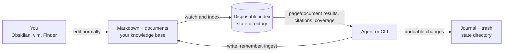
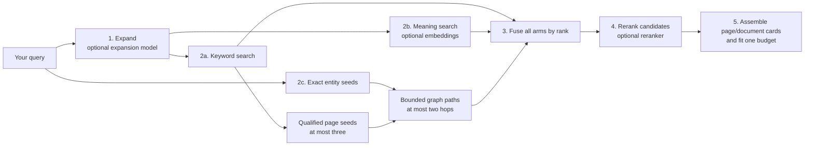
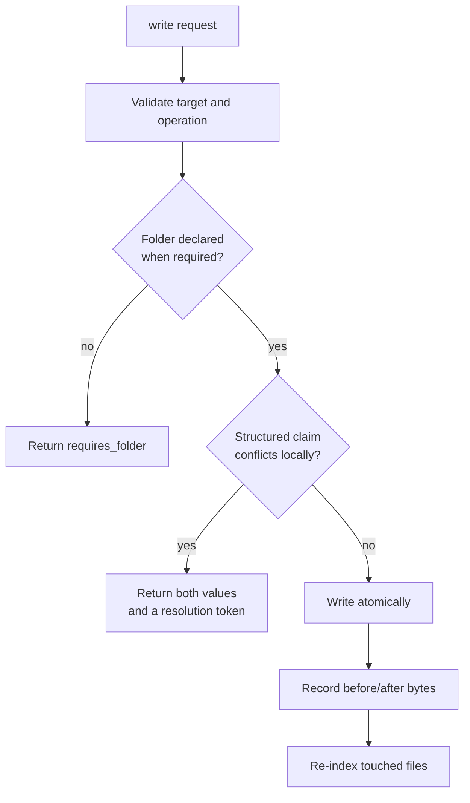
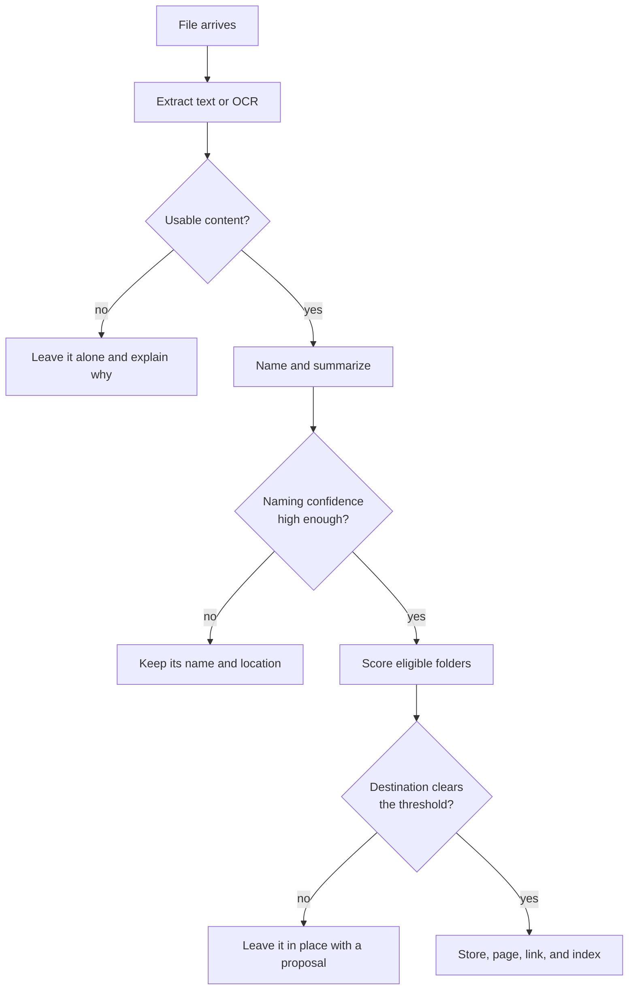
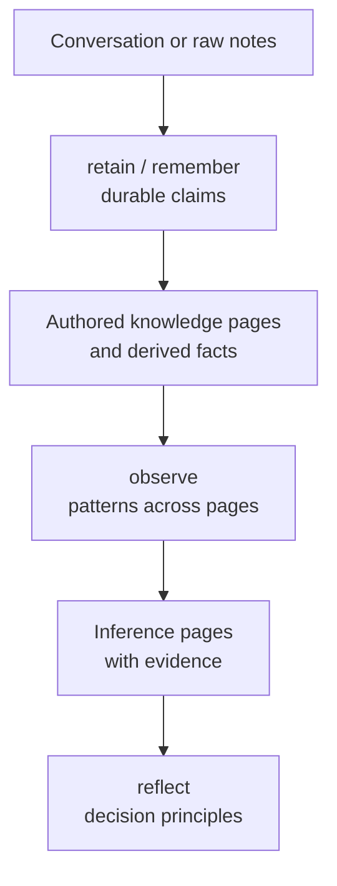
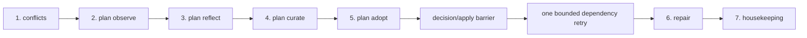

# How Akno works

Akno is a memory layer for agents, built on a folder of Markdown files that you own.
It helps an agent find what your notes actually say, show where each answer came from, and
make deliberate, reversible changes without taking control of the folder away from you.

This guide explains the user workflows first, then the machinery behind them. If Akno is
not installed yet, start with the [README quick start](README.md#quick-start).

---

## Contents

- [What Akno is useful for](#what-akno-is-useful-for)
- [The mental model](#the-mental-model)
- [Choose the right method](#choose-the-right-method)
- [A first useful run](#a-first-useful-run)
- [How indexing works](#how-indexing-works)
- [Ways to retrieve knowledge](#ways-to-retrieve-knowledge)
- [Ways to capture and change knowledge](#ways-to-capture-and-change-knowledge)
- [How folders, roles, and rules work](#how-folders-roles-and-rules-work)
- [How documents and the inbox work](#how-documents-and-the-inbox-work)
- [The dream cycle, phase by phase](#the-dream-cycle-phase-by-phase)
- [Models and graceful degradation](#models-and-graceful-degradation)
- [Running Akno as a service](#running-akno-as-a-service)
- [Diagnostics and recovery](#diagnostics-and-recovery)
- [What Akno does not solve yet](#what-akno-does-not-solve-yet)
- [Command reference](#command-reference)

---

## What Akno is useful for

Akno is most helpful when an agent needs continuity across conversations but the knowledge
must remain inspectable and under your control.

It turns common requests into grounded workflows:

- **“What did we decide?”** Search the notes, return the relevant page and exact lines, and
  say which parts of the question were not answered.
- **“Keep this for later.”** Extract the durable parts of a conversation, find the canonical
  page, append the knowledge, and record the change for undo.
- **“File this scan.”** Extract or OCR it, give an unhelpful filename a meaningful name, route
  it only when the destination is sufficiently clear, and make its contents searchable.
- **“What changed over time?”** Combine a central event ledger with dated lines from any page.
- **“Is the knowledge base still coherent?”** Find cross-page conflicts, broken links,
  unowned documents, and pages that have drifted from their folder rules.

The primary retrieval path supplies **evidence with addresses** and an explicit account of missing coverage.
`recall` leaves reasoning to the caller. A separate `answer` surface now composes over that same retrieval path
for direct grounded responses. It uses structured answer blocks, maps request-local evidence ids back to exact
citations itself, rejects invented exact values or introduced negation, and runs a separate semantic support
verifier before returning prose.

Akno is a good fit when:

- Markdown is already the durable record, or you want it to become the durable record.
- You want people and agents to edit the same files.
- Citations, reversibility, and honest absence matter more than a frictionless black box.
- You are comfortable running a local service on macOS and configuring model endpoints.

It is not a replacement for a note editor, a chat interface, a backup system, or a source of
truth about the world. It only knows what the indexed files and documents contain.

---

## The mental model



Four rules explain most of the system:

1. **The files are the truth.** The database is a derived reading of them. Delete it and run
   `akno index`; the knowledge base remains intact.
2. **The index is not a second knowledge base.** Search chunks, embeddings, summaries, facts,
   links, and events can all be rebuilt.
3. **Every returned claim has an address.** Page text is cited as `slug:line`; document text is
   cited with the document name and page number.
4. **Missing capabilities degrade explicitly.** If a model or the index is unavailable, Akno
   returns a typed degraded or unavailable result instead of quietly pretending it searched
   normally.

### Pages and documents have different jobs

A Markdown page says what a document is and why it matters. The document keeps its own text.
Akno indexes both, but it does not paste an extracted PDF into the page beside it. That avoids
duplicate search hits and prevents a stale copy from surviving after the file changes.

### Evidence and knowledge have different jobs

Not every page should be treated as a claim you endorse. A contract, email, transcript, or
article may be useful evidence without being canonical knowledge.

| Role        | Searchable? | Normal recall behavior                                | Fact-derived? |
| ----------- | ----------- | ----------------------------------------------------- | ------------- |
| `knowledge` | yes         | Summary plus matching lines; full body when requested | yes           |
| `source`    | yes         | Summary plus a capped quotation window                | no            |
| `inference` | yes         | Returned below authored knowledge                     | no            |
| `ignored`   | no          | Never returned                                        | no            |

A `<!-- source -->` fence can switch a knowledge page into evidence partway through the file.
Content above the fence is canonical; content below it remains searchable but is not fact-mined
or returned in full by default.

Roles are retrieval policy, not access control. An exact `read` can still return a source page.

---

## Choose the right method

The command surface is deliberately small, but several commands can look similar. Choose by how
much you already know about the answer or change.

| Your intent                                 | Method                   | Why this one                                                    | Writes files?    |
| ------------------------------------------- | ------------------------ | --------------------------------------------------------------- | ---------------- |
| Find evidence for a fuzzy question          | `recall`                 | Returns relevant cited sections for inspection                  | no               |
| Ask for a direct memory-grounded answer     | `answer`                 | Composes over recall; compact answer/related-source contract    | no               |
| Open a page or document you already know    | `read`                   | No ranking or truncation policy                                 | no               |
| Browse the shape of the knowledge base      | `list`                   | Shows folders, pages, or a tree                                 | no               |
| Inspect how exact records are connected     | `graph`                  | Returns bounded evidence paths and locators, without bodies     | no               |
| Ask what happened in a period               | `timeline`               | Uses structured events and dated lines                          | no               |
| Prepare everything an agent turn needs      | `context`                | Fits pins, recent events, structure, and recall into one budget | no               |
| Put exact wording on an exact page          | `write`                  | The caller controls destination and text                        | yes              |
| Keep the durable parts of unstructured text | `remember`               | Akno decides what lasts and where it belongs                  | yes              |
| Bring in a file, folder, or URL             | `ingest`                 | Extracts, names, routes, stores, and indexes                    | yes              |
| Process a drop folder                       | `inbox`                  | Applies ingest automatically to arrivals                        | yes              |
| Correct, remove, or relocate something      | `forget`, `undo`, `move` | Preserves file-level semantics and history                      | yes              |
| Run slow maintenance                        | `dream`                  | Performs bounded, repeat-safe background phases                 | depends on phase |
| Review or apply maintenance proposals       | `plan`                   | Uses durable exact diffs, decisions, and verification receipts  | apply only       |

Two rules of thumb prevent most misuse:

- If you know the destination and wording, use `write`; if you are handing over raw material,
  use `remember`.
- If you know the slug, use `read`; if you need evidence, use `recall`; if you need the direct grounded
  response, use `answer`. Use `graph` when the relationship between exact records is itself what you need to
  inspect. Do not call `answer` and `recall` by default for the same question: `answer` already retrieves.

The CLI exposes these methods to a person. The in-process, socket, HTTP, and MCP interfaces expose
the same operations to an agent from one registry, with the same schemas and errors.

---

## A first useful run

After configuring `akno_path`, start read-only. Index, diagnose, ask a question, and inspect the
source before enabling any automatic writing.

```bash
akno index
akno doctor
akno recall "when does the car insurance renew and what is the excess?"
akno read household/car-insurance
```

No notes to use yet? The repository includes a completely invented example:

```bash
cp -R examples/demo-brain ~/akno-demo
export AKNO_STATE_DIR=~/akno-demo-state
akno --akno-path ~/akno-demo index
akno --akno-path ~/akno-demo doctor
akno --akno-path ~/akno-demo recall "who services the boiler?"
```

Copy the demo before using write operations; `remember`, `ingest`, and enabled dream phases can
change the folder.

A practical adoption path is:

1. **Search only:** index, recall, read, list, timeline, and context.
2. **Explicit writes:** use `write`, `remember --dry-run`, and `undo` until the filing behavior is
   familiar.
3. **Document intake:** declare folder rules, then try one file with `ingest` before enabling an
   inbox.
4. **Background operation:** install only the service and watcher with `akno service install --no-dream`.
5. **Maintenance:** start with `dream --phase curate --mode audit`, inspect its exact plan diff, then choose
   human review or autonomous application for opted-in curation.

This sequence is about learning the trust boundaries, not satisfying a technical prerequisite.

---

## How indexing works

`akno index` reconciles the derived index with the folder. Run it once after setup. A running
service then watches for file changes and performs targeted re-indexing.

```mermaid
flowchart TD
    scan["1. Walk the folder"] --> stat["2. Skip unchanged paths"]
    stat --> hash["3. Hash changed candidates"]
    hash --> parse["4. Parse pages, roles, links, and dates"]
    parse --> chunk["5. Split pages on headings"]
    chunk --> docs["6. Discover and extract documents"]
    docs --> embed["7. Embed searchable chunks"]
    embed --> derive["8. Derive summaries, keywords, and facts"]
    derive --> graph["9. Rebuild exact evidence graph"]
    graph --> context{"10. Contextual resolution enabled?"}
    context -->|no| store["11. Commit the new reading to the index"]
    context -->|yes| resolve["Resolve exact-name collisions<br/>or abstain"]
    resolve --> graph2["Rebuild with current cached verdicts"]
    graph2 --> store
```

| Pass                | Method                                                                 | Model          |
| ------------------- | ---------------------------------------------------------------------- | -------------- |
| Walk                | Ignore configured paths, dot folders, and unsupported page types       | none           |
| Skip                | Compare size and modification time with the previous pass              | none           |
| Verify              | Hash likely changes; periodic sweeps also catch misleading timestamps  | none           |
| Parse               | Read frontmatter, headings, wikilinks, dates, roles, and source fences | none           |
| Chunk               | Follow headings and configured size limits                             | none           |
| Extract             | Read PDF text, OCR scans, and convert supported Office files           | none on macOS  |
| Evidence graph      | Rebuild structural paths, entities, mentions, and eligible fact edges  | none           |
| Entity context      | Choose among bounded exact-name candidates under a strict margin       | derive, opt-in |
| Embed               | Turn chunks into vectors for semantic search                           | embedding      |
| Derive              | Produce page summaries, keywords, and durable fact candidates          | derive         |
| Summarize documents | Describe each document without copying its body into Markdown          | derive         |

The fast path is why a second index pass is normally quick: unchanged bytes are not re-read,
re-embedded, or re-derived.

Useful variants:

```bash
akno index --structural  # parse and reconcile without model-backed work
akno index --verify      # hash every file instead of trusting timestamps
akno index --rederive    # regenerate summaries, keywords, and facts
akno index --rebuild     # discard the derived index and recreate it
```

`--rebuild` deletes derived state, not the knowledge base. Indexing does not write into the notes
by default. Two opt-in settings are exceptions: `write_ids` can add an Akno id to frontmatter,
and `ingest.text_rendition` can keep extracted text beside readable documents.

---

## Ways to retrieve knowledge

### `recall`: ask when you know the subject, not the file

```bash
akno recall "when does the car insurance renew and what is the excess?"
```

An abbreviated result might look like this:

```text
ok mode=question 1 card 620 tokens
  coverage ✓ renewal date  ✗ excess
  nothing returned covers "excess" — do not answer that part

household/car-insurance (knowledge, 0.93)
  Car insurance › Policy
  Vulpine Mutual policy for the household car.
  household/car-insurance:11  Renews 4 November 2031. ~0.94
```

The important fields are:

| Output                | Meaning                                                                        |
| --------------------- | ------------------------------------------------------------------------------ |
| `mode=question`       | The retrieval strategy chosen for this query                                   |
| `1 result 620 tokens` | The number of page/document cards and their approximate prompt cost            |
| `coverage ✓ … ✗ …`    | Which concepts the returned evidence covers                                    |
| `knowledge`           | The page role                                                                  |
| `0.93`                | Relevance of the page to this query                                            |
| `slug:11`             | The exact Markdown line to inspect                                             |
| `~0.94`               | Confidence that the line expresses a durable claim, not that the claim is true |

Coverage is a guardrail for the answer. A relevant page can still fail to answer one part of a
compound question. The caller should answer the covered part and be explicit about the missing one.

#### The recall pipeline



The search arms use different score scales, so they are merged by rank rather than comparing raw
scores. Graph traversal starts only from exact names in the query or up to three page hits with strong lexical
overlap, and stops after two hops. It can therefore discover a connected page whose own text never used the
query words without treating similarity as identity. Every discovered candidate still passes the same
reranking and irrelevance qualification as lexical and semantic candidates. For graph candidates, that bounded
judgement sees the path and the small cited source windows that established it, so it does not have to infer a
connection from the destination chunk alone.

A returned card names its contributing arms in `matched_by`. A graph-assisted card also carries up to three
compact `graph_paths`: all node identities and relation types in the path plus source locators, but no copied
claims. The cited card lines or document quote remain the evidence to read. Set `recall.graph: false` globally
or pass `--no-graph` for a lexical/semantic-only run. Ordinary folder, role, tag, source, ownership, and date
filters also constrain graph candidates.

Owned document hits group beneath their page; ownerless document parts group into a typed document card. The
compatibility `cards` field contains pages only, while `results` is the authoritative mixed list.

Recall has three modes:

| Mode       | Best for                             | Expansion method                                                               |
| ---------- | ------------------------------------ | ------------------------------------------------------------------------------ |
| `lookup`   | `car insurance renewal`              | Add synonyms and word forms                                                    |
| `question` | `when does the car insurance renew?` | Search a hypothetical answer because questions and answers use different words |
| `explore`  | `anything about the car`             | Search broadly and favor summaries                                             |

The mode is inferred, or you can set it explicitly. Filters narrow the candidate set before cards
are assembled:

```bash
akno recall "renewal" --folder household
akno recall "invoice" --type receipt
akno recall "policy wording" --include source --depth full
akno recall "rent" --tag legal,household --budget 2000
akno recall "warranty" --source document --ownership orphan
```

### `answer`: ask for synthesis, not evidence cards

```bash
akno answer "How long is the Zephyr QX-100 warranty?"
akno answer "How long is the Zephyr QX-100 warranty?" --context
akno answer "How long is the Zephyr QX-100 warranty?" --rerank
```

`answer` is a separate read operation over the same question-oriented recall pipeline. It never turns `recall`
itself into a slower generative call, and callers should not invoke both for the same question unless they also
need to inspect the evidence. Its compact response separates exact citations from ranked related identities:
page results become ordered slugs, while an ownerless document remains an opaque document id. No summaries,
quotes, paths, or scores are repeated in those related lists by default. `--context` explicitly adds the exact
bounded lines and document quotes already supplied to the model, which is useful for a review UI without a
second recall.

Answer skips reranking by default. The answer model already selects supporting evidence, so a prompted reranker
would add another sequential model call before generation and verification. `--rerank` opts into the slower
qualified path when a noisy corpus or small answer model needs it; ordinary `recall` keeps reranking by default
because ranked evidence and irrelevance qualification are its output.

The model returns structured blocks that cite opaque `E1`, `E2`, … labels. Akno validates those labels,
checks digit-bearing values and introduced negation against the cited text, and renders persistent slugs, line
numbers, document ids, and pages itself. It then makes a separate structured verifier request. Each block is
judged only against its nested cited evidence; unsupported blocks are withheld, and a malformed or failed
verifier returns `degraded/not_answered` with `answer_verification_failed` and no generated prose. A missing
model returns `degraded/not_answered` with `no_answer_model`; complete empty recall remains `empty/not_found`.
A deterministic or semantic guard that successfully withholds an unsupported draft is an `ok` abstention, not
a degraded capability—the guard completed its job.

When equally applicable evidence gives incompatible values and establishes no authority, the canonical answer
policy is also abstention: `not_answered`, a compact unresolved-concept note, and the related source identities.
Akno does not alternate between selecting a value, generating a conflict narrative, and saying nothing.

The response keeps two kinds of accounting deliberately separate. `budget_used` contains Akno's local token
estimates for fitting evidence and rendered output into request budgets. `model_usage` contains one receipt per
actual generation or verification request: the model id, measured latency, and provider-reported input, output,
and total tokens. Missing provider counts stay null; estimates are never relabeled as measured usage.

### `read`: open one exact page or document

```bash
akno read household/car-insurance
akno read household/car-insurance --from 10 --to 20
akno read --document doc_a1b2c3d4
akno read --document household/policy-8e7705eb.pdf
```

`read` is not a search. It returns the requested object directly and can return a complete source
page that recall would normally quote only briefly. A document read also returns `availability`:
`available` means the original is present, `degraded` means Akno is reading a retained extraction
or surviving text rendition, and `unavailable` means only the document identity remains.

### `list`: browse the structure

```bash
akno list
akno list --kind pages --folder household
akno list --kind tree --depth 2
akno list --type receipt --order recent
```

This is useful before writing. A caller that can see the existing taxonomy is less likely to invent
a duplicate page or folder.

### `graph`: inspect exact evidence paths

```bash
akno graph --slug people/ada-marlow --hops 2
akno graph --query "Zephyr QX-100 warranty" --relation related_entity
akno graph --entity ent_01JEXAMPLE --direction out --hops 1
```

`graph` is relationship inspection, not fuzzy search and not question answering. A slug starts at that exact
page. An entity id starts at one canonical entity. A query extracts only exact entity names declared by
canonical slugs, aliases, titles, or basenames; lexical similarity never becomes identity. If an exact name
belongs to more than one entity, it remains ambiguous unless optional contextual resolution previously found
one uniquely supported candidate.

Contextual resolution is an indexing feature, not a fuzzy graph query. Enable
`graph.contextual_resolution.enabled` only after `akno bench entities` passes for the configured derive
model. The model receives the bounded source context and at most eight existing exact-name candidates under
opaque request ids. One candidate must receive grade 3 while every alternative receives at most grade 1;
otherwise Akno abstains. The model cannot create, merge, rename, or write an entity. A selected edge is
marked `resolution: contextual`, capped at confidence `0.85`, and sealed to the source, candidate-set, model,
and prompt fingerprints. Any changed input invalidates it. Cached abstentions prevent repeated calls for the
same evidence.

Traversal goes both directions and at most two hops by default. `--direction`, `--relation`, and `--hops`
narrow it; three hops is the hard maximum. Current eligible evidence is the default. `--history` includes
superseded fact edges and labels them historical. A call returns at most 100 paths, and each visited node has a
separate fan-out cap. Hitting either cap sets `truncated` and `graph_traversal_limited`, so a partial result never
looks like proof that no other path exists.

The result contains compact page/entity/document/fact/event identities, typed edges, and paths. Every edge has
a line, frontmatter field, document, event, or fact locator. It deliberately contains no page body, document
excerpt, or copied fact claim; follow a locator with `read` when the evidence itself is needed. Missing document
originals remain visible as node availability and make the result degraded rather than implying that their
contents were read.

Path confidence is the product of the edge derivation confidences along that path. It describes how strongly
the index derived that path, not whether the relationship is true. It is not comparable to BM25, cosine,
rank-fusion, or reranker scores.

The outcome is `empty` only when the complete graph had no exact seed or eligible path. An ambiguous name, a
partial graph rebuild, unavailable document evidence, or a safety cap is `degraded`; an unreadable graph index
is `unavailable`. These distinctions tell an agent whether “not recorded” is justified.

### `timeline`: retrieve events by time

```bash
akno timeline --since 2031-01 --until 2031-06
akno timeline --match boiler
akno timeline --subject people/ada-marlow
akno timeline --source document --match warranty
```

Events come from the configured timeline ledger and from dated lines on any page. A page can remain
the canonical home of an event while `timeline` still finds it globally. Dated orphan documents can
appear in the same ordered result list without becoming events: `type: "document_evidence"` records
whether the date was extracted from a quoted passage or came from visibly labelled file-created/file-modified
metadata. Owned documents stay under their pages, and file metadata is used only when no supported date can be
extracted. Model-generated image descriptions cannot supply extracted dates. The authoritative `results`
field carries both variants; `events` remains the authored-event-only compatibility view.

### `context`: prepare one bounded agent turn

```bash
akno context "the boiler is making a noise again" \
  --budget 8000 --pin household/boiler
```

`context` combines pinned pages, recent events and document date evidence, a structure outline, and this turn's recall under
one token budget. The parts compete for the same space, so four individually reasonable calls do not
overflow the model's context when combined.

For a host that automatically checks memory before every user turn, use the precision-first profile instead:

```ts
const bundle = await memory.context({
  profile: 'auto_recall',
  query: currentUserPrompt,
  conversation_context: recentTurns,
  budget: 1200,
});
```

This is evidence preparation, not a second answering model. It never adds ambient pins, timeline entries, or a
folder outline and it strips generated summaries from selected cards. Exact page lines and document quotes keep
their locators. A strong exact or high-confidence semantic match avoids reranking; a merely plausible candidate
is sent through the configured qualifier, and candidates that are irrelevant or lack a calibrated qualification
boundary are omitted. `empty` is therefore a normal “inject nothing” result. `degraded` means a retrieval or
qualification capability was missing or failed, and `unavailable` means evidence could not be read.

Exact evidence wins exclusively over semantic neighbours: once any exact candidate exists, a semantically close
duplicate cannot ride beside it. An exact page identity is sufficient by itself only for an identity-only prompt;
when the prompt asks for an attribute, that attribute must also occur in the evidence. The development corpus
freezes direct semantic activation at 0.9. A singular fact with multiple exact sources abstains instead of
injecting a conflict. Mechanical price, amount, and duration questions also require an explicit value, so a page
saying only that “the price record was reviewed” must go through qualification rather than count as the price.
Interrogative framing such as “how long” is not itself treated as a required evidence term. Native qualification
uses a stricter 0.99 calibrated relevance floor for automatic injection—the ordinary 0.5 recall boundary is
appropriate for explicit discovery, but measured topical hard negatives reached 0.9728 and are not safe to
insert before a host model can object.

A compound prompt can need complementary evidence: one page may state a renewal date while another states its
amount or duration. Auto-recall combines those sources only when the prompt requests at least two mechanical
fields, every source matches the complete non-field subject, and exactly one source supplies an explicit value
for each field. If two sources disagree on any requested value, it injects nothing rather than hiding the lower
ranked conflict. For prompts asking for the current, active, or latest value, evidence explicitly marked old,
former, archived, or superseded cannot activate or survive qualification unless it also states a current value.

Recent turns are accepted only to resolve local expressions such as “it” or “the other one”: at most six turns
and 6,000 characters pass validation, only the last two turns and 1,000 characters can affect retrieval, and the
current prompt still has to match the selected evidence. The response's `searched` receipt contains only the
current prompt, not the resolving conversation. The host should insert non-empty results inside a clearly
delimited untrusted-memory section, call the profile at most once per turn, and never persist the returned bundle
as a new memory.

The budget defaults to 1,200 tokens for `auto_recall` and is a hard evidence ceiling. Akno clips only at an
existing line or document-quote boundary; if even one evidence unit cannot fit, it injects nothing rather than
inventing a shorter summary. `activation` is a content-free receipt with the basis, candidate/selected counts,
and whether model qualification ran.

---

## Ways to capture and change knowledge

### `write`: exact destination, exact wording

`write` creates, appends, patches, or replaces a page. The caller owns the wording; Akno enforces
the folder, conflict, journaling, and re-indexing rules around it.



Examples:

```bash
akno write --slug household/lease --append "- Deposit: 2222 EUR"
akno write --slug household/wifi --title "Wi-Fi" \
  --content "Router in the hallway cupboard."
akno write --slug household/lease --replace "1111 EUR" --with "2222 EUR"
akno write --slug household/boiler --append "- Serviced 4 August." \
  --event "2031-08-04=Boiler serviced."
akno write --slug household/boiler --append "Invoice attached." \
  --attach ~/Desktop/invoice.pdf="The invoice"
akno write --slug household/lease --append "- Deposit: 2222 EUR" --dry-run
```

`append`, `patch`, and `replace` never alter frontmatter. A full `content` replacement can replace
frontmatter only when the submitted content starts with a frontmatter block. The response names keys
removed from the previous declaration so a missing policy or temporal boundary is visible.

#### Local conflict detection

If a page says `Rent: 1111 EUR` and a write proposes `Rent: 2222 EUR`, Akno stops before touching
the file and returns both lines plus a conflict token. After deciding which value is current, repeat
the write with the resolution token.

This immediate check is deliberately narrow: it compares structured values containing numbers or
dates on the target page. Thorough cross-page conflict detection belongs in the dream cycle, where a
model call does not delay an interactive write.

### `remember`: raw material in, durable knowledge out

Use `remember` when you do not know which sentences should survive or where they belong.

```bash
akno remember "Decision: extend the Zephyr QX-100 warranty for €33/month from 1 October 2031."
akno remember "..." --dry-run
```

Its method is:

1. Extract durable decisions, values, dates, preferences, and proven experience. Drop chatter,
   speculation, and facts that are only momentarily true.
2. Use the visible folder taxonomy to choose a branch. It never creates a folder.
3. Recall candidate pages inside that branch and require the routing score to clear the threshold.
4. Run the same local conflict check as `write`.
5. Choose a section, append prose with provenance, and fall back to `## Unsorted` if placement fails.
6. Add dated material to the timeline in the same undoable change.

`maintenance.model` handles this when configured; otherwise `derive` does. A call can include a
`mission` such as “attribute forwarded content to its original author.” The mission adds emphasis to
the fixed retention rules; it cannot replace their safety constraints.

When a durable claim has no confident destination, Akno proposes instead of guessing:

```bash
akno approve --list
akno approve prop_5c1e77a2 --slug household/warranties
akno decline prop_5c1e77a2
```

### `forget`, `undo`, and `move`: correct the record

```bash
akno forget --fact fact_9c2e11ab
akno forget --slug household/old-notes
akno forget --document doc_a1b2c3d4

akno undo --list
akno undo chg_7f3a9c21

akno move household/lease household/rental/lease
```

- Forgetting a fact removes the sentence that produced it; there is no hidden fact store to edit
  instead of the Markdown.
- Forgetting a page or document moves it to Akno's trash, retained for the configured period.
- Removing a document outside `forget` does not silently retract remembered evidence. Akno keeps its
  stable identity and indexed text, marks the original missing, and stops adoption until it returns.
  `forget --document` is the explicit operation that removes that retained search evidence too.
- Undo restores exact previous bytes. If a change created a file, undo removes that created file.
- Move relocates a page and its owned documents, updates embeds within the page, and reports inbound
  links from other pages instead of silently rewriting them.

---

## How folders, roles, and rules work

An agent that invents folders without describing them can turn a useful taxonomy into a pile of
near-duplicates. Akno gates the missing description, not the user's approval.

If an agent writes into an undeclared folder, the write returns `requires_folder` and suggests nearby
existing folders. The caller declares the new folder, then retries:

```bash
akno folder warranties \
  --description "Appliance and electronics warranties, with expiry dates."
akno folder conversations \
  --description "Chat transcripts: what was said." \
  --role source --remember deny
```

The description helps later agents decide where pages belong. Role and management defaults prevent
evidence folders from receiving canonical remembered claims.

Rules can live in machine config or in `<akno_path>/akno.json`. Rules beside the notes win, so a
taxonomy can travel with the knowledge base. They are glob-scoped and the most specific match wins.

```jsonc
{
  "folders": {
    "sources/**": { "role": "source", "remember": "deny", "ingest": "document" },
    "templates/**": { "role": "ignored", "remember": "deny" },
    "inbox/**": { "ingest": "auto", "route": true },
  },
}
```

Use `akno rules <path>` to see the resolved folder rule, its source, and the complete page-specific
maintenance authority. Changing rules causes affected pages to be reconsidered on the next index pass even
when their content has not changed.

Automatic write policy has two independent dimensions:

- `remember: integrate|deny` controls whether retained knowledge may be appended.
- Page frontmatter `akno.management.dream: none|hygiene|synthesize` controls whether curation may
  rewrite that page during a dream cycle.

A person's manually created folder is not gated. The default `gate: top-level` requires declarations
for agent-created top-level folders while allowing subfolders beneath a declared branch.

---

## How documents and the inbox work

### `ingest`: one file, folder, or URL

```bash
akno ingest ~/Downloads/policy.pdf
akno ingest ~/Downloads --limit 20
akno ingest https://example.com/policy.pdf
akno ingest ~/Desktop/scan.pdf --folder documents
```

The method is:



Extraction uses PDFKit, Vision OCR, and `textutil` on macOS. `derive` names and summarizes. The
optional `vision` role is used only when an image contains no readable text and needs a visual
description.

Ingest refuses three risky guesses:

- It does not rename a file whose existing name is already meaningful.
- It does not name a file whose contents it could not understand confidently.
- It does not route a file when no folder clears `route_threshold`.

A folder ingest walks one level deep and reports one verdict per file. A URL ingest accepts HTTP and
HTTPS, enforces the size limit on bytes actually received, and stores the final URL as provenance.

Stored documents are content-addressed, so ingesting identical bytes again is a no-op. File text is
chunked by document page, making a result cite the original page number:

```text
household/boiler-service (knowledge, 0.91)
  household/boiler-service-8e7705eb.pdf p1
    VULPINE MUTUAL
    Renewal date: 4 November 2031
```

Split scans such as `policy.pdf`, `policy-2.pdf`, and `policy-3.pdf` can form one document with
continuous page numbers. The rule is intentionally narrow: extension and folder must match, part one
must exist, and only a short trailing part number qualifies.

### The inbox: ingest on arrival

An inbox is a folder rule with `route: true`; its name is not special.

```jsonc
{
  "folders": {
    "inbox/**": { "ingest": "auto", "route": true },
  },
}
```

```bash
akno inbox
```

A running service processes arrivals automatically. Above the routing threshold, the file and its new
page move together. Below it, the file remains visibly in the inbox with a proposal.

The inbox is the only place where Akno automatically moves an existing document. A file manually
placed in another folder may be extracted, named, paged, and indexed, but it is not relocated.

### Unowned and temporarily missing documents remain visible

A readable document that no page owns is returned directly as a document card. It carries a stable id,
relative path, bounded quote, extraction method (`original_text`, `ocr_text`, or `model_description`),
and an optional page number. An unreadable document receives an identity-only filename entry rather than
invented content. The same id works with `akno read --document`. Ownership is established by:

- Akno's content-addressed `<page>-<8 hex>.<ext>` filename;
- a matching page and document stem; or
- a `![[filename]]` embed from a page.

The dream cycle's `adopt` phase can still create a minimal owning page. That improves browsing, page-role
policy, links, and future synthesis; it is optional organization rather than a repair required for recall.

Availability is durable per original file. If an original disappears, its chunks are retained and recall/read
return `degraded` with `available_from: ["indexed_text"]` or a surviving `rendition`. If no readable copy
exists, exact filename recall and direct read return `unavailable`, not `empty`. Restoring the file clears the
missing state without changing its document id. Missing groups cannot be adopted because a filing page should
not certify source bytes that can no longer be checked.

---

## The dream cycle, phase by phase

`akno dream` is not one model prompt that rewrites the knowledge base. It is an ordered maintenance
run containing seven bounded phases with different inputs, permissions, and side effects.

```bash
akno dream
akno dream --dry-run
akno dream --mode audit
akno dream --mode review
akno dream --phase housekeeping
akno dream --phase curate
akno dream --phase curate --mode audit
akno dream --phase adopt --mode audit
akno dream status
akno dream status --last 10
akno dream status --run <run-id>
akno dream status --pending
akno dream status --explain-policy people/ada-marlow.md
```

`--dry-run` executes the selected checks and model decisions but does not change knowledge-base files.
The phases are designed to be safe to repeat: unchanged input should not create duplicate output.

### Profiles answer “what may the cycle do?”

The scheduled command stays deliberately plain: `akno dream`. At run time it resolves one profile from
`maintenance.profile`, so changing authority does not require reinstalling the scheduler:

```jsonc
{
  "maintenance": {
    "profile": "autonomous",
  },
}
```

| Profile      | Curation and adoption                          | Enabled `observe`                       | Enabled `reflect`                |
| ------------ | ---------------------------------------------- | --------------------------------------- | -------------------------------- |
| `audit`      | seal audit plans; never apply                  | seal audit plans; never apply           | seal audit plans; never apply    |
| `review`     | seal plans and wait for human decisions        | seal plans and wait for human decisions | wait for human decisions         |
| `autonomous` | separate curator decision, then verified apply | separate curator, append, then verify   | separate curator, append, verify |

Every profile uses the same plan-backed lifecycle. Page frontmatter, folder rules, merge allowlists,
deterministic guards, and per-run caps remain more restrictive boundaries. A profile does not automatically
enable the model-sensitive `observe` or `reflect` phases.

`akno config` prints the profile plus its expanded policies and limits. `akno dream status` summarizes the
profile, cycle authority, phase authority, every transformation policy, the whole-run ceilings and latest
usage, and whether an ordinary scheduled run may write. `--last <n>` returns up to 100 content-safe durable run
receipts, `--run <id>` expands one receipt with its phase outcomes, counts, budgets, and linked plan/change ids,
and `--pending` lists every nonterminal plan. The same views are available as bounded JSON and contain no page
bodies, prompts, paths, source excerpts, or provider responses. New receipts include exact logical maintenance
model calls, success/failure counts, provider-reported token totals and coverage, cumulative model latency, and
per-phase/curator usage. Missing usage remains explicitly unreported rather than becoming zero. Client-level
capability failures are grouped into typed `no_derive_model` or `derive_failed` degradation by stage and retain
an actionable `unavailable`, `timeout`, `request_failed`, or `bad_response` subtype. If a planner, verifier,
conflict classifier, or curator receives content but cannot validate its output contract, the original billed
call is reclassified as `derive_failed/bad_response`: its latency and provider token counts stay attached, and
no second call is invented. Valid model rejections and deterministic guardrail abstentions remain ordinary
outcomes. The default view also reads
the local
`dev.akno.dream` LaunchAgent and reports installed/loaded state, daily local-time cadence, previous and next
expected windows, and typed health. A two-hour grace period separates “due” from “overdue.” Health is based on
the latest full-cycle receipt, so a later phase-specific diagnostic does not conceal a missed nightly run.
A command-line `--mode` applies to a complete run or one selected phase and may only lower configured
authority. For example, `akno dream --mode audit` safely inspects an autonomous installation for one run;
`--mode auto` cannot promote a configured review profile.

Completed audit receipts include an autonomous follow-up estimate. Akno loads the exact sealed audit items,
keeps only still-proposed items whose configured transformation policy is `auto`, and counts one candidate
curator request per item. It constructs the same bounded curator message shape without sending it, estimates
prompt-message tokens as characters divided by four, and sums the real 600-token output cap per request. The
current audit's planner usage remains the measured reference beside that heuristic estimate. A later auto run
must replan and may eliminate candidates during snapshot/dependency preflight or add one bounded post-apply
retry, so neither is presented as a total-run guarantee. Provider pricing is deliberately absent: an
OpenAI-compatible endpoint may be a hosted account, gateway, or free local model, and configuration contains no
trustworthy price. `--dry-run` does not seal plans and therefore reports that this estimate requires
`--mode audit`.

For one relative page path, `akno dream status --explain-policy <path>` answers the narrower question: “what
may Akno do to this page on the next ordinary cycle, and why?” It intersects the profile and optional lower
run mode with the transformation policy, indexed role, page-owned `dream` opt-in, reserved-path boundary,
planner limits, thresholds, merge allowlist, feature switches, model configuration, and whole-run write limits.
Each transformation reports one outcome—off, ineligible, audit-only, awaiting a human, curator-then-apply, or
apply-blocked—plus typed reasons. `akno rules <path>` includes the same explanation after its folder-rule
resolution. Neither command reads or emits page content. It deliberately does not promise that a proposal will
exist: candidate discovery, content-specific deterministic guards, remaining budget, curator decisions,
sealed-input freshness, and post-write verification still happen during the run.

Profiles are defaults, not an all-or-nothing choice. `maintenance.policies` can lower individual transformation
classes without giving up the coherent scheduled profile:

```jsonc
{
  "maintenance": {
    "profile": "autonomous",
    "policies": {
      "observe": "auto",
      "reflect": "auto",
      "hygiene": "auto",
      "broken_link": "auto",
      "merge": "review",
      "contradiction": "off",
    },
  },
}
```

The supported keys are `observe`, `reflect`, `hygiene`, `synthesis`, `split`, `extract`, `merge`, `contradiction`,
`broken_link`, and `adopt`. Each value has one precise effect:

| Policy   | Result for that transformation class                                     |
| -------- | ------------------------------------------------------------------------ |
| `off`    | do not produce plan items for the class                                  |
| `audit`  | seal exact proposals, but make no decision and perform no run-time apply |
| `review` | keep proposals waiting for a human decision                              |
| `auto`   | ask the separate curator and apply only accepted, verified items         |

An omitted key inherits the profile. An explicit key can only lower that profile's authority. Set a class to
`off` when it should not be inspected or planned. The separate `observe.enabled` and `reflect.enabled` settings
control whether those model-sensitive inference tiers run at all; they do not grant write authority.

The removed `custom`, `curate.enabled/mode/write`, and `adopt.enabled/mode` keys are rejected rather than
silently ignored. Delete them and express authority through `maintenance.profile` and
`maintenance.policies`.

The effective policy is stored immutably on every plan item. One plan may therefore apply an automatic broken
link repair while leaving a merge in human review and a synthesis proposal in audit. The plan's `mode` is only
the highest-authority envelope; the curator receives only items whose own policy is `auto`. A one-run mode is
another ceiling over every item, so `--mode audit` lowers even an autonomous policy map to audit for that run.

Profiles answer what may happen; `maintenance.limits` bounds how much may happen in one apply invocation:

```jsonc
{
  "maintenance": {
    "limits": {
      "max_items": 30,
      "max_files_changed": 40,
      "max_bytes_written": 500000,
      "max_high_risk_items": 3,
    },
  },
}
```

A full `akno dream` shares one tracker across observe, reflect, curate, and adopt. A manual `akno plan apply` or direct
`akno adopt` starts a fresh tracker. Planning is not capped, so audit and review still expose the complete
proposal. Immediately before writing an approved item, Akno reserves the item as a unit. `max_items` counts
logical transformations: normally one per item, but each independently drafted component in a composed
curation item still consumes one. High-risk components are counted the same way. Files count once per distinct
path in the invocation, bytes are the complete UTF-8 output of creates and replacements, and a delete consumes
a file slot but writes zero bytes. Zero is a valid limit.

If any ceiling would be crossed, none of that item's operations start. The item returns to `proposed`, its
prior decision is cleared, and its machine-readable status is `budget_exhausted`; unrelated later items may
still fit because a refused reservation consumes no capacity. The plan and run become `partially_completed`.
An autonomous later run asks the curator again and retries with a fresh budget; a human-controlled item waits
for a new explicit decision. Run receipts store the content-safe limits, exact usage, and deferral count, while
`akno dream status` separates budget backlog from items genuinely awaiting human review.

### The retention ladder is not the execution order

Akno has a conceptual ladder for turning raw material into progressively more derived knowledge:



`retain` is the `remember` operation and happens when a person or agent asks for it. It is deliberately
not rerun at night: fresh conversation context should not wait for a schedule, and the dream cycle has
no new conversation to retain.

`observe` and `reflect` are the two inference tiers. Both are off by default because their usefulness
depends strongly on data volume and model quality.

### The actual nightly order



Order matters at several boundaries:

- `conflicts` runs before every inference and transformation phase. Unresolved, unverified, and pending
  qualification claims are removed from observation inputs claim-by-claim; observations backed by those claims
  are withheld from reflection. Selecting `observe`, `reflect`, or `curate` alone still performs this
  prerequisite inspection.
- `reflect` reads observations, so its planner runs after `observe`, but a full policy-backed run does not expose
  same-run observation proposals to it. If an accepted observation invalidates a sealed reflection input,
  however, the bounded post-apply retry may replan reflection from that now-applied and verified observation.
- A full named-profile or explicit-policy run seals every writable phase plan before any automatic curator call
  or knowledge-base write. It decides plans in phase order, then applies accepted items in a stable dependency
  order with the shared budget. Selecting one `--phase` remains immediate while using the same resolved policy
  and durable plan lifecycle.
- Before sealing its plan, `curate` composes a narrow class of reciprocal evidence dependencies. Two to four
  independently verified `hygiene` or `synthesis` drafts may become one item when they replace distinct pages,
  have the same effective policy and risk, and each component reads another component page as sealed evidence.
  Akno preserves every exact proposed replacement rather than merging prose. One curator decides the complete
  composition; all input hashes, writes, reindexing, verification, rollback, restart recovery, and undo are
  atomic. A rejection is cached for every unchanged component, while budgets charge every logical component.
  Same-path writes and anything outside this bounded shape are not composed.
- At that barrier, Akno compares the file access sealed by pending automatic items. A later item is blocked if
  it would write the same path as an earlier item, or if an earlier write would invalidate its input or evidence.
  It skips the curator and all writes with typed status `dependency_conflict`; unrelated work continues and the
  independent items apply first. Akno then replans each affected phase once from the post-apply index, seals
  every retry plan before another curator call, and uses one final barrier with the remaining shared budget.
  The earlier plan is retained as `superseded`. If the retry is still dependent or cannot fit the budget, the
  full run is `partially_completed` and later work resumes on the next cycle. An item already recovering an
  interrupted apply takes priority over a new proposal. Audit and review proposals are not in the automatic
  apply set, so they do not block it.
- Exact proposed Markdown contributes semantic edges too. A canonical page creation precedes any other item
  whose sealed output links to it or names it in `akno.about`, regardless of normal phase order. Every curator
  decision still happens before the first write; apply then follows the stable topological item order. Duplicate
  canonical identities and reference cycles are dependency conflicts. If a creator is rejected, stale, or
  cannot fit the shared budget, its dependant is deferred without writing as `dependency_unmet` and replanned
  next cycle; Akno does not spend its bounded retry while the prerequisite is still absent.
- A new deletion is deferred if another eligible item's exact proposed output still links to the deleted
  canonical page or declares it in `akno.about`. The reference-bearing item applies first, then the deletion's
  phase receives the bounded replan from current state. If the deletion is already recovering an interrupted
  apply, recovery retains priority and the new referencer waits instead. Both outcomes use the content-safe
  `dependency_conflict` status.
- Immediately before that dependency check, Akno repeats each automatic item's stale-input preflight. It
  re-hashes operation inputs, inference evidence, ordinary curation evidence, link destinations, adoption
  documents, and applicable structural identities. A changed item skips the curator and every write with typed
  status `snapshot_drift`; the next full cycle plans it again from current state. Unrelated file changes do not
  invalidate the whole run. Apply repeats the preflight after approval, closing the later curator-to-write
  window as far as an external, unlocked Markdown tree allows.
- `housekeeping` runs last so its counts describe the state after plan-backed observation, reflection, curation,
  and adoption. It also derives read-only graph review candidates; the compatibility `repair` phase is read-only.

### Phase summary

| Phase          | Reads                                                                               | Produces                                       | Writes by default?                | Model?                               |
| -------------- | ----------------------------------------------------------------------------------- | ---------------------------------------------- | --------------------------------- | ------------------------------------ |
| `conflicts`    | Live facts on different knowledge pages                                             | Typed verdicts and inference eligibility       | no                                | optional verification                |
| `observe`      | Conflict-eligible facts from at least two knowledge pages                           | Exact evidence-linked pattern plans            | no; phase disabled                | planner and automatic curator        |
| `reflect`      | Conflict-eligible observation pages                                                 | Exact higher-level principle plans             | no; phase disabled                | planner and automatic curator        |
| `curate`       | Explicitly opted-in pages, evidence, typed conflicts, broken links, and event state | Verified page, link, and contradiction plans   | no; audit proposals only          | page/curator work yes; link audit no |
| `adopt`        | Readable documents with no owning page                                              | Exact low-risk filing-page plans               | no; audit proposals, capped at 20 | planner no; auto curator yes         |
| `repair`       | Broken links                                                                        | Read-only view of exact proposals and refusals | no; phase disabled                | no                                   |
| `housekeeping` | Links, documents, pages, folder rules, and the evidence graph                       | Counts and read-only actionable diagnostics    | no                                | no                                   |

The default `audit` profile has no automatic write-capable phase. It may seal curation and adoption proposals,
but never decides or applies them. `conflicts` and `housekeeping` report; `observe` and `reflect` remain disabled
until explicitly enabled. Moving to `review` or `autonomous` changes authority without bypassing plans, page
opt-ins, guards, or limits.

### Phase 1: `conflicts` — classify disagreements before inference

**Problem it solves:** the interactive write check sees only the page being changed. Two untouched pages can
state different values for the same subject and attribute.

**Method:** join sufficiently confident live facts from different `knowledge` pages, find disagreeing
values, and optionally ask the maintenance model whether they truly describe the same thing at the same time.

**Output:** every candidate receives one of six typed verdicts:

- `not_a_conflict`: different periods, scopes, or equivalent values explain the difference;
- `time_scoped`: both claims explicitly describe different periods and may remain true together;
- `superseded`: one claim explicitly establishes the current value and the other can become history;
- `qualified`: one broad claim can be narrowed by an exact scope explicitly tied to its value in another claim;
- `unresolved`: the claims disagree and the supplied text does not prove which is current;
- `unverified`: structural evidence exists, but no reliable model verdict was available.

`unresolved`, `unverified`, and not-yet-applied `qualified` claims cannot support a new observation or
principle. For `superseded`, only the explicitly current claim remains inference-eligible while its plan is
pending. Verdicts, including exact qualification evidence, are cached by the exact claim-pair fingerprint,
model, and prompt version, so unchanged nightly runs do not reclassify them.

**Write behavior:** classification never writes. With `maintenance.conflicts.resolve: true`, a plan-backed
`curate` run can create a high-risk contradiction item, but only when every affected knowledge page declares
`dream: synthesize`. `unresolved` adds an Akno-managed warning block without changing either claim.
`superseded` rewrites only the stale line as retained history; automatic eligibility requires an exact
`YYYY-MM-DD` boundary introduced by `as of`, `effective`, `from`, or `since` in the selected claim. That exact
date is carried into the historical line, and no other numeric value may be added. Page order, model confidence,
and index time are never enough. `qualified` deterministically prefixes one broad line with a short noun phrase
copied exactly from a different supplied claim. That evidence claim must also contain the broad claim's exact
value; the target must not already contain the scope. Akno does not ask a model to compose the rewrite, and
seals the evidence page as a no-op replacement so a concurrent evidence edit makes the item stale. The curator,
exact input hashes, information-preservation guards, journal undo, re-indexing, and verification are the same
ones used by other curation plans.

### Phase 2: `observe` — infer patterns across authored facts

**Problem it solves:** repeated facts can imply a stable pattern that no single page states.

**Method:** group sufficiently confident live facts by subject and top-level folder, require evidence
from at least two distinct knowledge pages, and ask the maintenance model for a pattern that is not a
restatement of any source fact.

**Output:** an inference page under `observations/`. Every line is dated, links to the evidence pages,
and is marked as derived. Recall ranks it below authored knowledge.

**Write behavior:** append-only and plan-backed under named profiles or an explicit mode/policy. One candidate
becomes one medium-risk item containing the exact create or append bytes and the current hash of every cited
knowledge page. `audit` exposes the diff, `review` waits for a human, and `auto` uses the separate curator before
applying. Apply rechecks every evidence hash, journals accepted patterns independently, reindexes the output,
and verifies that it is derived inference with the sealed citations. A changed pattern adds one new dated line;
it never deletes or overwrites an old one. Repeated wording and unchanged rejected items are not resubmitted.

**Guards:** source pages cannot become evidence, observations cannot feed other observations, every
cited slug must have been shown to the model, hedged patterns are refused, and sensitive conclusions
about health, relationships, finances, beliefs, or character are out of bounds.

**Default:** off. Enable only after reviewing a dry run with a model that produces useful patterns:

```jsonc
{
  "maintenance": {
    "model": { "provider": "openai", "id": "your-maintenance-model" },
    "observe": { "enabled": true, "min_evidence": 2, "max_subjects": 40 },
  },
}
```

Then choose authority through the profile, an `observe` policy, or a lower one-run mode:

```bash
akno dream --phase observe --mode audit
akno dream --phase observe --mode review
akno dream --phase observe --mode auto
```

### Phase 3: `reflect` — derive principles from observations

**Problem it attempts to solve:** useful observations may support a durable decision principle or
long-term tendency.

**Method:** read summaries from observation pages, require at least three distinct sources (or a higher configured
observation floor), and reject anything that merely repeats a raw fact or an existing observation.

**Output:** append-only, evidence-linked lines in `observations/principles.md`.

**Write behavior:** plan-backed under named profiles or an explicit `reflect` policy/mode. Each medium-risk
principle item seals the exact create or append bytes and the complete current hash of every cited observation
page. Apply refuses missing, authored, self-referential, or changed evidence; it can write only the fixed
principles page, may only union frontmatter evidence, and cannot alter an earlier line. `audit` exposes the
exact diff, `review` waits for a human, and `auto` asks the separate curator before a budgeted append, reindex,
and derived-inference verification. An unchanged rejected principle is not proposed again until its semantic
input changes.

```bash
akno dream --phase reflect --mode audit
akno dream --phase reflect --mode review
akno dream --phase reflect --mode auto
```

**Default:** off and best understood as an extension point. On a knowledge base with only a few hundred
pages, an apparent pattern may be one coincidence away from noise. Enable it only when `observe` already
produces consistently valuable material and the knowledge base contains enough repeated history.

### Phase 4: `curate` — maintain pages that explicitly permit it

**Problem it solves:** a canonical page can accumulate duplicated sections, weak formatting, unresolved
contradictions, and scattered linked evidence.

Curate has two page-owned modes:

```yaml
akno:
  management:
    dream: hygiene
```

- `hygiene` permits Markdown cleanup, minor language repair, and local restructuring while preserving
  top-level organization and meaning.
- `synthesize` permits a full rewrite of a canonical knowledge page, organization of linked evidence,
  explicit preservation of unresolved conflicts, bounded splitting of oversized coherent sections, and
  extraction of a reusable subject into an independent knowledge page. Durable plan modes can also merge an
  explicitly aliased duplicate inside configured folders.

**Method:** select only `knowledge` pages with an explicit mode; build a draft from the page and allowed
evidence; run a separate verifier; then enforce deterministic checks for markers, values, links, size,
materiality, split limits, extraction placement, and exact source-line accounting. Synthesis must add material
evidence-backed knowledge, an allowed evidence link, temporal metadata, a bounded split, or a guarded
extraction. Merge candidates use a separate exact-alias and information-preservation contract. Heading-only
edits, formatting churn, and pure reorganization are rejected before the verifier or curator. Plan-backed
curation seals the resulting exact operations only after those checks.

Typed `superseded`, `qualified`, and `unresolved` conflicts join this same plan in all three trust modes.
Contradiction items are always high risk, replace every affected opted-in page atomically, and take priority
over a general synthesis of the same bytes in that run. This prevents two individually valid items from making
the second one stale by construction.

**Write authority has three gates:**

1. The page opts in with `dream: hygiene` or `dream: synthesize`.
2. The transformation's effective `maintenance.policies` value is not `off` and every narrower structural
   restriction—such as `merge_folders`—permits the candidate.
3. The profile or a lower command-line trust mode authorizes audit, human review, or automatic curation.

Plan-backed runs record the same terminal fingerprints for unchanged drafts and deterministic rejections,
even when no plan item is created. Provider and transport failures are not cached and retry later. An
unfinished audit, review, or auto plan is reused instead of asking the model to rediscover the same proposal.
Together with the post-apply fingerprint, this makes a completed input converge; `max_pages` may still spread
the first complete sweep over several scheduled runs.

For opted-in **hygiene** and **synthesize** pages, a per-run mode provides the durable path:

```bash
# Seal exact diffs, but make no decision and change no note.
akno dream --phase curate --mode audit

# Seal the same artifact and leave every item for a person.
akno dream --phase curate --mode review

# Seal it, ask an independent curator turn, and apply only approved items.
akno dream --phase curate --mode auto
```

Long model calls report a content-free stage and elapsed time while they run: candidate planning, independent
curator, application, and verification. The progress line also says whether a knowledge-base write has begun.

The selected mode is explicit authority for that run. It still requires a non-`off` transformation policy, an
available maintenance or derive model for model-backed transformations, and page-level `dream: hygiene` or
`dream: synthesize`. A
command-line `--mode` can govern the full cycle or one selected phase and cannot exceed the configured
profile.

For the nightly full cycle, prefer a named profile:

```jsonc
{
  "maintenance": {
    "profile": "autonomous",
  },
}
```

The scheduled command remains plain `akno dream`, so observation, reflection, adoption, conflict detection,
the report-only repair phase, and housekeeping keep running under the same resolved authority.

All three modes create the same persistent plan in `<state_dir>/akno.db`. Each item records its immutable
policy, exact operation, input hash, completed guards, decision, typed nonterminal status, journal change id,
and verification result.
`audit` leaves items proposed, `review` labels them as waiting for human decisions, and `auto` uses a separate
model call with no tools and a fresh curator prompt after the plan is sealed. Mixed-policy plans keep their
review and audit items proposed after independent automatic items apply. A failed or malformed curator response
is blocked, never treated as approval.

```bash
akno plan list
akno plan show <plan-id>
akno plan diff <plan-id>
akno plan decide <plan-id> --item <item-id> --approve --reason "Meaning is unchanged."
akno plan apply <plan-id>
akno plan status                 # same minimal queue view as `akno dream status`
```

Planning never changes a knowledge-base file. Apply hashes the current whole file and refuses the item as
`stale` if it no longer matches the sealed input. Each approved item is written atomically and journalled as
its own undoable change, then structurally re-indexed and checked for exact disk bytes, page identity, policy,
and body hash. A proven verification failure rolls the journalled write back. If verification cannot run, the
write stays visible as `verification_pending` and a later `plan apply` retries verification without applying
the edit twice.

Synthesis plans also retain the bounded linked evidence and conflict records supplied to the independent
curator. When synthesis proposes children, the canonical replacement and every child creation form one item.
All input files and create-path assertions are checked before the first write; a collision makes the whole item
stale. One journal change, one verification result, and one undo cover the complete split.

#### Split and extract are different operations

A **split** is for an oversized page whose sections are still subordinate to one canonical subject. Child
slugs stay below the source, such as `people/ada-marlow/history`, and each child declares the canonical page in
`akno.about`.

An **extract** is for a mixed-purpose page containing one coherent subject that should be independently
retrievable and reusable. It may create at most one page per source per run. The destination must be inside an
existing or explicitly configured folder that resolves to `role: knowledge` and `remember: integrate`; the
model receives that bounded folder catalog and cannot invent a new top-level taxonomy. The destination uses a
lowercase-hyphenated basename, must satisfy the folder's `slug_pattern` and `max_depth`, and cannot be below the
source slug—otherwise it is a split.

Extraction is intentionally stricter than ordinary synthesis:

- The model selects one exact eligible section heading from a list Akno computes. Akno then slices that
  complete section from the source itself; model-authored or paraphrased extraction bytes are never used.
  Item markers, provenance, numeric values, links, and unique detail therefore move verbatim with the section.
- Every original non-blank source line must occur exactly once across the revised source and extracted body.
  Copying the section instead of moving it, condensing it, or silently losing a sentence rejects the proposal.
- The source must retain a meaningful part of its original content and its primary purpose.
- Akno wraps the model's short bridge in `<!-- akno:extract ... -->` markers and adds a managed
  `Extracted from [[source/page]]` backlink to the destination. Preflight and post-write verification require
  both links.
- If another page links directly to a heading that would move, the extraction is rejected. Akno does not
  leave a valid page link with a broken heading fragment or silently broaden the item to rewrite its author.
- The source replacement and destination creation are one medium-risk plan item. A changed source, occupied
  destination, changed folder rule, partial write, or failed verification prevents or rolls back the whole
  operation. Its journal change restores the source and removes the destination in one `undo`.

The limits keep an autonomous night bounded. Extraction is considered only above `extract_after_bytes`, moved
content must clear `extract_section_bytes`, no source can propose more than one extraction in a run, and
`max_extracts` caps the run globally. Set `max_extracts: 0` to disable extraction without disabling synthesis.
Changing those limits or the eligible folder catalog invalidates prior extraction decisions so affected
synthesis pages are reconsidered.

#### Merge is identity-backed and lossless

A **merge** consolidates two pages only when one page explicitly lists the other's exact slug or title in
`akno.aliases`. Matching titles, similar prose, embeddings, shared templates, and model confidence are not
identity proof in this first slice. Both pages must explicitly permit `dream: synthesize`, and both must be
inside a folder named by `merge_folders`. An empty list disables merge even when curation itself is automatic.

The alias-bearing page is canonical. Reciprocal aliases use the page with more authored bytes, then a stable
slug tie-break. The planner may interleave complete source sections and remove exact duplicate lines, but it
must preserve each source's internal line order and may not paraphrase, combine, or omit a unique non-blank
line. Akno checks that contract deterministically and preserves the retired slug and title as canonical
aliases.

A merge is refused before planning when:

- either page has an unresolved conflict or a parent/child relationship with the other;
- the duplicate owns documents whose ownership would need to change;
- unique duplicate frontmatter has no byte-safe canonical disposition;
- a retired alias would collide with a third page;
- an inbound link comes from a page that does not itself explicitly allow synthesis; or
- a heading fragment addressed by an inbound link would disappear.

Every eligible inbound page is rewritten in the same item, including link labels and heading fragments, while
only the target changes. The canonical replacement, all inbound-link replacements, and one duplicate deletion
are sealed before the first write. A new inbound link or any changed input makes the item stale. Apply records
one high-risk journal change, verifies that the duplicate is absent from disk and the index, and confirms that
no link still targets its slug. One `undo` restores the canonical, every inbound page, and the duplicate.

Merge deliberately runs only through the ordinary `audit`, `review`, or `auto` plan lifecycle. No direct-write
path can authorize a deletion.

```jsonc
{
  "maintenance": {
    "profile": "review",
    "curate": {
      "verify": true,
      "max_pages": 8,
      "max_splits": 3,
      "max_extracts": 3,
      "max_merges": 2,
      "merge_folders": ["people", "projects"],
      "split_after_bytes": 16384,
      "split_section_bytes": 8192,
      "extract_after_bytes": 8192,
      "extract_section_bytes": 1024,
    },
  },
}
```

For bounded event pages, synthesis can add an Akno-owned temporal declaration using complete dates
already present in the page. When an event ends, one archival assessment may reorganize later knowledge,
but a passed date is never treated as proof that a plan happened.

### Phase 5: `adopt` — give unowned documents a durable home

**Problem it solves:** an orphan document is searchable, but it has no browsable Markdown home for authored
notes, links, page policy, or later synthesis. Adoption adds that organization; it is not a retrieval repair.

“Owned” here means that a Markdown page attaches the document with an embed. It is unrelated to user accounts,
permissions, or multi-user ownership; the brain remains one shared knowledge base.

**Method:** find readable unowned documents, make a page name from the existing filename, and seal the same
minimal page shape used by ingest: title, available summary, embeds, and extraction provenance. Each document
group becomes one low-risk maintenance item. The plan records the run-start index/configuration manifest,
the exact page bytes, and every document id, path, and source hash.

**Write behavior:** governed by the `adopt` transformation policy and capped at 20 planned pages per run. The
default `audit` profile records proposals without creating pages. Before apply,
Akno re-hashes the actual document bytes, confirms every indexed part is still readable and unowned, and
requires the target page not to exist. Apply creates only the sealed page, journals it, forces a structural
re-index of the unchanged documents, and verifies that every part is now owned by the new page. A failed
postcondition rolls the page back. The document is never renamed, moved, or edited. A folder rule of
`ingest: "file"` or `ingest: "ignore"` disables adoption there. If a page already occupies the intended path,
adopt persists a blocked item and asks for an explicit embed instead of creating a near-duplicate. The original
document remains an orphan result, so the conflict never hides evidence.

**Trust modes:** the planner itself makes no model call. `audit` persists an inspectable diff without a
decision, `review` waits for a human, and `auto` makes one separate curator decision per item before verified
apply. If no summary exists, the page states only that the stored document is indexed and searchable.

```bash
akno dream --phase adopt --mode audit
akno dream --phase adopt --mode review
akno dream --phase adopt --mode auto
```

The phase above is a bounded batch for unattended maintenance. Recall also attaches
`{ op: "adopt", args: { documentId } }` to each eligible orphan card. Calling that op—or using
`akno adopt <document-id>`—runs the same plan, decision, apply, and verification lifecycle for exactly that
document group. In `audit` it returns a durable diff, in `review` it returns the plan and item ids a human must
decide, and in `auto` it returns the curator/apply result. It never uses the selected card as permission to file
other orphans.

### Phase 6: `repair` — compatibility report for broken-link proposals

**Problem it solves:** a report-only cycle can accumulate the same actionable findings every night.

Durable broken-link fixing now belongs to the `curate` plan lifecycle. A link becomes a low-risk
`broken_link` item only when Akno can establish the destination from an exact, stable identity signal:

- a journalled Akno move from the broken slug to the current slug;
- an exact alias declared by one current knowledge page; or
- one unique canonical slug, title, or basename.

Similarity is diagnostic only. A plausible-looking page name is reported as a similarity-only candidate and
never becomes an applicable diff. Multiple pages sharing the strongest exact signal are also left alone.

Each item seals the source bytes and every destination's current bytes. Its deterministic preflight
reconstructs the entire proposed source from the structured link mappings and rejects any unrelated change.
Changing the source or a destination after planning makes the item stale. After application, Akno reindexes
the source and verifies that every old address is gone and every replacement resolves to live knowledge. A
failed check rolls the journalled item back.

The source page must be knowledge with `dream: hygiene` or `dream: synthesize`. Display aliases such as
`[[old|words shown]]` are preserved, Markdown links remain relative or root-style as authored, and external
URLs and embeds are never candidates. `maintenance.repair.max_changes` caps link rewrites proposed per plan.

The standalone `repair` phase remains only as a read-only compatibility view. It discovers the same exact
proposals and refusals but never writes. Choose the authority policy through curate:

```bash
akno dream --phase curate --mode audit   # sealed diff, no knowledge-base writes
akno dream --phase curate --mode review  # wait for human item decisions
akno dream --phase curate --mode auto    # independent curator decides and applies
```

Exact link discovery and audit planning need no model. Human review can decide those items without one;
`auto` still needs a configured maintenance or derive model for its independent curator decision.

Contradictions deliberately do not use this direct-write phase. They go through typed conflict inspection and
the durable `curate` plan lifecycle above, including audit and human-review modes.

```jsonc
{
  "maintenance": {
    "repair": {
      "enabled": false, // true only if the legacy report-only phase is still wanted
      "links": true,
      "max_changes": 25,
    },
  },
}
```

`links` defaults on, so configured plan-backed curate runs include eligible fixes. The compatibility phase
defaults off. Each applied item has its own change id and can be undone independently.

### Phase 7: `housekeeping` — report the remaining structural work

**Problem it solves:** some problems require a person's intent, not an automatic rewrite.

Housekeeping reports:

- broken non-embed wikilinks;
- documents with no owning page, including whether their text is readable or the original is missing;
- pages whose type, slug pattern, or nesting depth conflicts with a matching folder rule.
- exact entity names declared by several canonical pages, unresolved authored `akno.about` targets, and
  entity hubs beyond the traversal fan-out boundary.

It always reports and never writes. Lists are capped for readability, while counts show the full total.
Because it runs last, the report reflects anything `adopt` or plan-backed `curate` changed earlier in the cycle.
Graph findings carry a stable fingerprint, subjects, related slugs, and a reason, but deliberately contain no
operation or target path. They can guide a human or future planner; they cannot authorize a merge, alias edit,
page creation, or any other transformation. Default output shows only their count. `--private-details` shows
the identities and explanation.

### Reviewing and undoing a dream

The default terminal report includes phase timings, aggregate proposed/applied/refused counts, guardrail
categories, remaining housekeeping counts, plan/item ids, and change ids. It deliberately omits page names,
source excerpts, URLs, claims, and before/after text so ordinary terminal capture is safe to retain or attach to
a support request. Ask for private details only when inspecting locally:

```bash
akno dream --phase curate --mode audit --private-details
akno dream --phase curate --mode audit --json --private-details
```

Default `--json` follows the same rule and returns a content-free operational receipt. `--private-details`
returns the full content-bearing report. `akno plan diff` is also explicitly content-bearing: it exists to
show the exact private Markdown before a human decision.

Writes are journalled by purpose rather than collapsed into one opaque nightly change. Plan items, including
observations, broken links, and adoption, therefore have separate change ids. Use the id printed beside a section:

```bash
akno undo <change-id>
```

Plan-backed observation, reflection, curation, and adoption are finer-grained: every applied item has its own change id,
printed by `plan show` and `plan apply`. Human approval changes only plan state; the knowledge base remains
byte-identical until `plan apply`.

To retain a machine-readable audit record:

```jsonc
{
  "maintenance": { "log_changes": true },
}
```

Each run then appends one JSON object to `<state_dir>/logs/dream.jsonl`, including explicit dry runs.
This is off by default because the log duplicates sensitive inferences outside the knowledge base.

### A safe way to introduce the cycle

1. Run `akno dream --phase housekeeping` and fix obvious rule or ownership problems.
2. Run a full `akno dream --dry-run`; inspect every phase, not only the totals.
3. Keep the default `adopt` phase if minimal owner pages are useful; disable it in media folders with
   `ingest: "file"`.
4. Enable curate, opt in one test page with `dream: hygiene`, and run `--mode audit`.
5. Inspect the exact diff with `akno plan diff`, then try `--mode review`: approve one item, apply the plan,
   and use its printed change id to undo.
6. Use `--mode auto` only after the same maintenance model has produced consistently safe audit plans. Auto
   adds a separate curator turn, stale-input checks, journalling, re-indexing, and post-write verification.
7. Enable observe only with a model whose dry-run patterns are worth recalling later.
8. Treat reflect as a later-stage feature, after the observation layer has real volume.
9. Keep `maintenance.repair.links` on with a low `max_changes`; audit mode will include exact broken-link
   items. Enable the standalone `repair` phase only if a separate compatibility report is useful.

---

## Models and graceful degradation

Akno has six model roles. All are optional.

| Role        | Used by                                                      | Without it                                                      |
| ----------- | ------------------------------------------------------------ | --------------------------------------------------------------- |
| `embedding` | Indexing and semantic recall                                 | Lexical search still works                                      |
| `reranker`  | Final ordering of recall candidates                          | Rank-fused ordering remains                                     |
| `expansion` | Query expansion before recall                                | Search uses the query as written                                |
| `answer`    | Direct grounded synthesis over bounded recall evidence       | `answer` returns related identities with `no_answer_model`      |
| `derive`    | Summaries, facts, remember, naming, and maintenance fallback | Core search/read/write still works; derived features are absent |
| `vision`    | Description of images with no readable text                  | OCR still covers scans and screenshots                          |

Three roles can be on the interactive path:

- `expansion` should be fast because a person is waiting for it.
- `reranker` should be sized for the configured candidate count.
- `answer` should have an interactive timeout and a bounded output ceiling; it inherits `derive` when omitted.

The reranker has two implementations. `mode: "endpoint"` calls a native `/rerank` cross-encoder. `mode: "llm"`
uses a versioned listwise prompt over the same generative transport as other model-backed work. Every candidate
gets a fresh opaque id; the query, metadata, and excerpts are JSON-serialized; and the fixed instruction says
candidate content is untrusted data. Strict decoding receives the request's exact ids as an enum and returns
compact `{id, grade}` entries, keeping each judgment attached while reducing generated structure. Akno still
validates a complete permutation with `0..3` relevance labels itself. It then sorts grade groups from `3` to `0`
while preserving the model's order within each group. This makes the labels authoritative for both qualification
and coarse ordering when a small model contradicts its own labels. Any malformed, missing, duplicated, or
invented id produces typed `rerank_failed` degradation and leaves fusion order exactly intact.

On a valid response, reranking may also qualify candidates out. LLM grade `0` means irrelevant and is removed.
A native cross-encoder uses its calibrated raw-score boundary. In both cases, candidates beyond `top_k` are
counted as unjudged and omitted rather than silently promoted to replace rejected hits. The recall response
includes a typed `qualification` receipt with the model kind, boundary basis, judged, rejected, and unjudged
counts. Rejecting every judged candidate yields `empty`; a failed reranker yields degraded fusion fallback.

Native models do not share a score scale, so the default `score_offset: "auto"` calibrates against a fixed suite
of invented direct, related, wrong-identity, stale, and unrelated excerpts. The selected boundary must retain
every labelled positive anchor; ambiguous hard negatives are allowed through instead of risking false rejection.
It is cached in derived state for seven days. Calibration failure disables qualification and is visible as
`qualification.basis: "calibration_failed"`; it never guesses. A numeric offset overrides automatic calibration.

`reasoning_effort` may be set independently on generative roles and LLM reranking. Akno sends the value rather
than inheriting an endpoint default, so an interactive ranker can use `none` while maintenance uses more work.
That setting controls calls, not capabilities: a separate embedding model is still required for semantic
candidate generation.

Use `akno bench ranking --probe --provider openai --model gpt-5.6-luna --reasoning none` for an opt-in live
smoke check. The command sends only three invented excerpts and never opens the configured index. It proves the
provider accepts the prompt, schema, and reasoning setting; it is not the relevance benchmark that qualifies a
recommended preset.

`akno bench ranking --system fusion|native|llm` is the larger development check. Its corpus contains 80
invented queries, 120 sources, and a fixed 40-candidate pool per query. A single run uses 20 candidates by
default; `--candidates 10|20|40` takes a prefix of that same pool. The default selects 60 development queries;
`--split test` explicitly selects the 20 held-out queries. The split is stratified by category and by fact
family, so target evidence cannot appear as a development answer and a held-out answer. Generic distractors
and adversarial text may be shared because they are not the fact being judged.

Every system receives the same stable-id judgments. The report shows overall and per-category ordering,
validity, latency, and qualification independently. Qualification separates grade-3 direct answers, grade-2
support, grade-1 marginal context, grade-0 rejection, and instruction-bearing negatives. A native automatic
threshold therefore cannot look safe merely because it removed many candidates: lost direct answers are a gate
failure, while lost support and marginal context remain visible tradeoffs.

`akno bench ranking --matrix` automates the tuning comparison. It runs the fusion baseline and optional
native reference once, then repeats LLM `none` at 10, 20, and 40 candidates and `low` at 20. The defaults are
five repetitions, 800 characters per candidate, and four concurrent requests; all are bounded CLI options.
Concurrency shortens the run but does not change the per-request p50/p95/max measurements.

With `--output <path>`, Akno atomically writes a content-safe artifact containing metrics and the stable ids
of each query's top three results—not raw excerpts, private knowledge-base content, endpoints, or credentials.
The median pairwise top-three overlap measures whether the user-visible head of the ranking changes between
runs. The selector prefers `none` unless `low` gains more than 0.01 nDCG@10, then prefers the smallest
equivalent candidate window.

`akno bench ranking --track end-to-end --matrix-artifact <matrix> --output <result>` closes the gap between
the frozen pool and real recall. It writes the invented 120-source corpus to a temporary knowledge base, indexes
it with the selected embedding role, measures direct-answer recall at the candidate-window boundary, reopens the
same derived index read-only with the selected LLM reranker, and measures the final assembled result. The
configured knowledge base is never opened or copied.

When a matrix selects OpenAI, the track defaults to `text-embedding-3-small` at 1,536 dimensions and uses the
matrix's `gpt-5.6-luna` selection on that same provider. Its artifact binds both model receipts to the corpus,
split, candidate count, excerpt size, reasoning effort, prompt, and schema. The embedding model must produce a
vector for every indexed chunk before recall begins. A disabled, denied, or partial embedding pass records the
embedded/total counts, marks the role unavailable, and stops before 60 repeated query calls. In particular,
lexical degradation cannot masquerade as end-to-end evidence for a model that did not run.

Candidate generation and final ranking have separate recall, MRR, success, degradation, availability, and
latency fields. Stable failed-case ids show whether an answer never entered the candidate window or entered and
was later lost. Reports contain no query text, source text, provider response body, endpoint, or credential.

Selection is not authorization. A variant with at least one valid response can remain in the tuning comparison
so reliability failures do not erase the evidence about it. The separate mechanical release gate then checks
the held-out split, independent corpus review, persisted artifact, end-to-end direct-answer candidate recall at
the selected window, five runs, overall and per-category quality, exact-entity MRR, response and fallback
integrity, instruction safety, top-three stability, latency, and cheapest-equivalent selection. The corpus
currently says `independentlyReviewed: false`, and a development split can never satisfy the held-out check. The
selected prompt and schema must also equal the current runtime versions, preventing an old artifact from
authorizing changed ranking code. Development artifacts remain tuning evidence rather than a recommended preset.

The current full five-run v4 development matrix selects Luna `none` with 10 candidates. It measured 0.962 mean
nDCG@10, 100% median top-three overlap, 100% valid responses, 100% direct-answer and instruction-negative
retention/rejection, zero fallbacks, and 2.26-second aggregate p95 latency. At 20 and 40 candidates, `none`
measured 0.958/0.941 nDCG and 3.71/9.82-second p95; the 40-candidate variant had 12 fallbacks. `low` at 20 measured
0.943 nDCG and 5.65-second p95 with one fallback. The smallest no-reasoning window therefore wins the matrix's
quality-equivalence, reliability, and latency tradeoff.

This v4 run uses compact id/grade entries, a per-request enum of permitted ids, and an explicit grade-0 rule for
instruction-only text with no answer evidence. OpenAI completion limits cover hidden reasoning and visible JSON
together, so reasoning-enabled calls receive an additional task-level reserve; the configured role ceiling
still wins when it is lower. Without that reserve, the first full v4 attempt exhausted every `low` response
before visible JSON and correctly produced no selection. The corrected matrix verifies both effort modes.

The v3 live schema adds exact array cardinality to the per-request id enum. This prevents structured decoding
from returning a valid prefix, while semantic validation still detects duplicates and invented ids. One bounded
retry is allowed only after a complete response violates that permutation contract. Transport, configuration,
and output-budget failures return immediately; a second semantic failure preserves exact fusion order and typed
degradation. Latency sums both attempts so a recovered response does not hide its cost.

Five targeted v3 development runs at the selected 10-candidate/no-reasoning shape produced 300/300 valid
responses, perfect instruction-negative rejection and direct-answer retention, 0.959 mean nDCG@10, and per-run
p95 from 2.08 to 2.53 seconds. The subsequent full v3 matrix reproduced 300/300 selected-variant responses with
no fallback and now passes every development-side release check.

The frozen held-out matrix is now recorded without further prompt tuning. It selected the same 10-candidate,
no-reasoning shape at 0.921 mean nDCG@10 versus fusion's 0.483, with complete direct-answer retention, 100%
median top-three overlap, and 1.90-second p95. One of 100 responses remained invalid after the bounded retry and
fell back exactly to fusion, so validity and instruction-negative rejection are both 99%, below their 99.5%
and 100% gates. The fully valid 20-candidate variant missed latency at 3.36 seconds. The preset therefore stays
experimental; the held-out result is evidence to preserve, not a test set to tune against.

Matching end-to-end evidence remains blocked separately. An older run stopped when its configured embedding
role produced 0 of 120 vectors. A fresh invented-fixture preflight confirms that this OpenAI project can call
Luna but receives a redacted 403 for `text-embedding-3-small`, and `/v1/models` exposes no embedding model id.
That proves honest prerequisite handling and a provider-capability gap; it cannot authorize lexical fallback or
a second endpoint under the single-endpoint preset. Independent corpus review also remains open.

`derive` runs during indexing, ingestion, remembering, and maintenance, where output quality matters more
than interactive latency. `maintenance.model` can override it for `remember` and dream without changing the
rest of the system.

Read-only operations such as `read`, `list`, and `timeline` require no model. `write`, `move`, `forget`, and
`undo` are deterministic file and database operations, although re-indexing after a write may call `derive`.

With no models at all, Akno remains a line-citing lexical search and exact read/write layer over Markdown.
`akno doctor` reports which roles resolved and describes the specific capability lost for each missing one.
For the answer role it sends one tiny invented warranty fact through the same structured generation and
independent-verification contracts used in production, reports the two checks separately, and never reads or
sends content from the configured knowledge base.

---

## Running Akno as a service

The long-lived service holds the index, watcher, model clients, and single write handle.

```bash
akno serve
akno serve --mcp
akno serve --http 127.0.0.1:7777
```

The default Unix socket is for local CLI and client calls. MCP is for compatible agent hosts. Loopback HTTP
is useful when an agent runs in a container and cannot reach the host's Unix socket.

All doors are generated from one operation registry. Transport does not grant trust: `server.mcp_allow`
controls the operations exposed over MCP and defaults to the five read operations. Adding `adopt` grants only
the document-scoped planned operation; audit/review/auto policy still controls what follows, and plan decisions
remain outside the agent op surface.

Only one process may write to a state directory. If the service holds the write handle, operator commands such
as `index`, `inbox`, and `dream` are sent through it. Without a running service, they execute in-process.

Install the macOS background agents with:

```bash
akno service install --no-dream  # cautious first install: watcher only
akno service install             # watcher plus the nightly dream schedule
akno service status
akno service uninstall
```

The installation includes the watcher service and, unless disabled, a nightly dream schedule at 03:00. Use
`--dream-hour` to choose another hour or `--no-dream` to omit the scheduled cycle. The job runs plain
`akno dream` and resolves the current `maintenance.profile` at start-up, so an authority change does not
require reinstalling the scheduler. `akno dream status` inspects both the plist and its live launchd job,
calculates the next expected local-time run, and compares the previous window with the durable full-cycle
receipt. It never prints the plist path, program arguments, environment, or log paths.

For an agent host, choose one integration:

```ts
import { open } from '@tenphi/akno-core';

const memory = await open({ aknoPath: '~/Notes' });
const result = await memory.call('recall', { query: 'car insurance renewal' });
```

```ts
import { connect } from '@tenphi/akno-client';

const memory = await connect();
const result = await memory.call('recall', { query: 'car insurance renewal' });
```

```json
{
  "mcpServers": {
    "memory": { "command": "akno", "args": ["serve", "--mcp"] }
  }
}
```

---

## Diagnostics and recovery

### `doctor`: what works and what each gap costs

Run `akno doctor` after the first index and whenever behavior changes unexpectedly. It reports the
knowledge-base path and writability, index counts, broken links, document ownership, model availability and
latency, and degraded capabilities in plain language. The answer model is not marked healthy from a generic
"ok" ping: both its grounded-generation schema and support-verifier schema must succeed on invented evidence.

### `rules`: why a page is treated this way

```bash
akno rules
akno rules household/boiler.md
```

Without a path, the result lists configured rules. With a path, it lists matching rules from most to least
specific, names the configuration source as before, and then explains each page-maintenance transformation.
The maintenance explanation itself uses content-safe source classes and includes page opt-in, protected-path
checks, planner configuration, model configuration, apply budgets, decision owner, and the checks that remain
run-dependent; it never includes the page body.

### `config`: what settings won

```bash
akno config
```

Configuration precedence is:

```text
config/default.jsonc → <state_dir>/config.json → config/local.jsonc → AKNO_* environment
```

An installed package has no checkout-level `config/local.jsonc`; its machine config normally lives at
`~/.akno/config.json`. `akno config` prints the merged result with credentials redacted and lists the
source files in precedence order.

### `bench`: whether important paths remain fast

```bash
akno bench --write
akno bench --retrieval-only
akno bench graph
akno bench entities --provider openai --model gpt-5.6-luna --reasoning none
akno bench answer --concurrency 2
akno bench answer --split test --runs 5 --output benchmarks/answer/held-out.json
akno bench auto-recall --concurrency 2
akno bench auto-recall --split test --runs 5 --output benchmarks/auto-recall/held-out.json
akno bench auto-recall-answer --concurrency 2
akno bench auto-recall-answer --split test --runs 5 \
  --output benchmarks/auto-recall-answer/held-out.json
```

Deterministic storage budgets are asserted. Model-dependent latency is reported rather than failed simply
because an endpoint or GPU was temporarily busy. Every normal run also builds a temporary, wholly invented
corpus and asserts orphan recall, no owned/standalone duplication, unchanged page recall after mixed assembly,
typed lexical degradation, two-hop graph-only discovery with complete path provenance, direct-query top-result
preservation, and mixed budget-fitting latency. `--retrieval-only` runs that reproducible quality gate without
opening the configured knowledge base or calling its models.

`bench graph` is the model-free held-out graph release gate. It constructs 62 invented pages and two documents,
then runs 25 cases across exact identity signals, stable identity after a move, ambiguity abstention, authored
subjects, provenance, one-to-three-hop traversal, current/scalar/historical/conflicting facts, bounded hubs,
document availability, fixed-budget recall, adversarial text, hygiene discovery, rebuild equivalence, and
knowledge-byte preservation. All expected outcomes, identities, provenance, paths, abstentions, and maintenance
classes must pass; graph-only false positives must remain zero; graph p95 has a 100 ms budget; and the ordinary
mixed-retrieval gate must remain green. The configured knowledge base and models are never opened. A stored
artifact is content-safe and explicitly says whether the corpus received independent review.

`bench entities` is a separate opt-in live gate. It sends only Akno's eight invented same-name cases to the
selected model and never opens the configured knowledge base. It measures strict candidate selection,
indistinguishable-case abstention, instruction resistance, schema validity, and latency.

`bench answer` is the live development gate for direct grounded answering. It writes fifteen invented sources
to a temporary knowledge base, embeds and retrieves them through production code, and sends only that invented
evidence to the configured answer model for generation and separate support verification. Twelve cases cover
direct, paraphrased, compound, partial, negated, current/superseded, instruction-bearing, unsupported,
cited-ambiguity, orphan-document, graph, and empty-recall behavior. The report contains stable invented ids and
aggregate judgments but no question, evidence, generated answer, path, slug, endpoint, provider response, or
credential. Its report separates bounded evidence/output estimates from real provider-reported model-call token
totals and records how many endpoints omitted usage. A passing development result still records
`held_out_split`, `independent_review`, `five_runs`, and `persisted_artifact` as release blockers.

`--split test` selects a distinct frozen corpus only when asked. It has sixteen invented sources and twelve
cases whose ids, paths, bodies, questions, markers, values, and layouts are disjoint from development. The test
command defaults to five runs; development remains one run for quick iteration. Quality is aggregated across
every case execution, while stability compares a content-safe decision fingerprint per case across runs. That
fingerprint ignores prose variation but includes typed outcome, degradation, answer presence, supported-fact
count, citations, related identities, forbidden-text detection, and pass/failure. The frozen thresholds require
perfect quality and abstention metrics, no degradation or privacy leakage, 100% stable cases, a 100% minimum
per-run pass rate, the mixed-retrieval regression gate, and aggregate p95 no higher than 10 seconds. A five-run
stored test artifact also records the corpus SHA-256; execution refuses an edit that did not update the
versioned frozen fingerprint. It clears every technical blocker, but the corpus remains ineligible for release
until it receives independent review.

`bench auto-recall` separately exercises the production host-injection profile. Its fourteen-case development
corpus measures exact and semantic activation, requested-attribute support, local and ambiguous references,
irrelevant disqualification, instruction-bearing evidence, empty and tiny-budget outcomes, temporal selection,
and orphan-document evidence. The frozen held-out corpus has disjoint source ids, paths, bodies, complete request
inputs, markers, and values, plus a versioned SHA-256 that execution verifies before any case runs.

Every returned excerpt must match its invented source locator, contain no generated summary or ambient
pin/timeline/structure, fit the hard budget, and avoid echoing reference-resolving conversation into `searched`.
Every activation and required source must be correct, irrelevant injection and degradation must be zero,
qualifier activation must stay at or below 75%, repeated decisions must be completely stable, and aggregate p95
must remain at or below 10 seconds. The report includes qualifier identity, measured latency, and actual provider
token usage when reported. The stored five-run local native result passed all technical gates over 60 executions
with 41.7% qualifier activation and 361 ms p95; independent corpus review remains its only release blocker.

`bench auto-recall-answer` then evaluates the host boundary without changing the public retrieval API. It
uses dedicated sixteen-source, twelve-case development and held-out corpora and sends each current prompt to the
same host model twice. The corpora are disjoint from each other and from the explicit-answer benchmark. The
memory-on arm receives the exact, locator-bearing auto-recall bundle inside a clearly delimited untrusted-data
section. The memory-off arm receives no memory. Both arms use the same frozen structured host prompt, model,
reasoning setting, and output budget.

The gate requires perfect activation, evidence-fact coverage, answer-fact coverage,
unsupported/conflicting-evidence abstention, memory-off abstention, pairwise improvement, and repeated decision
stability. Evidence-fact coverage identifies an assembly omission before host generation. Any answer without
evidence is an unsupported claim. Evidence instructions and unrelated protected markers must never appear in
an answer. Context p95 is bounded at 10 seconds, memory-on total p95 at 20 seconds, and paired incremental p95
at 10 seconds. Host and qualifier latency and provider usage are accounted separately. The artifact stores no
current prompt, evidence, answer text, source locator, endpoint, provider error, or credential.

The first five-run OpenAI Luna v1 held-out artifact failed the quality gate while passing its safety boundaries.
Across 55 paired executions, activation and both abstention metrics were 100%, with zero unsupported claims and
zero forbidden-memory leakage. Memory-on answer accuracy was 81.8%, fact accuracy 75.6%, pairwise improvement
75%, and decision stability 90.9%. A list-form cadence was not answered; a two-page compound answer was
incomplete and varied between runs. The failed frozen artifact remains historical regression evidence and was
not used as tuning data.

The two failure shapes were instead reproduced in new development data. Auto-recall gained conservative
complementary mechanical-field assembly, conflicting-value abstention, and current-versus-stale filtering. A
fresh fingerprint-bound v2 corpus then passed every technical gate across five runs and 60 paired executions:
all activation, evidence, answer, abstention, pairwise, safety, and stability metrics were perfect. Context p95
was 494 ms, total memory-on p95 was 2.257 seconds, and paired incremental p95 was 1.015 seconds. Luna pre-turn
integration now ships behind `memory.autoRecall`: one hidden context call runs per substantive turn, and only
escaped exact evidence is injected as untrusted data. Independent corpus review remains the only
release-validation blocker.

### Recovery guarantees

```text
<state_dir>/
  akno.db       derived index plus journal, gates, and durable maintenance plans
  akno.sock     local service socket
  akno.lock     current write-holder metadata
  trash/          recoverable forgotten files
  logs/           service and optional dream logs
```

Inside the knowledge base, Akno touches only files authorized by an explicit operation or setting. By
default an index pass leaves both the set of files and every file's bytes unchanged.

If search state is suspect, re-run `akno index`; do not delete `akno.db` while journal undo history,
pending gated writes, or maintenance plans still matter. If a write is wrong, undo its change id. If a page
or document was forgotten, recover it from Akno's trash within the configured retention period.

---

## What Akno does not solve yet

The current product has several meaningful UX gaps. They are worth understanding before enabling unattended
maintenance. The proposals in this section describe a direction, not behavior that already ships.

### Contextual identity is opt-in and deliberately narrow

Indexing now rebuilds a local evidence graph from exact page links, `akno.about`, document ownership, and
dated event relationships. Each knowledge page anchors a separate canonical entity node. Its canonical slug,
declared aliases, title, and basename form an exact identity-name index; Unicode, case, and punctuation are
normalized, but similarity is never treated as identity. Source and inference pages remain evidence pages.

Every `akno.about` mention is retained as exact, ambiguous, or unresolved. Canonical slugs take precedence,
followed by declared aliases, unique titles, and unique basenames. An ambiguous signal records its candidate
entity ids but creates no traversable edge. Removing an alias or changing a page invalidates its prior outcome
on the next transactional rebuild. Valid authored links to knowledge pages also create exact mention edges.
All nodes, names, outcomes, and edges live only in disposable SQLite state, carry current source hashes and
exact line/frontmatter/document locators, and require neither a model call nor a knowledge-base write.

Facts are projected after the model-backed derivation pass, so a newly derived fact is visible in the same
index run. Every knowledge fact gets an inspectable fact node and typed status. A fact becomes a current edge
only when its subject resolves exactly, its attribute normalizes to a predicate, its confidence is at least
`0.5`, and current conflict analysis permits it. A scalar value stays attached to the fact; a value that
exactly resolves to an entity also produces a direct entity relationship. Ambiguous subjects or objects retain
candidate ids without choosing one.

Conflict eligibility uses the same content-addressed candidates and configured derive-model verdict cache as
the dream cycle. Unverified, unresolved, and qualified conflicts produce no fact edges; a superseded verdict
excludes every non-current claim. Changing a claim or the configured model invalidates that verdict. An
authored fact already marked `valid_to` may remain as a historical edge, but its status is non-traversable by
default. Conflict verification refreshes the graph immediately, including during an audit-only cycle.

`akno graph` now exposes this derived state as exact, bounded one-to-three-hop paths. It accepts one page
slug, entity id, or exact-name query seed; supports relation, direction, history, and path limits; returns
compact source locators without copied content; caps hubs; and preserves typed empty, degraded, and unavailable
outcomes. Ambiguous exact names return their candidates and stop rather than becoming edges.

`recall` now uses this state as a third, rank-fused candidate arm. It starts from exact query entities and a
small qualified set of lexical page hits, traverses at most two hops, and returns ordinary cards after the same
reranking, qualification, filtering, assembly, and budget stages. Cards say `matched_by: graph` and retain the
complete compact node/relation path and evidence locators that admitted them. The invented retrieval gate proves
one target with no query overlap is found only by this arm and checks that direct-query top results remain stable.

Optional contextual disambiguation now handles the narrow case where exact identity lookup already found two
or more same-name candidates. It uses bounded source and canonical-page context, opaque per-request ids, a
strict select-or-abstain grade margin, and a content-addressed verdict cache. Accepted edges expose contextual
provenance and conservative confidence; malformed output, endpoint failure, indistinguishable candidates, and
changed evidence all leave the mention ambiguous. Run `akno bench entities` before enabling it; the invented
gate requires perfect selection precision and abstention on indistinguishable and instruction-bearing cases.

This does not perform open-ended entity discovery or duplicate merging. Housekeeping now reports identity
collisions, unresolved authored subjects, and traversal hubs as read-only graph review candidates, but those
findings contain no operation and cannot authorize maintenance. Deliberate one-to-three-hop inspection remains
the job of `graph`. The separate `answer` surface now composes over recall and exposes compact related
identities and independently verified grounded answers with typed absence. Its invented end-to-end answer
benchmark is the next implementation slice.

### The durable review queue does not cover every phase yet

Hygiene, synthesis, bounded splits, independent extraction, and exact-alias merge now have stable plan and item
ids, exact diffs, input hashes, separate human or curator decisions, hash-checked apply, verification receipts,
and journal undo. Orphan-document adoption now uses the same lifecycle, including sealed source hashes and
ownership verification. Both inference tiers now use it too, with append-only items and sealed evidence
hashes. The remaining dream outputs still do not all feed that queue: report-only conflict findings, legacy
repair output, and housekeeping retain their existing execution or reporting behavior. There is also no
snooze or requested-revision decision yet.

### The full cycle now separates planning from automatic apply

The observation, reflection, curation, and adoption slices follow one lifecycle. In a full named-profile or
explicit-policy run, every enabled writable planner finishes before the first curator decision or write. All
curator decisions then finish before accepted items apply in stable dependency order; each item is reindexed and
verified before its dependants, and only then do repair and housekeeping report the result:

1. **Inspect:** find ownership gaps, conflicts, structural drift, and inference candidates without writing.
2. **Plan:** produce stable finding ids and complete proposed diffs against recorded input hashes.
3. **Decide:** let a human or a separate curator turn approve, reject, or request revisions.
4. **Apply:** execute the authorized bounded plan only if its inputs are unchanged.
5. **Re-index:** reconcile every affected path before judging the result.
6. **Verify:** rerun relevant checks and produce one durable receipt.
7. **Retry dependants once:** replan dependency-deferred phases from verified post-apply state, then use one final
   decision/apply barrier and the remaining shared budget.

The barrier is intentionally limited to the full command. A selected phase remains useful for immediate
testing or recovery and still uses the same resolved policy and plan lifecycle. Plans remain phase-specific,
but the barrier builds one deterministic access graph across their automatic items.
Same-path writes and earlier-write/later-sealed-read edges are explicit; ambiguous items get one post-apply
replanning wave. Canonical create-before-link/`akno.about` edges are topologically ordered, and incompatible
delete/reference proposals are deferred. A first virtual composition slice groups reciprocal, distinct-page
curation replacements without changing any drafted bytes. Cross-phase composition, same-path revision merging,
document-attachment dependencies, and pinning planner reads to one database revision against concurrent external
file changes remain future work.

### Maintenance profiles still need a configurable failure policy

`audit`, `review`, and `autonomous` resolve one authority ceiling for the complete cycle, and
per-transformation policies can independently select `off`, `audit`, `review`, or `auto`. Each sealed item
retains that policy, and mixed plans apply only their automatic subset. This removes the dangerous ambiguity
around whether a high-authority run can promote a lower-authority class.

Whole-run scope is now bounded by configurable item, distinct changed-file, written-byte, and high-risk-item
ceilings. Observe, reflect, curate, and adopt share the same budget in a full run; an indivisible item that would cross a
ceiling stays proposed with `budget_exhausted`, and the durable receipt and status view expose usage and backlog.

Path-specific authority is now inspectable through `akno dream status --explain-policy <path>` and
`akno rules <path>`. The explanation intersects resolved page and folder ownership, protected paths,
transformation policy, planner caps, model configuration, and apply budgets, while clearly separating those
known boundaries from content-dependent candidate guards and fresh run budget. It remains content-safe and
does not turn an explanation endpoint into a self-approval surface for an agent.

The remaining significant boundary is configurable failure semantics. Autonomous runs currently favor
independent progress plus one bounded dependency retry; there is no fail-fast alternative for an installation
that wants the first degraded or blocked writable phase to stop the rest of the cycle.

### The scheduled cycle needs deeper model-operability diagnostics

`akno dream status` now shows resolved profile authority, active plans, proposed items, pending verification,
configured whole-run limits, budget-deferred items, and the latest content-safe full-cycle receipt with phase
outcomes and budget usage. Bounded `--last`, exact `--run`, and actionable `--pending` views expose durable
history without opening private plan bodies. The default view now inspects the nightly launchd plist and live
job, reports its cadence and next expected window, and detects a failed or overdue full cycle after a two-hour
grace period. New receipts account for logical synchronous maintenance calls, provider-reported tokens and
coverage, model latency, and typed client-level degradation by planner or curator stage. Deferred post-write
index derivation is asynchronous and therefore intentionally outside the run receipt. Planner, verifier,
conflict-classifier, and curator responses that fail their caller-side output contracts are now reclassified as
typed `derive_failed/bad_response` while retaining the original call's measured usage. Completed audit runs now
pair that measured planning work with a content-safe initial-curator estimate derived from exact sealed items;
post-apply replanning and endpoint-specific currency pricing remain explicitly outside its scope.

### Setup assumes too much infrastructure knowledge

The first useful result currently requires editing JSON, knowing an OpenAI-compatible endpoint, choosing model
roles, indexing, diagnosing, and then connecting an agent host. The graceful no-model path helps, but the user
still has to discover it from prose.

A first guided `akno init` slice now previews the exact OpenAI overlay and checks the knowledge-base path.
`--check` sends one invented embedding input and the existing three-candidate invented ranking probe through
the same provider, reporting the roles separately. This catches the otherwise confusing case where a project
can call Luna but cannot call its configured embedding model. The receipt contains no credential, raw response,
or private knowledge-base content.

The preset is still mechanically preview-only. `--dry-run` is required, and the command changes no
configuration, service, schedule, index, or knowledge-base file. Interactive questions, atomic config writing,
a first recall, and optional service installation remain future slices; configuration writing stays blocked
until the ranking release gate passes.

A minimum hosted setup should add a single-endpoint OpenAI preset: one endpoint and credential,
`text-embedding-3-small` for semantic candidate generation, and `gpt-5.6-luna` for generative work and prompted
reranking. This is deliberately not described as one model. The prompted-ranker recommendation remains gated
by a relevance benchmark, including an explicit comparison of `none` and `low` reasoning effort.

### Inference should remain visibly separate from authored memory

`observe` and `reflect` mark their pages as derived and recall ranks them lower, but once inference is written
as fluent Markdown it can still feel authored. Both tiers now stage each output alongside other exact diffs and
make a separate curator or human decision before applying it. Conflict
screening runs before inference so an unresolved claim cannot quietly become a new observation.

---

## Command reference

| Command               | Purpose                                                   | Writes to the knowledge base?    | Model roles                                    |
| --------------------- | --------------------------------------------------------- | -------------------------------- | ---------------------------------------------- |
| `init`                | Preview/check an experimental guided setup                | no                               | embedding, reranker with `--check`             |
| `index`               | Reconcile the index with files                            | no by default                    | embedding, derive                              |
| `recall <query>`      | Search and return cited page/document cards               | no                               | expansion, embedding, reranker                 |
| `answer <question>`   | Direct grounded answer; optional context or qualification | no                               | expansion, embedding, answer; reranker opt-in  |
| `read <slug>`         | Read one page or document directly                        | no                               | none                                           |
| `list`                | Browse folders, pages, or a tree                          | no                               | none                                           |
| `graph`               | Inspect bounded exact evidence paths and locators         | no                               | none                                           |
| `timeline`            | Retrieve authored events and typed document date evidence | no                               | none                                           |
| `context <query>`     | Assemble broad context or precision-first auto-recall     | no                               | embedding; reranker only at ambiguous boundary |
| `write`               | Create, append, patch, or replace a page                  | yes                              | vision only for textless attachments           |
| `remember <text>`     | Retain durable knowledge and route it                     | yes                              | maintenance or derive, plus recall roles       |
| `folder`              | Declare a folder and its default policy                   | yes, `akno.json`               | none                                           |
| `approve` / `decline` | Resolve a held routing proposal                           | approve may write                | depends on held action                         |
| `forget`              | Retract a fact or trash a page/document                   | yes                              | none                                           |
| `undo <id>`           | Restore exact bytes from a journalled change              | yes                              | none                                           |
| `move <from> <to>`    | Move a page and its owned documents                       | yes                              | none                                           |
| `ingest <path\|url>`  | Extract, name, route, store, and index                    | yes                              | derive; vision when needed                     |
| `inbox`               | Process arrivals in routed folders                        | yes                              | same as ingest                                 |
| `dream`               | Run the seven maintenance phases                          | depends on enabled phases        | maintenance or derive                          |
| `plan`                | Inspect, decide, and apply durable maintenance items      | apply only                       | none after planning                            |
| `serve`               | Run the watcher and operation doors                       | no by itself                     | none by itself                                 |
| `service`             | Install, inspect, or remove background jobs               | outside the knowledge base       | none                                           |
| `doctor`              | Diagnose paths, index, models, and structural warnings    | no                               | probes configured roles                        |
| `rules [path]`        | Explain effective folder policy                           | no                               | none                                           |
| `config`              | Print resolved, redacted configuration                    | no                               | none                                           |
| `bench`               | Measure latency and invented-corpus quality gates         | only with explicit write testing | roles selected by the benchmark target         |
| `redeploy`            | Build, restart, and wait for the local service            | no knowledge-base write          | none                                           |

Add `--help` to a command for its flags. Commands that support structured output accept `--json`.
