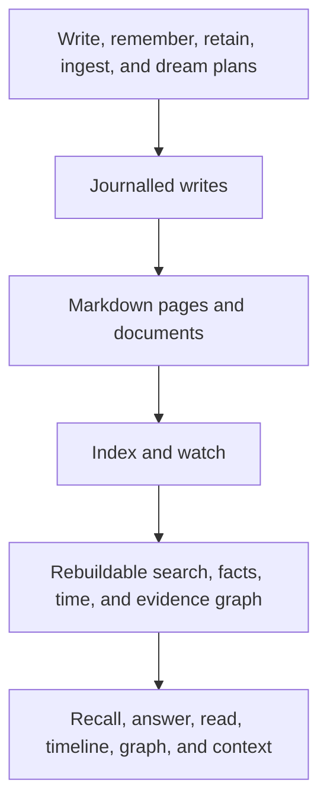

# Akno

Akno is a memory layer for agents built on a Markdown knowledge base you own.

An agent can search, answer from, and deliberately update the same files you edit in Obsidian, vim, or any
other editor. Markdown remains the source of truth. Akno adds rebuildable search projections plus durable undo,
plan, receipt, and recovery state in SQLite.

Akno is for personal agents that need continuity across conversations without turning memory into an opaque
chat-provider feature. Its memory stays inspectable, citable, reversible, and portable.

> **Status:** Akno is in active pre-1.0 development and is used on a real personal knowledge base. The core
> reading, writing, ingestion, and maintenance workflows described below are implemented today; interfaces may
> still change between minor releases.

## What works today

| Area            | Current behavior                                                                                                                 | Important boundary                                                                                                       |
| --------------- | -------------------------------------------------------------------------------------------------------------------------------- | ------------------------------------------------------------------------------------------------------------------------ |
| Retrieval       | Hybrid `recall`, full-page `read`, graph traversal, bounded agent `context`, and verified `answer`                               | Results cite page lines or document pages; `empty`, `degraded`, and `unavailable` remain distinct                        |
| Memory capture  | Exact `write`, conversational `remember`, and replay-safe keyed `retain` with automatic extraction and routing                   | Writes are journalled and undoable; retained support can be corrected or retracted by source revision                    |
| Semantic memory | Current facts, history, plans, attributed reports, questions, and discussion are distinguished during retrieval                  | A proposal or reported claim is useful context without silently becoming a current fact                                  |
| Time            | `timeline` combines authored events, retained facts, plans, deadlines, and document dates against an explicit clock              | Past, present, and future remain queryable without flattening every date into the same kind of fact                      |
| Documents       | Files can be indexed as evidence, searched immediately, and later adopted into canonical pages                                   | Searchable source material is not automatically promoted to canonical knowledge                                          |
| Derived memory  | Evidence-backed observations are co-located on admitted subject pages; reflected principles form a separate level                | Observations keep exact leaf-fact lineage and become ineligible when their support changes                               |
| Maintenance     | The seven-phase `dream` cycle detects conflicts, proposes exact repairs, organizes managed facts, and performs bounded synthesis | Scheduled maintenance defaults to audit; review and autonomous modes still use sealed plans and independent verification |
| Runtime         | A single-writer service watches the knowledge base on macOS or Linux, with nightly launchd/systemd scheduling                    | Akno assumes one owner or one trusted shared owner; it is not a multi-tenant permission system                           |

## Why Akno

- **Files stay authoritative.** Indexing leaves the set and bytes of source files unchanged by default.
- **Answers stay grounded.** Retrieval returns evidence locators, and generated answers are verified separately
  against the evidence they cite.
- **Absence stays honest.** A clean miss is different from a failed model, unavailable document extractor, or
  degraded ranking path.
- **Evidence is not automatically belief.** Pages, source documents, observations, and ignored material have
  different roles and retrieval policies.
- **Writes are bounded.** Mutations are journalled; maintenance plans exact diffs before a human or separate
  curator decides what may apply.
- **Organization never blocks retrieval.** An orphan document is searchable before Akno finds or creates its
  canonical home.

Akno does not replace your editor, backup system, or judgment. It only knows what the indexed files and
documents contain.

## Quick start

Akno supports macOS and Linux and requires Node 22.18 or newer.

```bash
npm install -g @tenphi/akno
akno init
```

Guided setup asks for the notes folder, model strategy, folder roles, and maintenance authority. It can configure
the benchmark-qualified OpenAI preset, a model-free lexical setup, or preserve an existing specialist setup.
Every optional follow-up—indexing, a first recall, and background-service installation—requires its own
confirmation.

For the OpenAI preset, provide the credential through the environment. Akno stores only the variable name:

```bash
export AKNO_OPENAI_API_KEY="..."
akno init
```

Then index and inspect the knowledge base:

```bash
akno index
akno doctor
akno recall "How long is the Zephyr QX-100 warranty?"
akno recall "What is planned for the Zephyr QX-100?" --memory-view planning
```

Markdown indexing needs no extra system tools. Document extraction uses native macOS frameworks; on Linux,
PDF, OCR, and office-file support use Poppler, Tesseract, and LibreOffice respectively. Missing tools degrade
only the affected extraction path and are reported by `akno doctor`.

Akno keeps requests on the selected model provider's configured origin: redirects cannot cross origins, and a
failed provider is never silently replaced by another configured provider.

Want an invented knowledge base to try? Copy
[`examples/demo-brain`](https://github.com/tenphi/akno/tree/main/examples/demo-brain) and follow the
[getting-started guide](docs/getting-started.md#try-the-demo-knowledge-base).

## How it fits together



The database is partly rebuildable, not disposable: search projections can be recreated from Markdown, while
the same database also owns undo history, maintenance plans, receipts, and recovery state.

Indexing quarantines deterministic Markdown conflicts before parsing. Complete merge blocks,
owner-configured conflict filenames, and duplicate stable page ids cannot become recall evidence or automatic
write targets. Akno does not alter those files; `akno doctor --quarantine-details` identifies what needs manual
repair.

## Everyday commands

| Goal                               | Commands                                                                                         |
| ---------------------------------- | ------------------------------------------------------------------------------------------------ |
| Find and inspect memory            | `recall`, `answer`, `read`, `list`, `timeline`, `graph`, `context`                               |
| Capture, correct, or remove memory | `write`, `remember`, `retain`, `forget`, `undo`, `move`, `folder`                                |
| Bring in source material           | `ingest`, `inbox`, `adopt`                                                                       |
| Maintain the knowledge base        | `dream`, `plan`, `approve`, `decline`                                                            |
| Set up and operate Akno            | `init`, `index`, `migrate`, `serve`, `service`, `doctor`, `rules`, `config`, `bench`, `redeploy` |

Use `remember` for one unkeyed transcript or note that Akno should extract and route. Use `retain` when the host
has a stable source id and revision: identical revisions replay without another model call, while corrected
revisions replace their exact earlier support. Use `ingest` to make a file searchable as source material without
asserting that everything in it is canonical memory.

`akno --help` and `akno <command> --help` describe the installed interface. The
[command reference](docs/commands.md) covers write behavior and model requirements; [Writing and
ingestion](docs/writing.md) explains how to choose among the write operations.

## Autonomous maintenance

`akno dream` is a seven-phase maintenance cycle, not a prompt that rewrites the whole folder. It detects
conflicts before inference, plans observations and page maintenance, files orphan documents, and reports
remaining repair and housekeeping work.

Every writable item is a durable exact proposal with sealed inputs. The configured profile determines who
makes the decision:

| Profile      | Behavior                                                                     |
| ------------ | ---------------------------------------------------------------------------- |
| `audit`      | Produce inspectable plans and apply nothing. This is the default.            |
| `review`     | Wait for explicit human decisions.                                           |
| `autonomous` | Ask a separate curator and apply only accepted, still-valid, budgeted items. |

Start with an audit:

```bash
akno dream --mode audit
akno dream status --pending
```

Background scheduling uses launchd on macOS and systemd user services on Linux. A missed nightly window catches
up when the service next loads, without rerunning a window that already has a receipt. Read [The dream
cycle](docs/dream-cycle.md) before enabling scheduled writes.

## Documentation

The guides are published at [akno.tenphi.me](https://akno.tenphi.me/) and live in [`docs/`](docs/README.md).

| If you want to…                           | Start with                                                                                                      |
| ----------------------------------------- | --------------------------------------------------------------------------------------------------------------- |
| Install Akno or try the demo              | [Getting started](docs/getting-started.md)                                                                      |
| Understand the everyday memory workflow   | [Memory lifecycle](docs/memory-lifecycle.md) and [Core concepts](docs/concepts.md)                              |
| Read or supply agent context              | [Reading memory](docs/reading.md)                                                                               |
| Write memory or ingest documents          | [Writing and ingestion](docs/writing.md)                                                                        |
| Configure autonomous maintenance          | [The dream cycle](docs/dream-cycle.md) and [Configuration](docs/configuration.md)                               |
| Deploy, diagnose, or recover Akno         | [Operations](docs/operations.md)                                                                                |
| Understand the implementation             | [How Akno works](docs/how-it-works.md)                                                                          |
| Check commands, benchmarks, or boundaries | [Command reference](docs/commands.md), [Benchmarks](docs/benchmarks.md), and [Limitations](docs/limitations.md) |

## Development

For a checkout:

```bash
pnpm install
pnpm build
cp config/local.example.jsonc config/local.jsonc
pnpm test
pnpm akno init
```

Read [CONTRIBUTING.md](https://github.com/tenphi/akno/blob/main/CONTRIBUTING.md) for architecture and testing
invariants, and [AGENTS.md](https://github.com/tenphi/akno/blob/main/AGENTS.md) for the repository's strict rule
against copying real knowledge-base data into tests, documentation, or commits.

## License

Akno is source-available under the
[PolyForm Noncommercial License 1.0.0](https://github.com/tenphi/akno/blob/main/LICENSE). Personal and other
noncommercial use is permitted; commercial use requires a separate licence.
