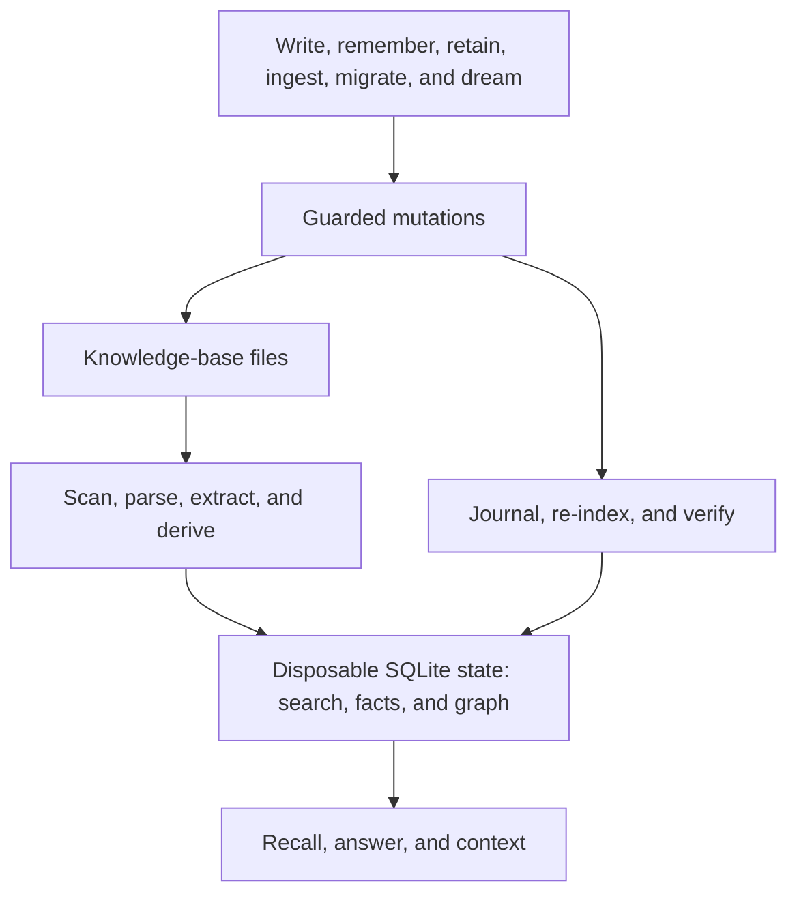
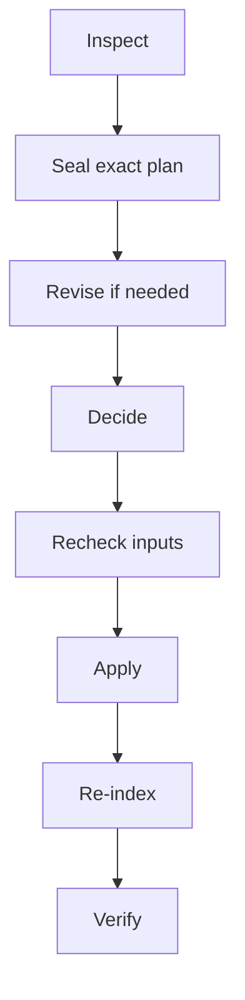

# How Akno works

This is the implementation-oriented explanation. For the same behavior organized around human actions, agent
actions, and common dream-cycle outcomes, start with [The memory lifecycle](memory-lifecycle.md).

Akno turns a folder of Markdown pages and documents into a memory interface without replacing the folder as
the source of truth.



The design has three boundaries:

1. Files are authoritative; indexed state is derived and rebuildable.
2. Retrieval may expose evidence without promoting it to canonical knowledge.
3. A model may propose a mutation, but policy, deterministic validation, and current file hashes decide whether
   the mutation is allowed.

## Indexing

`akno index` reconciles the index with the current files. The long-running service performs the same work in
response to filesystem events.

For each changed path, Akno:

1. applies ignore rules and classifies deterministic Markdown conflicts;
2. compares metadata and content hashes to avoid unnecessary work;
3. parses safe Markdown structure, frontmatter, links, stable identity, authored events, and owned observation
   markers;
4. extracts supported document text or OCR with source-page locators;
5. divides searchable text into bounded chunks;
6. optionally derives summaries, facts, dates, aliases, and embeddings;
7. resolves exact identities, observation qualification, and evidence edges; and
8. commits the new representation atomically.

Removed files are removed from the derived index. Renames preserve a stable identity when Akno can prove the
move. A complete rebuild produces the same public behavior without needing the previous database.

By default, indexing changes no knowledge-base files. Options such as `write_ids` and
`ingest.text_rendition` can create explicitly requested files, but they are off until enabled.

### Conflicted Markdown

Before parsing a canonical page, Akno quarantines a complete `<<<<<<<` / `=======` / `>>>>>>>` merge block,
an owner-configured sync-conflict path, or multiple live files claiming one stable page id. Properly closed
fenced code examples are literal documentation and do not trigger the marker detector; an unclosed fence is
treated conservatively.

Quarantine is derived index state, not a review queue. Akno keeps bounded hashes and a known stable identity,
but removes the page's chunks, facts, events, memory projections, and graph contribution; exact `read` returns
typed `source_conflict`, recall remains explicitly degraded while any candidate is held, and automatic writers
cannot target the page. It never edits, deletes, renames, or merges either source file. Repair or remove the
conflicting file state and run `akno index`; the same watcher, verified sweep, restart, and rebuild path clears
quarantine deterministically.

### Pages and documents

A Markdown page is authored knowledge: it can declare a subject, policy, links, facts, and events. A document
is source evidence: its extracted text is searchable and citable, but does not automatically become a durable
fact.

This distinction makes orphan documents useful immediately. A PDF does not need a generated Markdown wrapper
before `recall` can find a relevant page. `adopt` exists to organize it later.

### Facts and the evidence graph

Derived facts keep their source locator and confidence. Graph nodes represent stable page, document, fact,
event, retained-memory, observation, and identity records; edges represent explicit relationships such as
evidence, ownership, links, aliases, typed memory relations, observation lineage, and conflict status.

The graph is conservative. It follows exact authored or derived evidence and configured contextual identities;
it does not perform unrestricted entity discovery. [Limitations](limitations.md) describes that boundary.

## Retrieval

`recall` is a candidate-and-ranking pipeline:

```mermaid
flowchart TD
  accTitle: Retrieval pipeline
  accDescr: A question selects a semantic memory view, qualifies retained-memory chunks before gathering candidates, fuses candidate ranks, optionally reranks and qualifies them, and returns cited evidence cards.

  question["Question"] --> memoryView["Infer or accept semantic memory view"]
  memoryView --> eligibility["Qualify isolated retained-memory chunks"]
  question --> lexical["Lexical candidates"]
  question --> semantic["Semantic candidates, when embeddings are available"]
  question --> graph["Bounded graph candidates"]
  eligibility --> lexical
  eligibility --> semantic
  eligibility --> graph
  lexical --> fusion["Rank-based fusion"]
  semantic --> fusion
  graph --> fusion
  fusion --> rerank["Optional rerank and qualification"]
  rerank --> evidence["Cited evidence cards"]
```

The independent channels use different score units. Akno fuses their ranks; it does not compare a BM25 score
directly with a cosine value or reranker logit. A reranker may reorder candidates, and qualification may remove
results that are not relevant enough to return.

Version-two `akno:item` markers build a rebuildable semantic projection of kind, attribution, commitment,
disposition, epistemic basis, answer eligibility, time status, and typed relations. The chunker keeps each
marker beside its payload but apart from neighboring items, so qualification can happen before every search
arm's candidate limit without excluding unrelated prose on the page. The Markdown marker and adjacent readable
payload remain authoritative. Hash mismatches, invalid markers, and duplicate ids fail closed as partial
projection state; a complete index pass rebuilds it.

`recall` keeps discovery separate from synthesis. It returns bounded page or document sections with locators,
availability, and degradation information. The caller can inspect the evidence or pass it to its own model.

### Grounded answers

`answer` starts from retrieved evidence and asks the configured answer model for a direct response. A separate
verification step checks that answer claims are supported by the supplied citations. The result includes the
answer, citations, and related identities rather than repeating full source bodies.

No candidate can prove that memory is complete. Akno distinguishes:

- `empty`: the requested search completed and found nothing;
- `degraded`: a useful path ran, but one or more configured capabilities failed or were skipped; and
- `unavailable`: the operation could not make a trustworthy attempt.

This typed state is part of the result, not inferred from an exception string.

### Context for an agent turn

`context` assembles a complete pre-turn bundle against one output budget. Its `auto_recall` profile is for a
host that has the user's current prompt but no explicit memory question. It selects a small, precision-first set
of exact evidence and never generates an answer. Bounded recent turns may resolve a pronoun, possessive, or
omitted subject only when they bind to one candidate identity; ambiguous follow-ups return no evidence.

See [Reading memory](reading.md) for operation-level behavior.

## Mutations

All mutations go through the process that owns the write handle. They are journalled, followed by targeted
index reconciliation, and return a change id for `undo`.

An exact `write` is validated against folder rules and the current page. `remember` has more work to do: it
extracts durable claims from raw material, ranks relevant pages, checks an independent fact-injection admission,
and either performs a bounded write or returns a proposal. A plain knowledge page is searchable but read-only;
only explicit page or folder `remember: integrate` metadata admits injection. If the strongest match is
read-only, a weaker writable result cannot win merely because Akno may edit it. A new explicitly managed page or
a configured exact fallback can receive the claim only when its own page or parent-folder rule admits the write;
otherwise a typed `no_writable_destination` hold is safer. The routing order is an admitted semantic match, an
admitted new managed page proposed by retention, the configured fallback, and finally a hold. Per-claim
destination classes distinguish existing admitted pages, new managed pages, configured fallback use, and the
absence of an authorized home without requiring a host to parse prose. Each new managed sentence may also retain
one validated exact input quote
in private state, with only a hash of the full input. This lets the dream cycle verify or narrowly correct the
generated sentence later without granting authority over the containing page. Ingestion similarly separates
extraction, naming, routing, file movement, page creation, and indexing.

`retain` is the keyed host-facing counterpart. The caller supplies stable source identity and either complete
typed candidates or coherent inline text/ordered items for Akno to interpret; it may instead reference an
indexed `source` page or document without copying that source into the request. Extracted candidates pass
deterministic exact-span and discourse-frame validation plus a separate semantic-verification call. Provided
candidates can use exact model-free placement or the same automatic routing and section-placement engine as
`remember`; `remember` now adapts its legacy action response over this same validator, owned-block writer,
receipt, and evidence engine. Identical source revisions replay before another model call or write. An inline
source is archived only through explicit `preserve_source`, and correction/retraction changes only addressed
support. Inactive private evidence is securely pruned after its configured grace once no live item or
nonterminal maintenance work depends on it; hashes, replay identity, and source bindings remain.

Managed payload lines keep their level-one discourse and epistemic qualification through `read` and `recall`.
Noncanonical items remain searchable, but graph fact mining and factual `answer` evidence use the same narrow
eligibility rule, so a report or hypothesis does not become true merely because it was retained. Managed-memory
maintenance parses only the current v2 marker grammar; `akno migrate` is the explicit, dry-runnable and undoable
boundary for upgrading strict legacy owned blocks.

Level-two observations use their own versioned `akno:observation` grammar on existing exact-subject knowledge
pages. The rebuildable projection stores the subject, disposition, payload hash, exact fact/source-line
locators, and correlated proof groups. Qualification is recomputed after the fact graph on every relevant index
pass. Unknown marker versions, invalid payload labels, stale facts, changed proof groups, ambiguous subjects,
and revoked `observe: integrate` authority fail closed without rewriting Markdown. The fact deriver always
skips the readable payload after an observation marker, so L2 prose cannot re-enter as L1.

Reflection consumes only eligible projected L2 ids. Legacy detached observation pages are understood only by
the explicit `akno migrate --observations` operator path; ordinary observe, recall, graph, and reflect share the
single current marker parser and projection.

Typed world time in those v2 markers also builds a disposable temporal projection. `timeline` reads that
projection beside authored dated lines and orphan-document date evidence, then classifies every result against
the request's `as_of` and IANA timezone. Clock relations are never persisted, so `past`, `today`, `ongoing`, and
`future` move as the reader clock moves while the Markdown remains unchanged. Invalid temporal markers and
interrupted projection upgrades produce typed degradation; a full index pass can rebuild the projection from
Markdown without modifying the knowledge base.

Maintenance adds another boundary:



Planning and deciding are separate turns. In autonomous mode the curator receives the sealed proposal, not an
open-ended request to edit files. Current policy, hashes, dependencies, and whole-run budgets can still block an
accepted item. A human correction stays inside the original operation and evidence scope, preserves the old
revision for audit, and must be approved again. An automatic curator can request the same bounded correction
from a separate model turn; the revised head must pass deterministic guards and a new curator decision, with a
configured attempt cap preventing self-repair loops. See [The dream cycle](dream-cycle.md).

## Models and degradation

Akno assigns models by role instead of assuming one model can do every job:

- embeddings provide semantic candidates;
- expansion rewrites a query for retrieval;
- reranking orders and qualifies candidates;
- derivation extracts structured summaries, facts, and events;
- answer generates and verifies grounded responses;
- maintenance proposes or curates controlled changes; and
- vision describes textless visual evidence.

Several roles can point to the same OpenAI-compatible endpoint and generation model. Embeddings still require a
separate embedding model. Every model-dependent path has a declared degradation behavior, and `doctor` reports
the consequence of each missing role.

The provider chooses a generative transport explicitly or asks for `api: auto`. Auto-resolution runs at handle
or service startup with invented text, caches the endpoint-and-model-bound result, and tries Chat Completions
only after a definitively absent Responses route. The OpenAI preset uses the Responses API with stateless
storage disabled; existing compatible providers default to Chat Completions. Both adapters preserve the same
task-facing `chat` contract, strict schema validation, reasoning setting, usage receipt, retry policy, and typed
degradation. Akno never retries a real failed request through the other transport.

Provider selection is also the network boundary. Every model request and auto-detection probe handles redirects
explicitly. Akno may repeat a POST only for a bounded, loop-safe same-origin `307` or `308`; it refuses
method-rewriting `301`/`302`/`303`, malformed destinations, credentials in redirect URLs, unsupported schemes,
and every cross-origin target before sending headers or a body there. HTTP and schema compatibility retries
remain on the configured origin, and failure never selects another configured provider.

Structured model outputs are parsed and validated before use. Retries are bounded by error type and operation
deadline. Model text never grants itself filesystem authority.

## One operation registry, several doors

The protocol package defines each operation once: description, input schema, output schema, trust class, and
implementation status. Akno exposes that registry through:

- the in-process API;
- an owner-only Unix socket for local clients;
- policy-scoped HTTP for a containerized or remote agent; and
- stdio MCP for general agent hosts.

The default service owns the database, file watcher, models, and single write handle. A CLI command uses the
running socket when available and can otherwise open an in-process instance unless `--connect` requires the
service. MCP normally translates onto that same socket instead of opening a second writer.

Socket filesystem permissions are the local authentication boundary. Unauthenticated loopback HTTP is
read-only by default. Bearer identities are configured as environment-backed secret references and map to a
server-owned actor plus operation set; non-loopback binds require one. MCP has its own explicit allow list,
which remains effective when stdio MCP forwards through the service, because an agent cannot claim the user's
authority.

## State and recovery

The state directory contains the SQLite index, write journal, recoverable trash, private maintenance plans and
receipts, service socket, and logs. These have different recovery properties:

- search projections are reproducible and refreshed in place with `akno index --rebuild`; the database file
  itself is not disposable because it also contains the durable records below;
- journal and trash preserve undo history and should not be deleted casually;
- sealed maintenance plans remain reviewable across restarts;
- terminal plans shed exact private payloads before their compact audit receipts expire;
- interrupted runs are reconciled from durable item state rather than assumed successful.
- unsafe journal or byte-verification outcomes durably pause automatic apply until the owner resumes it;
- three distinct automatic verification rollbacks pause only that transformation, leaving other classes active.

The knowledge base itself should be backed up normally. Akno's journal is an operational reversal mechanism,
not a substitute for version control or backups.

For service management, diagnostics, privacy, and recovery commands, see [Operations](operations.md).
