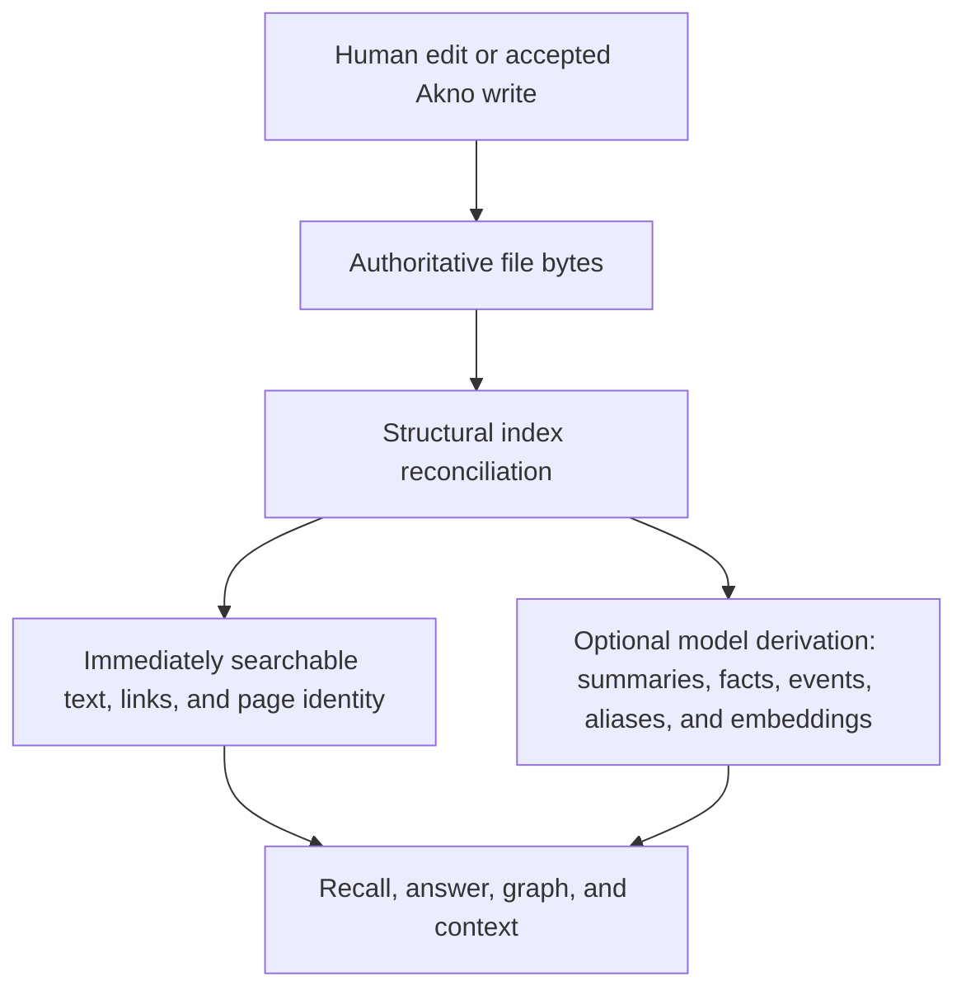
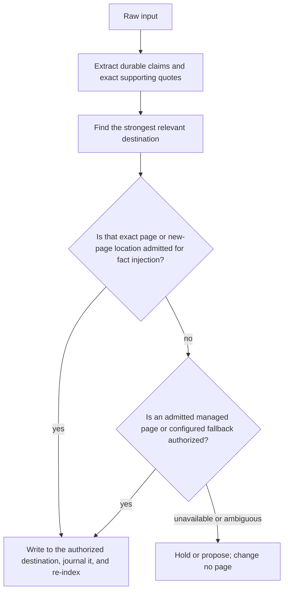
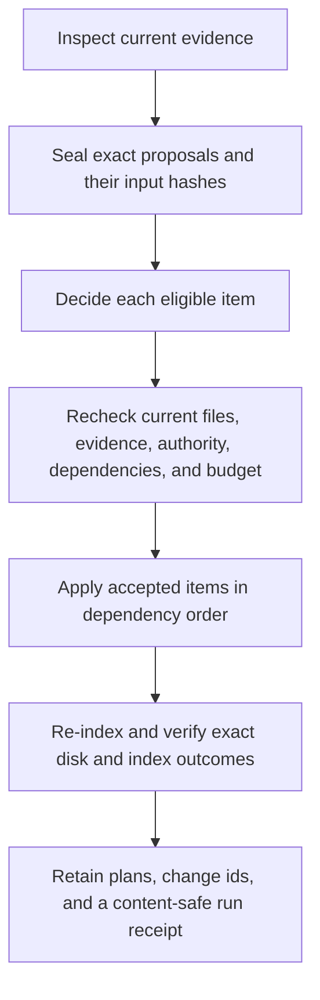

# The memory lifecycle

This guide explains Akno from the perspective of the people and agents using it: who may do what, when a change
becomes memory, and what the dream cycle can do with it later.

The short version is:

> The files are the memory. Akno reads and indexes them, agents may change only admitted parts, and maintenance
> must plan an exact change before anyone—or an autonomous curator—can authorize it.

## The three participants

| Participant | Normal role                                                                                 | What it cannot assume                                                                            |
| ----------- | ------------------------------------------------------------------------------------------- | ------------------------------------------------------------------------------------------------ |
| Human       | Authors files, chooses policy, reviews plans, and can explicitly act with user authority    | That every direct editor change has an Akno undo receipt                                         |
| Agent       | Searches, answers, captures information, and performs permitted operations                  | Human authority, write access to merely searchable pages, or permission to broaden folder policy |
| Akno        | Indexes current files, routes operations, journals its writes, and runs guarded maintenance | Ownership of the knowledge base or permission to rewrite every indexed page                      |

The human and agent may use the same Akno service, but they are not interchangeable actors. MCP calls are agent
calls. CLI writes also default to agent authority; `--actor user` is an explicit assertion that the person at
the terminal is making that request. User authority bypasses the agent approval gate, not structural validation,
safe paths, journalling, or re-indexing.

## What is authoritative?

Akno has four kinds of state with different recovery rules:

| State                                    | Meaning                                                             | If it disappears                                                                                     |
| ---------------------------------------- | ------------------------------------------------------------------- | ---------------------------------------------------------------------------------------------------- |
| Markdown and source documents            | The actual knowledge base                                           | Restore it from version control or backup                                                            |
| Search index, facts, events, and graph   | A derived reading of the current files                              | Rebuild it with `akno index`                                                                         |
| Journal and recoverable trash            | Akno's reversal history                                             | Akno loses some ability to undo earlier operations                                                   |
| Plans, run receipts, and source receipts | Proposed changes, maintenance history, and keyed retention identity | Pending review, detailed audit history, replay safety, and source-scoped retraction lineage are lost |

An indexed fact, summary, embedding, or graph edge is not a second source of truth. It is valid only while its
source locator and source hash still match the files.

## From an edit to usable memory



An Akno write performs targeted structural reconciliation before it reports success. Expensive model derivation
may finish afterward. A direct editor change is noticed by the running watcher; if no watcher is running, use
`akno index`. Retrieval can therefore be temporarily degraded while optional derivation catches up, but the file
is already authoritative.

## What a human can do

### Edit Markdown directly

Direct editing is the simplest and strongest authorship path. Save the file and the watcher re-indexes it.
Akno does not require a special adoption or approval step for a valid existing page.

A direct edit is not recorded in Akno's change journal. Use the editor, sync history, Git, or a backup to reverse
it. Akno may still report that the edit invalidated a pending plan or changed the evidence behind an inferred
fact.

### Use Akno's write operations

Commands such as `write`, `remember`, `retain`, `forget`, `move`, `ingest`, and `folder` validate the request.
When an operation is accepted, Akno uses guarded filesystem operations, records a change id, and reconciles the
affected index. Use `--actor user` only when the request really is a human decision:

```bash
akno write --actor user --slug equipment/zephyr --append "The inspection is due in 2030."
akno remember --actor user "Ada Marlow extended the Zephyr QX-100 warranty to five years."
```

These writes are reversible with `akno undo <change-id>`. They are still constrained by safe paths and operation
semantics; human authority is not an instruction to accept malformed input.

### Review maintenance

A human can inspect exact planned bytes without granting broad editor access to a model:

```bash
akno dream --mode audit
akno plan list
akno plan diff <plan-id> --item <item-id>

# When the configured profile permits human review:
akno dream --mode review
akno plan list --status awaiting_review
akno plan decide <plan-id> --item <item-id> --approve --reason "Matches the source."
akno plan apply <plan-id>
```

The command-line mode can lower configured authority but cannot raise it: an installation configured for audit
must first be deliberately changed to review or autonomous authority. The decision and application remain
separate. Between them, Akno checks that the plan, evidence, policy, and current files still match.

## What an agent can do

An agent can use memory without receiving general filesystem authority:

- `context(profile: "auto_recall")` supplies a small, precision-first pre-turn evidence bundle;
- `recall` discovers and ranks relevant evidence;
- `answer` produces and verifies a direct cited answer;
- `read`, `timeline`, and `graph` inspect known memory more precisely;
- `remember` extracts durable claims and finds an authorized destination;
- `retain` extracts or accepts typed memory from identified, replayable source revisions;
- exact mutation operations change only the requested and permitted scope.

The agent cannot promote itself to human through MCP. It also cannot turn a related search result into a writable
destination. Search relevance and write authority are separate decisions. An MCP host exposes only the operations
in its configured allow list; `dream`, `plan`, and service management are operator commands rather than ordinary
memory tools. A host must separately and deliberately provide access if it wants an agent to operate them.

## What happens when an agent remembers something?

`remember` is not “append this prompt to the nearest page.” Its normal path is:



A successful retained item has a stable marker around the generated sentence. That marker is an ownership
boundary: later maintenance may inspect and repair that item without acquiring authority over the human prose
around it.

Both keyed `retain` and unkeyed `remember` reach the same owned-block writer and exact evidence validator.
Keyed sources additionally keep durable replay receipts and may point at an existing source page/document,
atomically archive inline input when explicitly requested, or replace exact earlier support. Full inline input
is never stored implicitly. Its bounded exact frames remain private while live memory or nonterminal
maintenance work needs them, then become eligible for secure pruning after `evidence_grace_days`.

When the marker carries typed world time, reads preserve the original precision, relation, status, timezone,
and recurrence while computing currentness from the caller's clock. This lets a past state remain inspectable
without being injected as a current fact, and lets an accepted plan answer a future-oriented question without
becoming a factual claim.

The marker's other semantics matter at read time too. Akno projects retained claims, reports, plans, decisions,
questions, and tentative discussion into separate semantic views without moving or duplicating their Markdown.
Generic agent recall stays factual. A prompt explicitly asking what was reported, planned, rejected, left open,
or discussed selects that qualified form before retrieval; the returned sentence still carries its attribution,
commitment, disposition, basis, and answer eligibility. If no in-view item matches, an out-of-view match may be
shown as context, but it is not automatically injected or restated as true.

Possible results matter:

| Result                        | Meaning                                                                               |
| ----------------------------- | ------------------------------------------------------------------------------------- |
| Written                       | The claim has authorized file bytes, a journal entry, and updated structural indexing |
| Proposal or approval required | Akno found a bounded question that needs a human decision                             |
| `no_writable_destination`     | Relevant pages may exist, but none is authorized to receive the claim                 |
| Rejected or ignored claim     | The input was not considered durable memory                                           |
| Degraded or unavailable       | A required model, index, source, or service path could not complete reliably          |

Only the first result means the knowledge base changed.

Immediate write-gate proposals are distinct from dream maintenance plans:

```bash
akno approve --list
akno approve <proposal-id>
akno decline <proposal-id>
```

Use `akno plan ...` only for the exact multi-stage maintenance workflow.

## Searchable, injectable, and maintainable are different

These are deliberately independent capabilities:

| Page policy           | Search and answer        | Receive `remember` facts          | Dream may change                                                              |
| --------------------- | ------------------------ | --------------------------------- | ----------------------------------------------------------------------------- |
| Plain knowledge page  | Yes                      | No by default                     | No by default                                                                 |
| `remember: integrate` | Yes                      | Yes                               | Only strict Akno-owned item blocks unless broader dream authority exists      |
| `dream: hygiene`      | Yes                      | Only if remember is also admitted | Conservative whole-page cleanup plus eligible owned-item work                 |
| `dream: synthesize`   | Yes                      | Only if remember is also admitted | Evidence-backed reorganization and other specifically enabled transformations |
| Source/reference page | Yes, as bounded evidence | Normally no                       | Normally no                                                                   |
| Ignored page          | No                       | No                                | No                                                                            |

Folder rules can supply these choices for many pages; page frontmatter can make one page stricter or more
specific. An opt-in only makes planning possible. Profile, transformation policy, evidence, model availability,
budgets, stale-input checks, and verification can still refuse the change.

This is why reference notes can remain intact while still helping retrieval, and why allowing an agent to retain
facts does not silently grant permission to rewrite the containing page.

## How today's change appears to tonight's dream

| Change made during the day                                           | What dream may do later                                                                                                                                      |
| -------------------------------------------------------------------- | ------------------------------------------------------------------------------------------------------------------------------------------------------------ |
| Human edits ordinary prose on a page with no dream opt-in            | Use eligible current knowledge as evidence, but do not rewrite that prose                                                                                    |
| Human edits a hygiene- or synthesis-enabled page                     | Propose only transformations enabled by that page and current policy                                                                                         |
| Agent adds a marked item to `remember: integrate` memory             | Verify marker integrity, placement, routing, conflict status, and—when retained evidence exists—wording                                                      |
| Eligible facts support an observation on `observe: integrate` memory | Plan one marker-owned L2 create/reinforce/refine/split; never rewrite adjacent authored prose                                                                |
| An observation loses qualifying support                              | Exclude it from factual use immediately, then plan or hold an exact weaken/retract disposition update                                                        |
| Human edits text inside an Akno-owned marker                         | Treat the saved bytes as current, then re-check the still-managed item; a stale or unsupported binding is held or planned through the ordinary decision path |
| Human removes an Akno item marker but keeps its sentence             | Stop treating that sentence as Akno-owned; later cleanup prunes the detached private evidence record                                                         |
| Human changes page or folder authority                               | Re-evaluate that authority before any old or new proposal can apply                                                                                          |
| Human edits source/reference material                                | Re-index it as evidence; do not promote it to canonical facts or whole-page maintenance input without explicit policy                                        |
| A new readable document has no owning page                           | Keep it searchable immediately; the adopt phase may propose a minimal organizing page                                                                        |
| A link target moves or disappears                                    | Report the broken link and plan a repair only when exact identity and page authority make it safe                                                            |
| Two current claims disagree                                          | Classify the conflict before observation, reflection, graph inference, or synthesis uses either claim                                                        |

Removing a marker is therefore the explicit way for a human to take a retained sentence out of managed-item
maintenance without deleting the sentence itself. Adding `remember: integrate`, by contrast, admits future
retained items; it does not transfer ownership of the page's surrounding authored text.

Observation ownership is narrower still. `observe: integrate` admits only an `akno:observation` block for the
page's exact resolved subject. Removing that marker turns the remaining sentence into ordinary authored prose;
changing or removing its support instead makes the projected L2 line ineligible until a planned lifecycle
transition updates the marker.

## What the dream cycle does

A full dream is a maintenance transaction with visible stages, not an unrestricted rewrite prompt:



Conflict analysis runs before phases that infer or synthesize knowledge. Observe creates marker-owned L2 blocks
on admitted exact-subject pages; reflect appends derived, cited L3 principles. Curate handles explicitly enabled
page transformations and narrow owned-item maintenance. Adopt can organize searchable orphan documents.
Housekeeping reports remaining structural work.

### Who decides?

| Profile      | User experience                                                                                                 |
| ------------ | --------------------------------------------------------------------------------------------------------------- |
| `audit`      | Akno creates durable plans and changes no knowledge-base files                                                  |
| `review`     | Plans wait for human decisions; approved items still require a separate apply                                   |
| `autonomous` | A separate curator turn decides eligible items; accepted items still pass deterministic guards and verification |

Per-transformation policy can lower that authority. For example, an autonomous installation may apply broken
links automatically while keeping merges in human review.

## What happens in common dream cases?

| Situation                                                            | What happens to the knowledge base?                                 | What the user sees                                                           |
| -------------------------------------------------------------------- | ------------------------------------------------------------------- | ---------------------------------------------------------------------------- |
| Nothing qualifies                                                    | No change                                                           | Completed run with no applicable items                                       |
| Audit finds work                                                     | No change                                                           | Exact durable plans and an estimated later curator workload                  |
| Review finds work                                                    | No change until a person decides and applies                        | `awaiting_review` items with inspectable diffs                               |
| Autonomous curator rejects an item                                   | No change for that item                                             | Rejection and reason remain on the plan                                      |
| Autonomous curator accepts a valid item                              | Only the sealed operations are written                              | Change id, re-index result, item verification, and run receipt               |
| Model output is malformed or unavailable                             | Dependent work is rejected, held, or reported degraded              | Typed model degradation; unrelated deterministic work may continue           |
| A budget is exhausted                                                | Over-budget items are not written                                   | Typed deferrals for a later cycle with a fresh budget                        |
| Evidence or a target changed before apply                            | The affected item is not written                                    | `stale` or `snapshot_drift`; unrelated items may continue                    |
| A foreground Akno write occurs during full-cycle planning            | The foreground write completes; the dream applies no plan           | The run stops at the next boundary with retryable `conflict`                 |
| An unrelated editor or sync change appears during final verification | The unrelated bytes remain                                          | Certification fails with a content-safe `unattributed_file_change` count     |
| Applied bytes cannot be verified                                     | Akno attempts journalled rollback and may pause automatic authority | `verification_failed`, rollback status, and an exact recovery command        |
| A process stops mid-apply                                            | Unknown newer bytes are not overwritten during recovery             | The next writer reconciles before retrying or reports a verification failure |

Persisted dry-run diagnostics remain visible in history but do not replace a real full cycle in nightly schedule
health. Use `--mode audit` for the durable, realistic no-write workflow.

## What if a human edits while dream is running?

Timing determines which guard handles it:

1. **Before the planning snapshot:** the new bytes are ordinary input to the cycle once indexed.
2. **During full-cycle planning:** watcher reconciliation waits behind the planner barrier. A foreground Akno
   mutation preempts the barrier and aborts the dream before decisions or writes.
3. **After planning but before decision or apply:** repeated preflight detects changed evidence or target bytes
   and marks affected items stale.
4. **After unrelated maintenance writes:** whole-run verification preserves the unrelated edit but refuses to
   certify the run as fully attributable.

Akno does not lock editors and does not provide an operating-system filesystem snapshot. There is necessarily a
small race between a final check and an atomic rename, especially for direct editor or sync-client changes that
bypass the service. For important knowledge bases, keep ordinary version control or backups and avoid editing the
same page during the short apply portion of an autonomous cycle. See [Limitations](limitations.md#dependency-planning-is-bounded).

## Seeing what happened

Start with the least private status surface and open exact details only when needed:

```bash
akno dream status
akno dream status --last 10
akno dream status --run <run-id>
akno dream status --pending
akno plan show <plan-id>
akno plan diff <plan-id>
akno undo --list
```

Default run receipts contain counts, policy, timing, model usage, typed degradation, verification, and change or
plan ids—not page bodies, prompts, or source excerpts. Exact diffs are private and requested explicitly.

## Choosing an operating style

- **Read-only exploration:** use model-free or model-backed retrieval, keep `remember` destinations denied, and
  leave maintenance in audit.
- **Human-curated memory:** admit intended memory folders, use review mode, and inspect plan diffs before apply.
- **Trusted agent-connected memory:** admit narrow destinations, keep reference areas read-only, start with an
  audit cycle, then enable autonomous policies transformation by transformation.

Whichever style you choose, keep the same invariant: files stay readable and useful without Akno. For command
details continue with [Writing and ingestion](writing.md); for the maintenance phases and safety mechanisms see
[The dream cycle](dream-cycle.md); for implementation architecture see [How Akno works](how-it-works.md).
