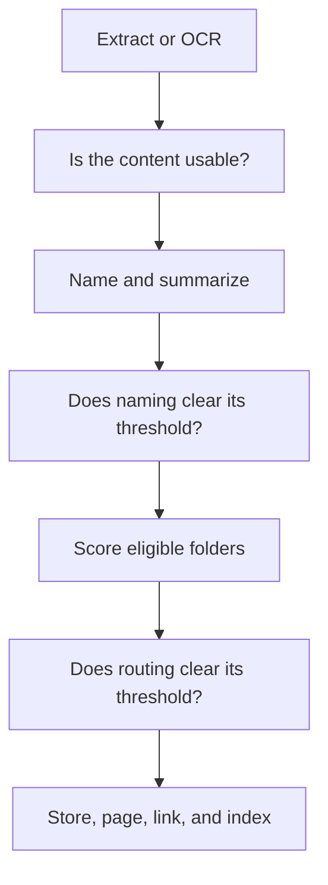

# Writing and ingestion

Akno has separate operations for exact edits, retaining raw material, importing documents, correcting the
record, and applying maintenance plans. Choosing the narrowest operation keeps authority visible.

## Choose the right write operation

| Intent                                                  | Operation  |
| ------------------------------------------------------- | ---------- |
| Put exact wording at an exact destination               | `write`    |
| Hand over unstructured text and keep its durable claims | `remember` |
| Retain identified, replayable source revisions          | `retain`   |
| Declare what belongs in a folder                        | `folder`   |
| Import a file, folder, or URL                           | `ingest`   |
| Process configured drop folders                         | `inbox`    |
| Give an orphan document a page                          | `adopt`    |
| Retract a sentence or trash an object                   | `forget`   |
| Relocate a page and its documents                       | `move`     |
| Reverse a journalled change                             | `undo`     |

If you know both wording and destination, use `write`. If Akno must decide what is durable and where it belongs,
use `remember`.

## Exact writes

`write` creates, appends, patches, or replaces one page. It can include tags, events, links, and document
attachments. A write into an undeclared gated folder returns `requires_folder` with nearby alternatives; it
does not silently invent taxonomy.

```bash
akno folder warranties \
  --description "Appliance and electronics warranties, with expiry dates."
```

Every accepted mutation records previous bytes and returns a change id. External edits remain valid: the
watcher re-indexes them like any Akno write.

Frontmatter is preserved byte-for-byte unless a complete frontmatter block is deliberately supplied in a
create or whole-content write. Append, patch, and replace-body operations do not reinterpret a pasted block as
page policy.

## Remember

```bash
akno remember "Ada Marlow confirmed that the Zephyr QX-100 warranty lasts five years."
akno remember "..." --dry-run
akno remember "The inspection is due tomorrow." \
  --mentioned-at 2031-03-04T10:00:00Z --timezone UTC
```

`remember` is for conversation excerpts, rough notes, or other raw material. It uses the current folder
taxonomy and explicitly admitted pages to decide whether the input should:

- update an existing canonical page;
- create a page in an existing or declared eligible folder;
- append a loose dated event; or
- remain a proposal because routing or confidence is insufficient.

Recall only nominates destinations. A separate bounded ownership decision must select one existing page or the
retention model's proposed new page; topical or same-person similarity alone cannot authorize an append. The
complete typed time interval, or one unambiguous year-bearing date in the retained sentence, excludes
incompatible period-bucket pages before that decision. Exact month pages and exact or explicitly ledger-like day
pages are buckets; a date-prefixed named event remains eligible to own related preparation and follow-up memory.
Searchability is not write permission: an unmarked Markdown page defaults to `knowledge` for recall and to
`remember: deny` for injection. A page or folder must explicitly set `remember: integrate`; pages Akno creates
for retained memory carry that declaration themselves. When the strongest semantic match is read-only, Akno
does not silently use a weaker writable page. It creates a dedicated managed page in an admitted folder when
the retain result supplies one, uses `maintenance.retain.fallback_page` when that exact destination is configured
and admitted, or holds the claim for a destination decision. The fallback is tried only after ordinary routing
and managed-page creation; its config value never grants write authority and the page remains a temporary queue,
not a valid canonical home during later managed-item curation. A missing fallback page may be created
only under an exact parent-folder rule that permits it, while an existing unindexed file is never overwritten.

The response makes that boundary machine-readable. Each `considered` claim reports `destination` as
`existing_admitted_page`, `new_managed_page`, `configured_fallback`, or `no_writable_destination`. When the
configured page was needed, top-level `fallback` reports whether it was `used` or `unavailable` with a stable
reason. The top-level
`no_writable_destination` outcome means at least one retained claim had no authorized home; its approval carries
the same stable `reason_code`, so an agent can ask for a destination without parsing explanatory prose. Ordinary
semantic ambiguity remains `requires_approval`, while an undeclared target folder remains `requires_folder`.
`--dry-run` computes these same destination and outcome classes without writing a page or creating a proposal.

It does not create pages in unexplained or read-only folders. `adopt` and immediate index reconciliation make
accepted memory visible without another manual step.

Relative dates are resolved only when the caller supplies both the source's RFC 3339 `--mentioned-at` time and
an IANA `--timezone`. The timezone supplies calendar context without licensing a location guess. When either
part of the source clock is absent, Akno does not substitute its processing clock and holds the candidate as
`time_unresolved`.

### Evidence and later maintenance

For each sentence extracted by `remember`, the model also identifies one bounded exact quote from the input.
Akno validates the quote before storing it privately alongside the managed-item id and keeps only a hash of the
complete input. The dream cycle can therefore re-check generated wording even when the page has no
`dream: hygiene` or `dream: synthesize` permission. A safe correction may change only that one generated payload
line and still passes the ordinary sealed plan and curator or human decision path. Older items and new items for
which no valid exact quote was returned remain readable but report `source_unavailable`; Akno will not guess a
semantic correction for them. Explicitly forgetting the fact, managed memory, or page retires its retained
quote from active verification; a complete maintenance scan also prunes quotes whose managed marker no longer
exists.

The dream cycle can also correct where any valid managed memory lives, including reports, plans, questions, and
other items deliberately excluded from factual answers. It checks the rebuildable managed-memory projection
rather than requiring a derived fact row, then uses ordinary retrieval to nominate a small
set of existing writable knowledge pages, then asks a separate classifier whether the current page is clearly
wrong. A move is accepted only to one supplied page and section. If no existing unique `##` section fits, the
only creatable option is a short plain heading derived deterministically from the managed item's current
attribute, section, or kind; the classifier cannot supply its own wording. Akno moves the exact marker and
sentence together, seals the change as a medium-risk maintenance item when it creates a section or touches two
pages, and writes or undoes both pages atomically. It never creates a page or rewrites the fact during this
operation; ambiguity becomes a held routing finding.

The configured fallback is treated specially in this pass: an item cannot be certified as correctly placed
there. The classifier may move it to one supplied canonical page, or the item remains a typed held finding until
such a page exists. Curate does not invent a new page for a queued item and never moves another item into the
fallback.

Use `approve` or `decline` for held routing proposals. These are separate from maintenance-plan decisions,
which use `akno plan decide`.

## Retain identified sources

`retain` is the host-facing path when source identity must survive retries. It accepts coherent inline text,
ordered source items, an indexed source-page slug, or an indexed document id. It supports extracted or
caller-provided semantic candidates, explicit atomic correction, optional inline-source archival, and
standalone source-scoped retraction:

```bash
akno retain request.json
akno retain request.json --dry-run
akno retain - < request.json
```

The retention mode and placement policy are independent where applicable:

- `mode: "extract"` runs Akno's fixed discourse-aware extraction and a separate semantic verification call,
  then uses automatic routing and section placement;
- `mode: "provided", placement: "automatic"` trusts the caller's selection and semantic shape, validates its
  exact source spans, and lets Akno choose an admitted destination;
- `mode: "provided", placement: "exact"` validates and writes to each supplied destination without a
  synchronous model call; and
- `mode: "retract"` removes only support owned by an addressed earlier receipt.

For the automatic host path, the smallest useful request is:

```json
{
  "sources": [
    {
      "source_id": "conversation:2222",
      "revision": "turn-7",
      "source_group": "conversation:2222",
      "source_kind": "conversation",
      "mentioned_at": "2031-03-04T10:00:00Z",
      "timezone": "UTC",
      "input": {
        "items": [
          {
            "item_id": "turn-7",
            "role": "user",
            "speaker": "Ada Marlow",
            "text": "I selected the five-year warranty for the Zephyr QX-100."
          }
        ]
      },
      "retention": {
        "mode": "extract",
        "mission": "Preserve product decisions and their duration."
      }
    }
  ]
}
```

The mission is additive emphasis, not a replacement for Akno's fixed retention rules. Extraction refuses to
truncate a coherent source whose omitted discourse could reverse its meaning; it returns the typed
`context_too_large` hold instead. Every accepted candidate has unique exact proposition support, a complete
discourse frame, deterministic candidate identity, and an independent semantic-verification verdict.

Assuming `memory/**` is admitted as `knowledge + remember: integrate`, this complete request creates a managed
page when needed and places the decision under its deterministic `## Unsorted` section:

```json
{
  "sources": [
    {
      "source_id": "conversation:1111",
      "revision": "1",
      "source_group": "conversation:1111",
      "source_kind": "conversation",
      "mentioned_at": "2031-03-04T10:00:00Z",
      "timezone": "UTC",
      "locator": "conversation:1111#turn-1",
      "input": {
        "items": [
          {
            "item_id": "turn-1",
            "role": "user",
            "speaker": "Ada Marlow",
            "mentioned_at": "2031-03-04T10:00:00Z",
            "text": "I selected the five-year warranty for the Zephyr QX-100."
          }
        ]
      },
      "retention": {
        "mode": "provided",
        "placement": "exact",
        "candidates": [
          {
            "candidate_id": "warranty-selection",
            "kind": "decision",
            "text": "Ada Marlow selected the five-year warranty for the Zephyr QX-100.",
            "subject": "Zephyr QX-100 warranty",
            "attribution": {
              "source_role": "user",
              "source_speaker": "Ada Marlow"
            },
            "discourse": {
              "commitment": "asserted",
              "disposition": "accepted"
            },
            "epistemic": {
              "basis": "self_attested"
            },
            "support": [
              {
                "item_id": "turn-1",
                "quote": "I selected the five-year warranty for the Zephyr QX-100."
              }
            ],
            "discourse_frame": [
              {
                "item_id": "turn-1",
                "quote": "I selected the five-year warranty for the Zephyr QX-100."
              }
            ],
            "time": {
              "start": "2031-03-04",
              "precision": "day",
              "relation": "occurred",
              "status": "actual",
              "timezone": "UTC",
              "mentioned_at": "2031-03-04T10:00:00Z"
            },
            "destination": {
              "slug": "memory/zephyr-qx-100-warranty"
            }
          }
        ]
      }
    }
  ]
}
```

The tuple `source_id + revision` is immutable. Repeating identical source metadata, bytes, and retention
instructions returns the stored result without another write; changing any of them under the same tuple returns
`revision_conflict`. Exact support and discourse-frame spans must resolve uniquely inside the supplied text or
structured source item. Every accepted source has at most one journal change, and one failed source does not
erase successful siblings. On an existing page, a named exact section must already exist exactly once; omission
uses the deterministic `## Unsorted` fallback. Reports, hypotheses, proposals, plans, questions, and rejected
options stay searchable with visible status and typed line qualification but are excluded from ordinary derived
facts and factual `answer` evidence. Automatic routing can write only to an existing admitted knowledge page, a
new managed page under an exactly admitted folder, or the configured admitted fallback. Recall candidates are
globally nominated and then qualified for page ownership; the extractor's folder suggestion is not a search
boundary. A stronger read-only match blocks a weaker writable destination. Exact managed-memory duplicates are
recognized across pages and attach support to the existing block instead of creating another copy.

Automatic responses include content-free receipts for extraction, verification, destination-qualification, and
section-placement model calls. Both routing calls use the existing `placement` receipt list for protocol
compatibility. `held` candidates carry stable reason codes such as `discourse_uncertain`, `time_unresolved`,
`routing_uncertain`, and `no_writable_destination`; callers should branch on those codes rather than explanatory
prose. A source-level `apply_failed` is reported as typed degradation rather than a successful empty result.
`--dry-run` computes the same interpretation and routing but writes no page, journal change, or replay
receipt.

A later revision never implies deletion. Retraction names the earlier `target_revision` and, optionally, exact
candidate ids. When another source still supports the same memory, Akno removes only the addressed support and
keeps the readable item. An explicit user `forget` also retires keyed support, so replaying an old source
revision cannot resurrect memory the user removed; undo restores both the Markdown and its support state.

To retain from source bytes Akno already owns, use exactly one reference input:

```json
{ "input": { "page_slug": "sources/zephyr-manual" } }
{ "input": { "document_id": "doc_1111" } }
```

`page_slug` accepts only a page whose effective role is `source`; feeding a canonical knowledge page back into
retention is refused. A document with readable retained extraction remains usable with `degraded` availability
when its original is missing. A document with no readable original, extraction, or rendition is `unavailable`,
not an empty source. The receipt keeps only the binding and bounded evidence frames—never a second full-source
copy.

Inline input is also not archived by default. An automatic host that intentionally needs “archive and retain”
can add:

```json
{
  "preserve_source": {
    "mode": "source_page",
    "slug": "sources/warranty-message"
  }
}
```

The exact destination must be new (or already byte-identical) and explicitly governed by `role: source` plus
`remember: deny`. Its deterministic readable page and every accepted memory write share one journal change. A
source-level extraction failure writes neither; individual candidate holds remain visible while the archive and
other accepted candidates commit together. Retraction never deletes this separately requested archive.

A corrected source revision can explicitly remove earlier candidates in that same atomic apply:

```json
{
  "revision": "2",
  "retracts": {
    "target_revision": "1",
    "candidate_ids": ["warranty-selection"]
  }
}
```

Targets are validated before extraction spends a model call. The earlier marker/support is checked again
against current bytes before replacement. Omission from a newer probabilistic extraction still retracts
nothing.

Private exact frames remain while support is live or nonterminal maintenance work needs the managed item.
After retraction/forget and `maintenance.retain.evidence_grace_days` (30 by default), writable dream runs
securely prune eligible quotes while retaining replay identity, hashes, and reextractable page/document or
explicit archive bindings.

## Brain migration

Owned Markdown grammar changes are explicit:

```bash
akno migrate --dry-run
akno migrate
```

The normal managed-memory parser reads only the current v2 grammar. The legacy decoder exists only in this
operator command. Migration rewrites strict owned blocks conservatively as attributed reports, holds malformed
or ambiguous blocks, journals the exact files, re-indexes changed paths, and can be reversed with `undo`.
Ordinary indexing never rewrites the knowledge base.

Legacy detached observation lines use a separate explicit migration mode:

```bash
akno migrate --observations --dry-run
akno migrate --observations
```

For each dated legacy line, Akno resolves every page citation to exactly one current eligible fact, recomputes
independent proof groups, and resolves one exact subject and one existing `observe: integrate` target. After
rechecking both files, it adds the L2 block and removes only that legacy line; a failed verification restores
both previous files. Ambiguous citations, mixed subjects, insufficient proof, or missing authority are held in
place. Each migrated observation receives its own journal change and can be undone. Legacy pages are
deliberately retained when authored prose remains; migration never deletes ambiguous or user-authored content.

## Documents and ingestion

```bash
akno ingest /path/to/warranty.pdf
akno ingest /path/to/folder --limit 20
akno ingest https://example.com/invented-warranty.pdf
akno ingest /path/to/scan.pdf --folder warranties
```

Ingestion performs a guarded pipeline:



It refuses three risky guesses:

- it does not rename a file whose existing name already carries intent;
- it does not name a file it could not read confidently;
- it does not file a document when no destination clears `route_threshold`.

Below a threshold, the original remains in place with a typed proposal. Ingesting identical bytes again is a
content-addressed no-op that reports the existing object.

On macOS, Akno uses PDFKit for text layers, Vision for OCR, and `textutil` for supported office formats. On
Linux, it uses Poppler for PDF text and page rasterization, Tesseract for scanned PDFs and images, and
LibreOffice for `.doc`, `.docx`, `.odt`, and `.rtf` files. Missing native tools produce an actionable degraded
result rather than failing ingestion. The vision model is reached only when an image has no readable text and
needs a visual description. Each indexed document records whether its content came from original text, OCR, or
a model description. [Platform support](operations.md#platform) lists the dependencies and installation example.

Document text is indexed as the document, with original page numbers where possible. It is not pasted into the
owning Markdown body. Optional text renditions let editors and command-line tools read extracted text beside the
file without creating duplicate search results.

## Inbox

An inbox is any folder rule with `route: true`; the folder name is not special.

```jsonc
{
  "folders": {
    "inbox/**": { "ingest": "auto", "route": true },
  },
}
```

```bash
akno inbox
```

A running service processes arrivals automatically. Above the threshold, the file and its generated page move
together. Below it, the file stays visibly in the inbox. This is the only workflow that automatically relocates
an existing user file; files manually placed elsewhere may be indexed but are not moved.

## Orphan documents and adoption

A readable document does not need a page before recall can find it. Orphan results include a stable id, relative
path, bounded quote, extraction method, availability, and page number where possible.

```bash
akno read --document doc_a1b2c3d4
akno adopt doc_a1b2c3d4
```

`adopt` is organization, not retrieval repair. It plans a minimal page from the existing indexed summary, seals
the source hashes, and uses the configured audit/review/auto policy. Apply confirms the document is still
readable and unowned, creates only the sealed page, re-indexes, and verifies ownership.

The nightly adopt phase is the bounded bulk form. A folder-level cap prevents hundreds of orphan files from
becoming hundreds of pages in one unattended run.

## Correcting and reversing changes

```bash
akno forget --fact fact_a1b2c3d4
akno forget --memory mem_a1b2c3d4
akno forget --slug products/zephyr-qx-100
akno move products/zephyr-qx-100 products/zephyr-qx-100-warranty
akno undo <change-id>
akno undo --list
```

- `forget --fact` removes the exact sentence that produced a derived fact. `forget --memory` removes one
  exact sealed retained item, including reports, plans, and questions that deliberately have no fact id.
  Page and document forms move the selected source to recoverable trash.
- `move` relocates a page with its owned documents and reports inbound links rather than silently rewriting
  unrelated pages.
- `undo` restores journalled bytes and survives an index rebuild because the journal is durable state, not a
  search artifact. Before changing anything it verifies every affected path still matches the exact
  post-change state. A later edit, deletion, recreation, moved destination, source collision, or damaged trash
  snapshot returns a typed `conflict` with paths and reasons; the whole undo remains unapplied.

Akno's trash is recoverable within `trash_retention_days`. If an automated change is wrong, prefer its change
id and `undo` over manual reconstruction.

## Write safety

All normal writes share the same important boundaries:

- exactly one process holds the write handle;
- gated and plan-backed actions check current input bytes before mutation;
- file operations are journalled;
- affected paths are re-indexed after writes;
- maintenance items additionally verify their expected disk and index outcomes;
- no default index pass changes knowledge-base bytes.

For autonomous transformations and human review, continue with [The dream cycle](dream-cycle.md).
