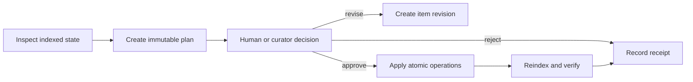

# Maintenance plans and decisions

- **Status:** proposed
- **Depends on:** current change journal and proposal storage

## Problem

The current `curate` preview reports what kind of change it would make, but does not expose the complete body
or file diff. Existing proposals primarily gate ingestion and routing decisions. Neither is a sufficient review
surface for autonomous knowledge-base maintenance.

A useful review needs the exact proposed result, the evidence that motivated it, and the deterministic checks
already performed. An autonomous run needs the same artifact so its decision can be audited later.

## Outcome

Every maintenance edit is first captured in an immutable plan. Once all selected planners finish, a separate
decision stage considers the complete plan. The decision maker is a human or a curator model. Policy determines
which items reach that decision maker and whether an accepted item is applied automatically; it does not approve
model-authored content by itself.

The unit of review is a **plan item**, not an individual file write. One item may contain several file
operations when applying only half would break the knowledge base.

## User experience

Planning never changes knowledge-base files:

```text
$ akno dream --mode audit
Plan drm_01J...: 8 items
  3 hygiene      ready
  2 broken-link  ready
  1 merge        needs review
  1 conflict     blocked
  1 split        ready

$ akno plan show drm_01J...
$ akno plan diff drm_01J... --item itm_01J...
```

Review mode persists the plan and waits:

```text
$ akno plan decide drm_01J... --item itm_01J... --approve
$ akno plan apply drm_01J...
Applied 1 approved item; 6 pending; 1 blocked.
```

An interactive command may approve, reject, or request revision of one or more items. The same decision API is
available to a graphical client and to the curator stage. A user may edit the proposed result before approval;
that creates a new revision rather than mutating the old proposal.

## Lifecycle



A plan and its items move through typed states:

- Plan: `building | ready | deciding | applying | completed | partially_completed | failed | superseded`.
- Item: `proposed | revision_requested | approved | rejected | blocked | stale | applying | applied |
verification_failed`.

State transitions are compare-and-swap operations. Repeating a decision or apply request with the same
idempotency key returns the existing result.

## Data contract

Maintenance plans should not overload the current ingestion proposal table. They have different retention,
payload, atomicity, and state requirements. Add dedicated storage under `state_dir`, conceptually:

```ts
interface MaintenancePlan {
  id: string;
  createdAt: string;
  completedAt?: string;
  mode: 'audit' | 'review' | 'auto';
  phases: string[];
  status: PlanStatus;
  indexRevision: string;
  configFingerprint: string;
  plannerVersion: string;
  itemIds: string[];
  summary: PlanSummary;
}

interface MaintenanceItem {
  id: string;
  planId: string;
  revision: number;
  kind:
    | 'hygiene'
    | 'split'
    | 'extract'
    | 'merge'
    | 'broken_link'
    | 'contradiction'
    | 'synthesis'
    | 'adopt'
    | 'other';
  risk: 'low' | 'medium' | 'high';
  status: ItemStatus;
  rationale: string;
  evidence: EvidenceRef[];
  operations: PlannedOperation[];
  checks: CheckResult[];
  decision?: Decision;
  apply?: ApplyReceipt;
  verification?: VerificationReceipt;
}
```

Each `PlannedOperation` contains:

- operation type: `create | replace | move | delete`;
- path before and after, when applicable;
- expected hash of the input bytes or an explicit assertion that the path must not exist;
- full proposed output bytes or a lossless patch plus its verified reconstructed output hash;
- a unified diff generated for display;
- stable identifiers for pages, documents, links, and claims affected by the operation.

The proposed bytes are authoritative; the display diff is not replayed. All paths are resolved beneath the
configured knowledge-base root before storage and again before apply.

Plans may contain private knowledge-base text and therefore live only in `state_dir`, inherit its filesystem
permissions, never enter telemetry, and have configurable retention. Logs contain identifiers and summaries,
not full bodies or diffs.

## Decision contract

A decision is independent from planning and contains:

```ts
interface Decision {
  actor: 'human' | 'curator';
  outcome: 'approve' | 'reject' | 'revise';
  reason: string;
  decidedAt: string;
  model?: { provider: string; id: string; promptVersion: string };
}
```

The curator receives the complete plan item, its evidence, exact before/after content, deterministic check
results, and neighboring plan items that overlap the same pages. It runs as a separate model call and context
from the planner. Using the same configured model is allowed; using the same response as both proposal and
approval is not.

The curator returns structured decisions only. It may approve, reject with a reason, or request a bounded
revision. A revision returns to the relevant planner and is capped by configuration. It may not directly write
files or invent new operations outside the original item scope.

Overlapping approved items are either combined into a new item revision and reviewed again, or one is blocked.
Apply order is never inferred from array order.

Policy checks may block, defer, or route an item without a decision. A curator outage never turns a configured
automatic item into a policy-approved write.

## Apply contract

Before writing, Akno rechecks every expected input hash and path assertion. If any input changed, the entire
item becomes `stale`; none of its operations are applied.

For an approved item Akno must:

1. validate all paths and proposed bytes;
2. stage every output and run parse/frontmatter checks against the staged view;
3. create one change-journal group containing every operation;
4. atomically replace files where the platform permits it;
5. roll back the group if a write fails before completion;
6. index the affected paths;
7. run the item's postconditions;
8. record the journal change id and verification receipt.

A failed verification does not erase evidence of the attempted change. Akno reports the failure and either
automatically undoes the whole item when the failure is safely reversible, or marks it for recovery. This policy
must be explicit in configuration.

## Deterministic checks

All items, regardless of decision actor, must pass checks that include:

- every path stays below the knowledge-base root;
- every input hash still matches;
- generated Markdown parses and has valid Akno frontmatter;
- page ids and slugs remain unique;
- files outside the item's declared operations remain byte-identical;
- no operation exceeds configured file, item, or run budgets;
- protected folders and pages are not changed;
- referenced evidence and line ranges existed in the indexed input;
- destructive operations have a complete journal before-image.

Transformation-specific checks are specified in
[Autonomous page curation](002-autonomous-page-curation.md).

## CLI and operation surface

Add commands or equivalent registered operations for:

- `plan list [--status ...]`
- `plan show <plan-id> [--json]`
- `plan diff <plan-id> [--item <item-id>]`
- `plan decide <plan-id> --item <item-id> --approve|--reject|--revise`
- `plan apply <plan-id> [--approved-only]`
- `plan supersede <plan-id>`

Agents may inspect plans and submit decisions only when the host explicitly exposes those operations. Keep the
existing protection that prevents an untrusted agent from proposing and approving its own unrestricted write.

## Acceptance criteria

- Audit mode can display the complete exact result of every proposed item without changing the knowledge base.
- A plan remains inspectable after process restart and contains enough information to explain every decision.
- A changed input causes an item to become stale with zero partial writes.
- An item containing multiple file operations is applied or rolled back as one unit.
- A curator decision occurs in a separate call from generation and cannot bypass deterministic checks.
- A human can approve one item, reject another, revise a third, and leave the rest pending.
- Applying or deciding twice with the same idempotency key does not duplicate changes.
- Every applied item points to a change-journal id and a verification receipt.
- Plan text never appears in normal logs or model requests unrelated to its decision.

## Non-goals

- A collaborative real-time diff editor.
- Treating Git as the primary transaction or review store. Git remains useful but is optional.
- Guaranteeing a single filesystem transaction across arbitrary mounts.
- Allowing a curator model to bypass a configured protected path or deterministic guard.

## Open questions

- Should an apply-time verification failure always trigger automatic undo, or only for specified check classes?
- What retention period balances useful audit history against duplication of private knowledge-base content?
- Should a human-edited proposal remain attached to its original planner item or become a distinct `manual`
  item kind?
