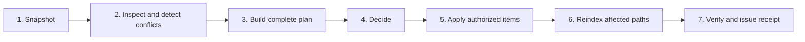

# Dream lifecycle

- **Status:** proposed
- **Depends on:** [Maintenance plans and decisions](001-maintenance-plans-and-decisions.md),
  [Autonomous page curation](002-autonomous-page-curation.md)

## Problem

The current dream cycle runs phase-specific work in sequence and some enabled phases may write before later
phases inspect the result. Conflict detection also follows observation, reflection, curation, and adoption. That
order allows a disputed claim to influence a new inference before Akno has identified the dispute.

The new maintenance surface needs a run-level contract: inspect a stable snapshot, construct all proposals,
make decisions in a separate stage, apply an authorized set, reindex, and verify. Without that separation,
“dry run,” human review, and autonomous curation would behave like different products.

## Outcome

`akno dream` becomes one lifecycle around phase-specific planners:



The same lifecycle serves three trust modes:

- `audit`: stop after the plan is ready;
- `review`: persist the plan and wait for external decisions;
- `auto`: run the curator and policy engine, apply accepted items, and verify them.

`--dry-run` is a familiar alias for `--mode audit`; it is not a separate implementation path.

## Snapshot and consistency

At the beginning of a run Akno records:

- index revision and schema version;
- knowledge-base root fingerprint;
- effective configuration fingerprint;
- enabled phase and transformation policies;
- planner, prompt, and model identifiers;
- start time and run id.

All planners read the same indexed snapshot. They may read current file bytes to create input hashes, but may
not mutate knowledge-base files. Watcher events can continue to be collected; if an affected input changes,
that item becomes stale before apply.

Only one dream run may decide or apply at a time. A second scheduled invocation reports the active run rather
than silently exiting or running concurrent planners. Read-only plan inspection remains available.

## Inspection order

Inspection runs cheap structural work first, then semantic work:

1. reconcile the current index and capture changed paths;
2. inspect ownership, links, ids, frontmatter, managed markers, and stale index state;
3. generate structural conflict candidates;
4. classify conflicts with a model when configured;
5. construct the set of claims eligible for inference;
6. run observation and reflection planners against only that eligible set;
7. run page transformation and adoption planners;
8. produce housekeeping findings for work that is not actionable or is out of scope.

The user-visible retention ladder remains `episode → observation → principle`. It is not the execution order.
Conflict analysis is a prerequisite filter for observation and reflection, not merely a later report.

## Conflict eligibility

Every conflict candidate has a typed verdict:

- `not_conflict`: safe to use normally;
- `time_scoped`: claims may be used only with their explicit time scope;
- `resolved`: the accepted claim may be used and the superseded claim remains provenance;
- `unresolved`: neither incompatible value may support a new observation or principle;
- `unverified`: structural evidence suggests a conflict but classification was unavailable or unreliable.

`unverified` uses the conservative behavior of `unresolved` for inference. It remains separately visible so an
operator knows whether the knowledge is disputed or the classifier was unavailable.

When a conflict involves only one field, Akno excludes that field and may still use unrelated facts from the
same page. Exclusion is claim-scoped rather than page-scoped.

## Planning phases

The old phase names remain useful as planner selectors, but none writes during planning:

| Planner        | Reads                                                 | Produces                                    |
| -------------- | ----------------------------------------------------- | ------------------------------------------- |
| `conflicts`    | structurally comparable claims                        | typed conflict records and resolution items |
| `observe`      | authored, conflict-eligible facts from distinct pages | observation create/update items             |
| `reflect`      | accepted, conflict-eligible observations              | principle create/update items               |
| `curate`       | opted-in pages and eligible evidence                  | page transformation items                   |
| `adopt`        | unowned documents and folder policy                   | optional filing items                       |
| `repair`       | typed conflicts and structural findings               | bounded repair items                        |
| `housekeeping` | stable snapshot plus complete proposed plan           | findings not already covered by an item     |

`housekeeping` reports the planned state and the current state separately. For example, a broken link covered by
an approved item is “planned,” not silently absent from the report.

Observe and reflect output becomes plan items even when it only appends to Akno-managed pages. This gives
inferred knowledge the same decision, journal, and verification path as structural curation.

## Cross-item planning

After individual planners finish, Akno constructs a dependency graph:

- an item that creates a target precedes a link to that target;
- a conflict resolution precedes synthesis that uses the accepted value;
- page split or merge operations precede adoption into those pages;
- two items replacing the same page conflict unless a new combined revision is generated;
- observations depending on a page transformation are deferred to the next run unless they were planned from
  the pre-transform snapshot.

The planner never promises a single “after” state by naively concatenating diffs. It topologically orders
compatible items, groups operations that must be atomic, and marks ambiguous overlaps as blocked.

For the first implementation, inference should use the initial snapshot and defer any inference that would
depend on proposed edits. Planning against a virtual post-plan snapshot is a later optimization.

## Decision stage

The decision stage begins only after the plan is sealed. It uses the configured mode and per-transformation
policy described in [Trust modes and status](005-trust-modes-and-status.md).

In automatic mode:

1. deterministic policy rejects or blocks items outside allowed scope;
2. the curator reviews eligible items in a separate call from their planners;
3. bounded revisions return to a planner and create new immutable item revisions;
4. approved compatible items form the apply set;
5. risk, item, file, and byte budgets are checked over the whole apply set.

Reaching a budget does not partially apply an indivisible item. Remaining items stay `proposed` with a typed
`budget_exhausted` reason and may be considered in a later run.

## Apply and verification

Apply follows the atomic item contract in specification 001. Items are processed in dependency order. An item
failure blocks its dependants but does not automatically block independent items unless the run policy is
`all_or_nothing`.

After each apply group, affected paths are reindexed before its postconditions run. At the end Akno executes
run-level verification:

- index and filesystem agree for affected paths;
- every applied item has a journal id and verification result;
- no unplanned file changed;
- new parse, ownership, id, or link failures are attributed to the responsible item;
- conflict eligibility is recomputed for changed claims;
- the planner does not immediately propose the inverse of a split or merge;
- run budgets and model usage match the receipt.

The final receipt distinguishes `completed`, `partially_completed`, `failed`, and `awaiting_review`. A scheduled
job exits non-zero only for a run or infrastructure failure, not merely because review items or housekeeping
findings exist.

## Retry and recovery

Runs and items have stable ids. On restart Akno examines durable state:

- `building`: resume idempotent planners or supersede the incomplete plan;
- `ready`/`awaiting_review`: leave available for decisions;
- `applying`: compare journal and filesystem hashes to determine whether an operation completed;
- `verification_failed`: preserve diagnostics and offer explicit undo or retry;
- `completed`: never apply again.

A retry uses the same plan only if all unapplied input hashes still match. Otherwise it creates a new plan and
marks the old items stale. Model calls may be retried during planning, but apply is never inferred from whether
a model request succeeded.

## Scheduling

The scheduler selects a named maintenance profile rather than a bag of phase booleans:

```jsonc
{
  "maintenance": {
    "profile": "autonomous",
    "schedule": { "hour": 3 },
  },
}
```

Profiles expand to mode, planners, transformation policies, limits, curator settings, and failure policy. The
resolved values remain inspectable through `akno config`.

The initial named profiles are:

- `audit`: inspect and plan only;
- `review`: plan and wait for human decisions;
- `autonomous`: curate and automatically apply accepted work within explicit policy;
- `custom`: use the fully expanded configuration.

Installation asks which profile to schedule. It does not silently equate “install the service” with “allow
knowledge-base writes.” Existing installations preserve their resolved behavior during migration.

## Acceptance criteria

- `--dry-run` and `--mode audit` produce the same durable plan and zero knowledge-base writes.
- Conflict classification completes before any observation or reflection prompt is constructed.
- Unresolved and unverified conflicting claims are absent from inference inputs.
- All selected planners finish before a curator or human decision is requested.
- Every apply operation belongs to a sealed plan and an approved item revision.
- A dependency failure blocks dependants without corrupting independent items.
- A process restart cannot duplicate an already applied item.
- Scheduled concurrent invocation reports the active run and does not start a second apply path.
- Receipts distinguish current findings, planned fixes, applied fixes, skips, degradations, and failures.
- Repeating an unchanged successful run creates no semantically duplicate work.

## Non-goals

- Producing new observations from content proposed earlier in the same run.
- Requiring every planner to use a model.
- Treating a scheduled job's process exit code as the complete maintenance status.
- Replacing the existing per-turn retention behavior for fresh conversation context.

## Open questions

- Should automatic mode default to independent-item progress or all-or-nothing apply for the first release?
- How long may an awaiting-review plan remain eligible before it is automatically superseded?
- Should conflict classification be cached across runs by claim fingerprint and model/prompt version?
